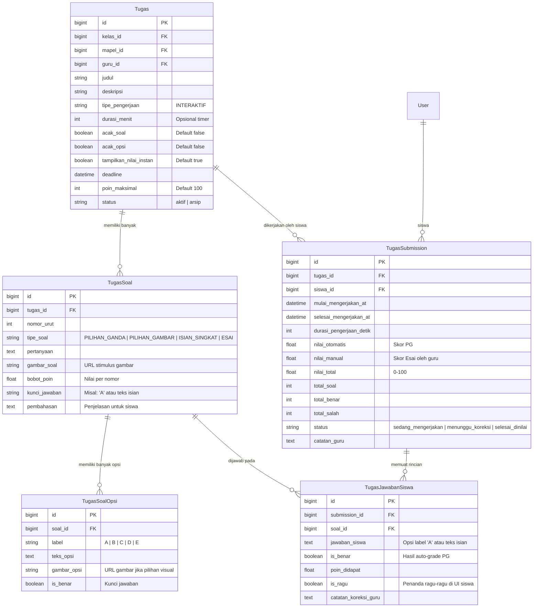
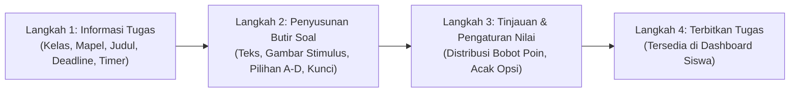
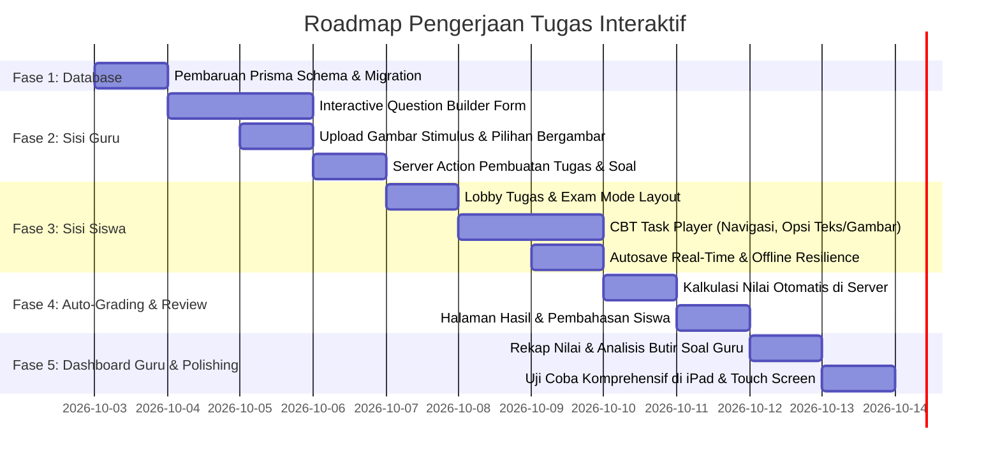

# 📋 Master Plan: Transformasi Penuh Sistem Tugas Murid & Guru (In-App Interactive Task / CBT System)

> **Dokumen Perencanaan Teknis & Arsitektur**  
> **Aplikasi**: Al-Azhar Student  
> **Status**: Ready for Implementation  
> **Versi**: 2.0 (Modern In-System Interactive Assignment & Question Builder)

---

## 📌 1. Latar Belakang & Ringkasan Perubahan

### 1.1 Kondisi Saat Ini (Legacy File-Based System)
Saat ini, modul tugas berjalan dengan mekanisme pengumpulan berkas manual (*file upload*):
* **Sisi Guru**: Guru hanya mengisi formulir sederhana (Judul, Deskripsi singkat, Tenggat Waktu) dan mengunggah 1 file dokumen panduan/soal (PDF/Foto). Tidak ada pembuatan butir-butir soal di dalam sistem.
* **Sisi Murid**: Murid membaca soal dari file PDF / gambar yang dilampirkan, lalu wajib menulis jawaban di buku/kertas fisik, memotret lembar jawaban (atau scan PDF), dan mengunggahnya (*upload*) ke sistem.
* **Sisi Penilaian**: Guru memeriksa berkas foto siswa satu per satu melalui fitur coret-coret kanvas (*InBrowserGrader*) lalu memasukkan nilai manual 0–100.

### 1.2 Masalah yang Ditemukan pada Sistem Lama
1. **Beban Pengumpulan bagi Murid**: Siswa (khususnya SD & SMP) kerepotan harus bolak-balik mengambil foto, hasil foto sering buram/miring, dan ukuran file membengkak.
2. **Ketergantungan Kuota & Upload**: Kegagalan koneksi saat mengunggah gambar resolusi tinggi sering terjadi di iPad siswa.
3. **Pemeriksaan Lambat & Tidak Efisien**: Guru harus membaca tulisan tangan siswa yang bervariasi satu per satu secara manual tanpa bantuan koreksi otomatis (*auto-grading*).
4. **Tidak Ada Analisis Butir Soal**: Guru tidak bisa melihat soal nomor berapa yang paling banyak salah dijawab oleh murid untuk evaluasi remedial/pembelajaran.

### 1.3 Arah Transformasi Penuh (Target Sistem Baru)
Sistem tugas akan dirombak secara **penuh (100% in-app interactive)**:
* 🚫 **TIDAK ADA LAGI upload file foto/lembar tugas** oleh siswa.
* ✨ **Pengerjaan Langsung di Aplikasi**: Siswa mengerjakan tugas/kuis interaktif langsung di layar (pilihan ganda teks, pilihan ganda bergambar, stimulus diagram, isian singkat, dan esai terstruktur).
* 🛠️ **Pembuat Soal Visual untuk Guru (Interactive Question Builder)**: Guru menyusun butir-butir pertanyaan langsung di aplikasi dengan teks, lampiran gambar stimulus, opsi jawaban A/B/C/D, penentuan kunci jawaban, dan bobot nilai per butir.
* ⚡ **Auto-Grading Otomatis**: Penilaian instan untuk soal objektif (pilihan ganda), sehingga nilai langsung terhitung saat murid menekan tombol selesai.
* 📱 **Optimal untuk iPad & Tablet**: Antarmuka pengerjaan ramah anak (*kids & youth friendly*), tombol opsi sentuh yang besar, navigasi nomor soal yang jelas, autosave jawaban berkala, serta bebas distorsi.

---

## 🏗️ 2. Komparasi Arsitektur: Lama vs Baru

| Dimensi | Sistem Saat Ini (Lama) | Sistem Baru (In-App Interactive) |
| :--- | :--- | :--- |
| **Penyusunan Tugas (Guru)** | Input judul, deskripsi umum, dan lampirkan 1 berkas PDF/foto. | **Interactive Question Builder**: Guru menyusun butir soal satu per satu (teks soal, gambar stimulus, opsi A-D, kunci jawaban, bobot nilai, batas waktu). |
| **Format Soal** | Pasif (hanya dokumen statis di layar). | **Multi-Format Interaktif**: Pilihan Ganda Teks, Pilihan Ganda Bergambar, Isian Singkat, dan Esai langsung di sistem. |
| **Metode Kerja Siswa** | Menulis di kertas fisik $\rightarrow$ memfoto $\rightarrow$ upload berkas foto/PDF. | **In-App Task Runner (CBT UI)**: Memilih opsi atau mengetik langsung di web/iPad dengan navigasi nomor interaktif. |
| **Penyimpanan Progres** | Tidak ada (hanya submit form sekali di akhir). | **Autosave Real-Time**: Jawaban tersimpan otomatis setiap siswa memilih opsi (tahan gangguan jaringan/browser reload). |
| **Sistem Penilaian** | Manual 100% via kanvas coret foto siswa. | **Hybrid Auto-Grading**: Pilihan ganda dinilai otomatis oleh server detik itu juga; esai dapat dikoreksi guru per butir. |
| **Umpan Balik Siswa** | Menunggu guru membuka file dan memberi skor. | Skor langsung keluar (opsional guru), disertai rekapitulasi nomor benar/salah & pembahasan soal. |
| **Analitik Guru** | Hanya rata-rata nilai total kelas. | Analisis daya serap butir soal (misal: soal no. 3 salah dijawab 65% siswa). |

---

## 🗄️ 3. Perancangan Skema Database (Prisma Schema)

Untuk mendukung pengerjaan soal langsung di sistem, kita memerlukan entitas relasi baru antara `Tugas`, `TugasSoal`, `TugasSoalOpsi`, `TugasSubmission`, dan `TugasJawabanSiswa`.

### 3.1 Diagram Relasi Database (ERD)



### 3.2 Penjelasan Skema Prisma
1. **`Tugas` (Enhancement)**:
   * Menambahkan kolom konfigurasi kuis: `tipe_pengerjaan` (`INTERAKTIF`), `durasi_menit` (opsional batas waktu countdown), `acak_soal` (boolean), `acak_opsi` (boolean), dan `tampilkan_nilai_instan` (boolean).
   * Kolom lama `file_petunjuk` dipertahankan untuk kompatibilitas data masa lalu (*backward compatibility*).
2. **`TugasSoal` (Model Baru)**:
   * Setiap tugas memiliki 1 atau lebih butir soal.
   * Mendukung teks soal kaya (*rich text / math symbols*), stimulus gambar (`gambar_soal`), bobot poin tiap soal, serta pembahasan.
3. **`TugasSoalOpsi` (Model Baru)**:
   * Menyimpan alternatif jawaban A, B, C, D (atau E untuk jenjang SMP).
   * Tiap opsi bisa berupa teks, gambar (contoh: "Pilihlah bangun ruang prisma segitiga di bawah ini:"), atau kombinasi teks dan gambar.
4. **`TugasSubmission` (Transformasi)**:
   * Menggeser fokus dari `file_url` ke metrik pengerjaan: waktu mulai, waktu selesai, `total_benar`, `total_salah`, `nilai_total`, dan status pengerjaan.
5. **`TugasJawabanSiswa` (Model Baru)**:
   * Menyimpan secara atomik jawaban siswa per butir soal. Memungkinkan autosave berkala per nomor tanpa harus mengirim seluruh formulir sekaligus.

---

## 🎨 4. Alur & Desain Antarmuka Pengguna (UI/UX)

### 4.1 Sisi Guru: Pembuat Soal Interaktif (*Interactive Question Builder*)

Guru tidak lagi hanya mengisi textarea kosong. Alur pembuatan tugas menjadi terstruktur dengan antarmuka modern (*wizard / stepper*):



#### Fitur Utama di Builder Guru:
1. **Quick Question Formatter**:
   * Pilihan Tipe:
     * 🔘 **Pilihan Ganda (Standar Teks)**: Soal teks dengan 4 opsi A, B, C, D. Guru cukup klik radio button pada opsi yang benar sebagai kunci jawaban.
     * 🖼️ **Pilihan Ganda Bergambar**: Guru mengunggah gambar diagram/peta/ayat pada stimulus soal, dan/atau mengunggah gambar pada masing-masing kartu pilihan A, B, C, D.
     * ✍️ **Isian Singkat (Auto-Check)**: Siswa mengetik 1-2 kata, sistem mencocokkan dengan kata kunci yang ditentukan guru (case-insensitive).
     * 📝 **Esai Terstruktur**: Siswa mengetik penjelasan di kolom jawaban, guru mengoreksi kemudian.
2. **Kalkulator Bobot Poin Otomatis**:
   * Guru bisa klik *"Bagi Poin Rata"* (misal 10 soal $\rightarrow$ masing-masing 10 poin, total 100 poin), atau mengatur bobot manual per nomor.
3. **Live Preview Mode**:
   * Guru dapat mengklik tombol *"Pratinjau Tampilan Siswa"* untuk menguji pengerjaan soal di simulator layar tablet/iPad sebelum diterbitkan.
4. **Duplikasi & Reorder Soal**:
   * Tombol geser nomor urut atas/bawah dan duplikasi soal dengan 1 klik.

---

### 4.2 Sisi Siswa: Arena Pengerjaan Interaktif (*Interactive CBT Task Player*)

Pengalaman siswa diubah total dari "membuka PDF dan foto tugas" menjadi antarmuka pengerjaan modern ala Computer-Based Test (CBT) yang dirancang khusus untuk anak sekolah (SD & SMP):

#### Tampilan Antarmuka Player Siswa:
```
+-----------------------------------------------------------------------------------+
|  [<- Keluar]   Matematika Kelas 5 - Operasi Pecahan     [⏱️ 28:45 Sisa Waktu]    |
+-----------------------------------------------------------------------------------+
|                                                                                   |
|  SOAL NOMOR 3 DARI 10                          [ ] Tandai Ragu-Ragu               |
|                                                                                   |
|  Perhatikan gambar potongan kue di bawah ini:                                     |
|  +-------------------------------------+                                          |
|  |  [ GAMBAR STIMULUS: DIAGRAM KUE ]   |  (Sentuh untuk memperbesar)              |
|  +-------------------------------------+                                          |
|                                                                                   |
|  Berapakah nilai pecahan yang menunjukkan bagian kue berwarna kuning?             |
|                                                                                   |
|  (A)  1/4 bagian                                                                  |
|  ======================================================================           |
|  (B)  3/8 bagian    <-- [TERPILIH: Border Emerald + Ikon Centang Al-Azhar]         |
|  ======================================================================           |
|  (C)  1/2 bagian                                                                  |
|  ======================================================================           |
|  (D)  5/8 bagian                                                                  |
|                                                                                   |
|  -------------------------------------------------------------------------------  |
|  [ <- Soal Sebelumnya ]           [ Simpan & Lanjut -> ]      [ Kumpulkan Tugas ]  |
+-----------------------------------------------------------------------------------+
|  LEMBAR NOMOR SOAL:                                                               |
|  [ 1: Selesai ]  [ 2: Selesai ]  [ 3: Aktif ]  [ 4: Kosong ]  [ 5: Ragu-ragu ] ...|
+-----------------------------------------------------------------------------------+
```

#### Keunggulan Pengalaman Siswa:
1. **Opsi Card Sentuh yang Nyaman**:
   * Ukuran tombol pilihan A, B, C, D dibuat proporsional dan ramah jari di layar sentuh iPad. Efek visual animasi halus saat opsi ditekan.
2. **Fitur Gambar Interaktif (Zoom & Lightbox)**:
   * Jika ada soal bergambar (peta, ayat Al-Qur'an, tabel IPA), siswa cukup mengetuk gambar untuk melihat versi ukuran penuh (*modal lightbox*).
3. **Penyelamat Jawaban (Autosave & Anti-Loss)**:
   * Setiap siswa memilih opsi, status jawaban dikirim ke server via background request dan disimpan sementara di `localStorage`.
   * Jika iPad siswa kehabisan baterai atau koneksi terputus tiba-tiba, ketika halaman dimuat ulang, semua jawaban tetap utuh!
4. **Navigasi Grid Nomor Soal**:
   * Lembar nomor soal di bagian samping/bawah memperlihatkan indikator:
     * 🟢 **Hijau**: Sudah terjawab.
     * 🟡 **Kuning**: Ditandai ragu-ragu.
     * ⚪ **Abu-abu**: Belum dibuka / belum dijawab.
5. **Dialog Validasi Pengumpulan**:
   * Ketika tombol *"Selesaikan Tugas"* ditekan, sistem memeriksa:
     * Jika ada soal belum terjawab: *"Perhatian: Masih ada 2 nomor yang belum kamu jawab (Nomor 4 dan 7). Yakin ingin mengumpulkan sekarang?"*

---

### 4.3 Sisi Siswa: Halaman Hasil & Ulasan Pembahasan (*Review & Celebration Screen*)

Setelah siswa mengumpulkan tugas:
1. **Layar Selebrasi Gamifikasi**:
   * Animasi konfeti islami modern (*KidsCelebrationModal*) yang memberikan apresiasi: *"Alhamdulillah! Tugas telah selesai dikerjakan!"*
2. **Ringkasan Skor Langsung**:
   * Menampilkan perolehan nilai, jumlah jawaban benar, jumlah jawaban salah, dan durasi pengerjaan.
3. **Ulasan Soal & Pembahasan (Jika diizinkan Guru)**:
   * Siswa dapat melihat kembali butir soal: jawaban mereka vs jawaban yang benar, disertai teks penjelasan pembahasan yang ditulis guru.

---

### 4.4 Sisi Guru: Rekapitulasi & Koreksi Semi-Otomatis

1. **Rekap Hasil Kelas Seketika**:
   * Begitu siswa menekan submit, nilai langsung masuk ke tabel penilaian guru tanpa perlu guru menunggu atau mengoreksi manual untuk soal PG.
2. **Koreksi Soal Esai Cepat (Jika ada esai)**:
   * Sistem hanya menampilkan soal esai yang perlu dinilai. Guru cukup memasukkan poin 0 hingga bobot maksimal untuk esai tersebut.
3. **Analitik Butir Soal (*Item Difficulty Analytics*)**:
   * Grafik visual yang menandai: *"Soal No. 4 paling sulit: hanya 30% siswa menjawab benar"*. Guru dapat langsung membahas soal tersebut di sesi kelas berikutnya.

---

## 💻 5. Rencana Modifikasi File & Komponen

Berikut adalah pemetaan komponen yang akan dirombak dan komponen baru yang akan dibangun:

### 5.1 File & Komponen yang Perlu Dibuat (New Files)
| Path File | Deskripsi & Kegunaan |
| :--- | :--- |
| `src/components/features/assignment/builder/interactive-task-builder.tsx` | Komponen utama Guru untuk membuat dan menyunting tugas interaktif secara multi-step. |
| `src/components/features/assignment/builder/question-item-card.tsx` | Kartu editor butir soal (input pertanyaan, stimulus gambar, opsi A-D, kunci jawaban). |
| `src/components/features/assignment/builder/image-upload-preview.tsx` | Utilitas upload gambar cepat untuk soal & pilihan bergambar. |
| `src/components/features/assignment/runner/interactive-task-runner.tsx` | Komponen utama Siswa untuk menjalankan kuis/tugas di browser (CBT Player). |
| `src/components/features/assignment/runner/question-palette-modal.tsx` | Navigasi grid nomor soal untuk mobile/tablet. |
| `src/components/features/assignment/runner/option-selector.tsx` | Komponen kartu opsi A, B, C, D (teks & gambar) dengan micro-interaction yang nyaman. |
| `src/components/features/assignment/result/task-result-view.tsx` | Tampilan skor hasil pengerjaan siswa, statistik benar/salah, dan ulasan pembahasan. |
| `src/components/features/assignment/teacher/interactive-task-analytics.tsx` | Tampilan analisis butir soal dan rekapitulasi nilai untuk guru. |

### 5.2 File yang Dihapus / Dihentikan Ketergantungannya
* `src/components/features/assignment/kids-submission-zone.tsx` *(Direncanakan transisi: digantikan oleh Interactive Task Runner, fungsi upload foto dinonaktifkan)*.
* `src/components/features/assignment/file-submission-zone.tsx` *(Dinonaktifkan)*.
* `src/components/features/assignment/in-browser-grader.tsx` *(Kanvas coret-coret foto lama dipensiunkan, diganti tampilan koreksi interaktif)*.

### 5.3 File yang Dimodifikasi (Refactored Files)
| Path File | Rencana Perubahan |
| :--- | :--- |
| `prisma/schema.prisma` | Menambahkan model `TugasSoal`, `TugasSoalOpsi`, `TugasJawabanSiswa`, dan menyesuaikan `Tugas` & `TugasSubmission`. |
| `src/actions/assignment.ts` | Menambahkan Server Actions baru: `saveInteractiveTugasAction`, `submitInteractiveTaskAction`, `saveStudentAnswerDraftAction`, `gradeInteractiveEssayAction`. |
| `src/app/(dashboard)/guru/tugas/create/page.tsx` | Mengintegrasikan `InteractiveTaskBuilder` menggantikan form upload file lama. |
| `src/app/(dashboard)/guru/tugas/[tugasId]/page.tsx` | Menampilkan ringkasan butir soal, tab analisis butir soal, dan tabel pengerjaan murid. |
| `src/app/(dashboard)/guru/tugas/[tugasId]/review/[subId]/page.tsx` | Menampilkan lembar jawaban interaktif murid (jawaban murid vs kunci) alih-alih foto berkas. |
| `src/app/(dashboard)/siswa/tugas/[tugasId]/page.tsx` | Berfungsi sebagai "Lobby Tugas" (menampilkan info kuis, jumlah soal, timer, dan tombol "Mulai Kerjakan"). |
| `src/app/(dashboard)/siswa/tugas/[tugasId]/kerjakan/page.tsx` *(Route Baru)* | Halaman pengerjaan tugas interaktif layar penuh (*exam mode*). |
| `src/app/(dashboard)/siswa/tugas/[tugasId]/hasil/page.tsx` *(Route Baru)* | Halaman hasil nilai instan dan ulasan pembahasan siswa. |

---

## 🚀 6. Roadmap Pelaksanaan Bertahap (Step-by-Step Implementation)

Pelaksanaan akan dibagi ke dalam **5 fase terstruktur** agar sistem tetap stabil dan teruji dengan baik:



### Rincian Tiap Fase:

#### 🔹 FASE 1: Skema Database & Server Entities
1. Perbarui `prisma/schema.prisma` dengan model:
   * `TugasSoal` (Teks pertanyaan, gambar, bobot, kunci).
   * `TugasSoalOpsi` (Pilihan A/B/C/D, gambar per opsi).
   * `TugasJawabanSiswa` (Log jawaban per nomor).
   * Perluasan `Tugas` & `TugasSubmission`.
2. Jalankan `npx prisma db push` atau migrasi skema.
3. Buat helper parsing JSON/Data transformer untuk efisiensi transfer data client-server.

#### 🔹 FASE 2: Builder Soal Guru (Teks, Gambar, & Kunci Jawaban)
1. Buat komponen `InteractiveTaskBuilder`:
   * Header: Judul, Kelas, Mapel, Deadline, Durasi Waktu, Acak Soal.
   * Butir Soal: Tombol `[+ Tambah Soal]`.
   * Tiap butir memiliki:
     * Kolom teks soal (mendukung formatting).
     * Unggah gambar stimulus (otomatis disimpan ke `/uploads/tugas/stimulus/`).
     * Pilihan format: Pilihan Ganda (Teks) atau Pilihan Ganda (Bergambar).
     * 4 Baris Opsi (A, B, C, D) dengan tombol radio untuk menentukan kunci jawaban yang benar.
     * Bobot poin soal (default: otomatis dibagi rata menjadi total 100).
2. Buat Server Action `createInteractiveTugasAction` untuk menyimpan seluruh butir soal dalam satu transaksi atomic database (`prisma.$transaction`).

#### 🔹 FASE 3: CBT Task Player Siswa (Pengerjaan Langsung di Layar)
1. Buat rute baru: `/siswa/tugas/[tugasId]/kerjakan`.
2. Rancang antarmuka ramah anak:
   * Mode fokus (*Distraction-Free Exam UI*): Menyembunyikan sidebar standar aplikasi saat pengerjaan berlangsung agar layar iPad luas dan fokus.
   * Timer hitung mundur (*countdown timer*) yang menempel di sudut atas.
   * Kotak soal dengan teks besar & jelas, serta stimulus gambar yang bisa di-tap untuk zoom.
   * Kartu opsi A, B, C, D interaktif dengan efek sentuh instan.
   * Palet grid nomor soal (menampilkan nomor mana yang sudah terisi dan nomor yang belum).
3. Mekanisme Autosave:
   * Jawaban langsung disimpan di state lokal + dikirim ke server via Server Action `saveAnswerDraftAction` secara berkala (debounced).

#### 🔹 FASE 4: Mesin Auto-Grading & Penilaian
1. Saat siswa menekan *"Kumpulkan Tugas"*:
   * Server mencocokkan jawaban siswa dengan `kunci_jawaban` di tabel `TugasSoal`.
   * Menghitung total skor berdasarkan bobot poin soal yang dijawab benar.
   * Menyimpan rincian ke `TugasSubmission` dan `TugasJawabanSiswa`.
2. Halaman Hasil (`/siswa/tugas/[tugasId]/hasil`):
   * Skor langsung terlihat beserta medali/badge gamifikasi.
   * Kartu ulasan per nomor: Warna hijau jika benar, merah jika salah, dan penjelasan pembahasan dari guru.

#### 🔹 FASE 5: Penyesuaian Halaman Guru & Pengujian iPad
1. Perbarui halaman detail tugas guru (`/guru/tugas/[tugasId]`):
   * Tampilkan rekapitulasi nilai semua siswa tanpa perlu memeriksa foto satu per satu.
   * Tambahkan tab *"Analisis Soal"* untuk melihat persentase kebenaran di masing-masing nomor.
2. Pengujian kompabilitas sentuh (*touch gesture*) pada browser iPad/Safari, performa jaringan lambat, dan mitigasi reload browser.

---

## 🔒 7. Penanganan Kasus Khusus (Edge Cases & Resilience)

1. **Siswa Tidak Sengaja Menutup Browser / Reload**:
   * Sistem mendeteksi `submissionId` yang berstatus `sedang_mengerjakan`. Saat halaman dibuka kembali, soal langsung melanjutkan dari nomor terakhir yang dikerjakan beserta opsi yang telah tersimpan.
2. **Koneksi Internet Terputus saat Memilih Jawaban**:
   * Jawaban selalu dituliskan ke `localStorage` browser terlebih dahulu. Saat koneksi kembali normal (*online event*), sistem otomatis melakukan sinkronisasi ulang ke server.
3. **Waktu Habis (*Timer Expired*)**:
   * Ketika waktu pengerjaan habis, aplikasi otomatis memicu fungsi submit darurat dan mengunci formulir, sehingga jawaban yang sudah dipilih tetap dinilai.
4. **Data Tugas Masa Lalu (Legacy Tasks)**:
   * Tugas-tugas lama yang berbasis berkas PDF/foto tetap dapat diakses di mode arsip melalui pengecekan `tipe_pengerjaan === 'FILE' || 'INTERAKTIF'`.

---

## ✅ 8. Kesimpulan & Rekomendasi Selanjutnya

Perubahan dari sistem berbasis file ke sistem tugas interaktif langsung (*in-app CBT*) ini merupakan lompatan besar untuk kenyamanan belajar siswa Al-Azhar dan efisiensi waktu para guru. Siswa tidak lagi terbebani upload file, dan guru terbebas dari koreksi manual lembaran foto.

**Rekomendasi Langkah Awal yang Siap Dijalankan:**
1. Eksekusi **Fase 1** (Pembaruan Skema Prisma Database).
2. Membangun **Interactive Question Builder** di sisi guru agar guru dapat langsung membuat dan menyimpan bank soal interaktif.
3. Membangun **Interactive CBT Task Player** di sisi siswa dan menghubungkannya dengan auto-grading.
