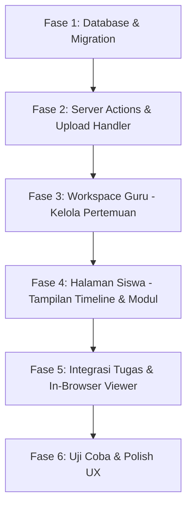

# Blueprint & Rencana Implementasi: Modul Materi Pembelajaran Berbasis Pertemuan (Session-Based Lesson Modules)

> **Aplikasi:** Student Apps — SD & SMP Islam Al-Azhar Cairo Palembang  
> **Berkas Target:** `c:\ruang-kerja-alazhar\student-app\plan-materi-per-pertemuan.md`  
> **Status:** Siap Dieksekusi (*Ready for Implementation*)  
> **Sasaran Utama:** Menghadirkan fitur penyampaian materi belajar terstruktur per sesi KBM (Pertemuan 1 s/d 16 per semester), mengintegrasikan bahan ajar (PDF, PPT, Video, Teks Ringkasan), keterkaitan langsung dengan penugasan/tugas kelas, serta antarmuka ramah anak (*Kids-Friendly*) dan ruang kerja praktis untuk Ustadz/Ustadzah.

---

## 1. Latar Belakang & Analisis Kebutuhan

### Masalah Saat Ini:
1. **Mata Pelajaran Belum Memiliki Wadah Materi**:
   - Halaman detail mata pelajaran siswa (`/siswa/mapel/[mapelId]`) saat ini hanya menampilkan info guru pengampu dan daftar tugas mendatar (*flat task list*).
   - Siswa tidak memiliki tempat rujukan untuk membaca kembali apa yang diajarkan oleh guru di kelas pada hari itu.
2. **Kesulitan bagi Siswa yang Izin / Sakit**:
   - Ketika siswa berhalangan hadir di sekolah, mereka tidak tahu bab apa yang sedang dibahas, rangkuman materi apa yang diberikan, atau slide presentasi apa yang ditampilkan guru.
3. **Keterputusan antara Materi dan Tugas**:
   - Tugas berdiri sendiri tanpa konteks pertemuan. Siswa sering bingung: *"Tugas ini untuk materi pekan berapa dan bab apa?"*.
4. **Guru Memerlukan Tempat Menata Bahan Ajar**:
   - Guru membutuhkan ruang untuk mencicil materi sebelum KBM dimulai (*Draft mode*), mengunggah modul ajar Al-Azhar, menyematkan video pembelajaran animasi/YouTube, dan mengaitkan lembar kerja siswa dalam satu wadah terpadu.

---

## 2. Paradigma 4 Pilar Modul Pertemuan (*Core Pillars*)

```
┌─────────────────────────────────────────────────────────────────────────────────────────────┐
│                           MODUL MATERI PER PERTEMUAN (AL-AZHAR LMS)                         │
├──────────────────────────────┬──────────────────────────────┬───────────────────────────────┤
│ 1. STRUKTUR SESI TERATUR     │ 2. MULTI-FORMAT BAHAN AJAR   │ 3. INTEGRASI TUGAS & KELAS    │
│ • Pertemuan 1 s/d 16         │ • Ringkasan Teks & Tadabbur  │ • Tautkan Tugas Terkait       │
│ • Tanggal KBM & Capaian Bab  │ • Modul PDF & Slide PPT      │ • Tombol Masuk Kelas Online   │
│ • Status: Draft vs Terbit    │ • Video Edukasi / YouTube    │ • Pelacak Selesai Membaca     │
├──────────────────────────────┴──────────────────────────────┴───────────────────────────────┤
│                               4. RUANG KERJA GURU PRAKTIS                                   │
│ • Buat/Edit Pertemuan Cepat   • Duplikasi Materi ke Paralel  • Pratinjau Tampilan Siswa     │
└─────────────────────────────────────────────────────────────────────────────────────────────┘
```

### Pilar 1: Struktur Sesi Teratur (*Session Timeline*)
- Alur pembelajaran disusun kronologis berurutan: **Pertemuan 1, Pertemuan 2, Pertemuan 3, dst.**
- Dilengkapi dengan **Tanggal Pelaksanaan KBM**, **Judul Pokok Bahasan** (contoh: *"Pertemuan 1: Adab Menuntut Ilmu & Thaharah"*), serta **Tujuan Pembelajaran Singkat**.
- Guru dapat menyiapkan materi jauh-jauh hari dengan status **Draft** (hanya terlihat oleh guru) dan mengubahnya menjadi **Terbit / Published** saat jam pelajaran tiba.

### Pilar 2: Multi-Format Bahan Ajar (*Zero-Download Experience*)
- **Rangkuman / Catatan Ustadz**: Teks penjelasan langsung yang bisa dibaca di layar tanpa harus download apapun.
- **Modul Berkas (PDF / PPT / Word)**:
  - Siswa dapat membuka dan membaca langsung di browser menggunakan *In-Browser Document Viewer* (zoom, slide preview).
  - Tetap disediakan tombol unduh (*Download*) bagi siswa yang ingin mencetak atau menyimpan dokumen offline di gawai mereka.
- **Video Penjelasan**: Dukungan embed video YouTube pembelajaran interaktif atau tautan rekaman penjelasan guru.
- **Link Eksternal / Referensi Islami**: Tautan ke artikel tadabbur, simulasi interaktif (Phet/Kahoot), atau buku digital Al-Azhar.

### Pilar 3: Integrasi Mulus dengan Tugas & Kelas Online
- Dalam satu kartu pertemuan, siswa bisa langsung melihat:
  1. Materi yang harus dipelajari.
  2. **Tugas / Misi Latihan Terkait** (menampilkan kartu tugas yang langsung mengarah ke pengerjaan PR).
  3. **Tautan Kelas Online (Virtual Room)** jika pertemuan diadakan via daring (terintegrasi dengan Daily.co yang sudah ada di tabel `KelasOnline`).
- **Penanda Progres Belajar ("Alhamdulillah, Sudah Dipelajari")**: Siswa dapat mencentang tombol selesai belajar sehingga orang tua dan guru dapat memantau kedisiplinan belajar mandiri anak.

### Pilar 4: Ruang Kerja Guru Praktis (*Teacher Experience*)
- Guru cukup memilih rombel kelas & mata pelajaran.
- Tersedia opsi **"Tambah Pertemuan Baru"** dengan form intuitif.
- Fitur hemat waktu: **"Salin Materi ke Kelas Paralel"** (misal materi Matematika Pertemuan 1 di Kelas 4A bisa disalin ke 4B dan 4C hanya dengan satu klik).

---

## 3. Alur Pengguna & Antarmuka (*User Journey & Wireframes*)

### A. Tampilan Siswa (`/siswa/mapel/[mapelId]`)

Halaman detail mata pelajaran siswa dibagi menjadi **2 Tab Utama**:
1. **Tab 1: Modul & Pertemuan (Default)**
2. **Tab 2: Semua Tugas & Nilai**

```
┌──────────────────────────────────────────────────────────────────────────────────────┐
│ [← Kembali ke Daftar Mata Pelajaran]                                                 │
│                                                                                      │
│ ╔══════════════════════════════════════════════════════════════════════════════════╗ │
│ ║ [PAI-4] PENDIDIKAN AGAMA ISLAM & BUDI PEKERTI              [ Kelas 4 Umar ]      ║ │
│ ║ Ustadz Ahmad Fauzi, S.Pd.I  •  Senin, 07:30 - 09:00 WIB    [ Tanya Ustadz 💬 ]   ║ │
│ ╚══════════════════════════════════════════════════════════════════════════════════╝ │
│                                                                                      │
│  ┌───────────────────────────────┬───────────────────────────────┐                   │
│  │  ★ Modul Pertemuan (6 Sesi)   │  ☑ Daftar Tugas & Latihan (2) │                   │
│  └───────────────────────────────┴───────────────────────────────┘                   │
│                                                                                      │
│  TIMELINE PERTEMUAN:                                                                 │
│                                                                                      │
│  ┌─ Pertemuan 1 ────────────────────────────────────────── [ Senin, 15 Juli 2026 ] ─┐│
│  │  📖 Pengenalan Adab Belajar & Berwudhu yang Benar                                ││
│  │                                                                                  ││
│  │  Poin Pembelajaran Hari Ini:                                                     ││
│  │  • Memahami syarat sah dan rukun wudhu sesuai sunnah Rasulullah SAW              ││
│  │  • Praktik doa sebelum dan sesudah berwudhu                                      ││
│  │                                                                                  ││
│  │  Lampiran Bahan Ajar:                                                            ││
│  │  [📄 Modul_Wudhu_Bergambar.pdf (2.4 MB)] -> [Baca di Layar 👁] [Unduh 📥]         ││
│  │  [▶ Tonton Video Tata Cara Wudhu (YouTube)]                                      ││
│  │                                                                                  ││
│  │  Tugas Terkait Pertemuan Ini:                                                    ││
│  │  ┌────────────────────────────────────────────────────────────────────────────┐  ││
│  │  │ 🎯 Misi 1: Video/Foto Praktik Gerakan Wudhu         [ Status: Sudah Dinilai] │  ││
│  │  │ Poin: 95/100 • Mumtaz! ⭐                           [ Lihat Catatan Guru ➔ ] │  ││
│  │  └────────────────────────────────────────────────────────────────────────────┘  ││
│  │                                                                                  ││
│  │  [✓ Tandai Sudah Dipelajari]                                                     ││
│  └──────────────────────────────────────────────────────────────────────────────────┘│
│                                                                                      │
│  ┌─ Pertemuan 2 (Pekan Depan) ──────────────────────────── [ Senin, 22 Juli 2026 ] ─┐│
│  │  🔒 Tata Cara Sholat Fardhu Berjamaah                                            ││
│  │  (Materi akan aktif pada hari H pembelajaran)                                    ││
│  └──────────────────────────────────────────────────────────────────────────────────┘│
└──────────────────────────────────────────────────────────────────────────────────────┘
```

---

### B. Tampilan Guru (`/guru/mapel/[mapelId]/pertemuan` atau Modal Manajemen)

```
┌──────────────────────────────────────────────────────────────────────────────────────┐
│ [← Kembali ke Jadwal Mengajar]                                                       │
│ Kelola Pertemuan: PAI & Budi Pekerti (Kelas 4 Umar)                                 │
│                                                                                      │
│ [+ Tambah Pertemuan Baru]   [📋 Salin dari Kelas Lain]                               │
│                                                                                      │
│ ┌─ Pertemuan 1 [TERBIT] ───────────────────────────────────────────────────────────┐│
│ │ Judul   : Pengenalan Adab Belajar & Berwudhu                                     ││
│ │ Tanggal : 15 Juli 2026  •  File: Modul_Wudhu.pdf  •  Tugas: 1 Dikaitkan          ││
│ │ [Edit Sesi ✏️]   [Lihat Materi 👁]   [Hapus 🗑]                                    ││
│ └──────────────────────────────────────────────────────────────────────────────────┘│
│ ┌─ Pertemuan 2 [DRAFT] ────────────────────────────────────────────────────────────┐│
│ │ Judul   : Tata Cara Sholat Fardhu Berjamaah                                      ││
│ │ Tanggal : 22 Juli 2026  •  File: Slide_Sholat.pptx                                ││
│ │ [Edit Sesi ✏️]   [Terbitkan Sekarang 🚀]   [Hapus 🗑]                              ││
│ └──────────────────────────────────────────────────────────────────────────────────┘│
└──────────────────────────────────────────────────────────────────────────────────────┘
```

---

## 4. Penyesuaian Skema Database (Prisma Schema)

Untuk mendukung fitur materi per pertemuan dengan performa optimal tanpa merusak struktur yang sudah ada (*fully backward compatible*):

```prisma
// ==========================================
// 1. MODEL PERTEMUAN (SESI KBM)
// ==========================================
model Pertemuan {
  id             BigInt        @id @default(autoincrement()) @db.UnsignedBigInt
  kelas_id       BigInt        @db.UnsignedBigInt
  mapel_id       BigInt        @db.UnsignedBigInt
  guru_id        BigInt        @db.UnsignedBigInt
  pertemuan_ke   Int           // Contoh: 1, 2, 3 ...
  judul          String        @db.VarChar(255)
  deskripsi      String?       @db.Text         // Uraian/ringkasan materi guru
  tanggal        DateTime      @db.Date         // Tanggal pelaksanaan sesi KBM
  
  // File Lampiran Utama (PDF/PPT/DOCX)
  file_url       String?       @db.VarChar(500)
  file_name      String?       @db.VarChar(255)
  file_size      Int?          // Ukuran dalam Bytes
  file_type      String?       @db.VarChar(50)  // pdf, pptx, docx, img
  
  // Media Tambahan & Eksternal
  video_url      String?       @db.VarChar(500) // URL YouTube / Daily.co recording
  link_eksternal String?       @db.VarChar(500) // Tautan materi web luar
  
  // Status Publikasi
  is_published   Boolean       @default(true)   // True = Siswa bisa lihat, False = Draft guru
  
  created_at     DateTime?     @default(now()) @db.Timestamp(0)
  updated_at     DateTime?     @updatedAt @db.Timestamp(0)

  // Relasi
  kelas          Kelas         @relation(fields: [kelas_id], references: [id], onDelete: Cascade)
  mapel          MataPelajaran @relation(fields: [mapel_id], references: [id], onDelete: Cascade)
  guru           User          @relation(fields: [guru_id], references: [id], onDelete: Cascade)
  tugas          Tugas[]       // Relasi 1 Pertemuan -> Banyak Tugas
  progressSiswa  PertemuanProgress[]

  @@index([kelas_id, mapel_id])
  @@index([guru_id])
  @@index([tanggal])
  @@map("tbl_pertemuan")
}

// ==========================================
// 2. MODEL PROGRESS BELAJAR SISWA (OPTIONAL-READY)
// ==========================================
model PertemuanProgress {
  id           BigInt    @id @default(autoincrement()) @db.UnsignedBigInt
  pertemuan_id BigInt    @db.UnsignedBigInt
  siswa_id     BigInt    @db.UnsignedBigInt
  is_completed Boolean   @default(false)
  completed_at DateTime? @db.Timestamp(0)

  pertemuan    Pertemuan @relation(fields: [pertemuan_id], references: [id], onDelete: Cascade)
  siswa        User      @relation(fields: [siswa_id], references: [id], onDelete: Cascade)

  @@unique([pertemuan_id, siswa_id], map: "unique_pertemuan_siswa_progress")
  @@index([siswa_id])
  @@map("tbl_pertemuan_progress")
}

// ==========================================
// 3. PENYESUAIAN PADA MODEL TUGAS
// Tambahkan foreign key opsional pertemuan_id di model Tugas
// ==========================================
// model Tugas {
//   ...
//   pertemuan_id  BigInt?       @db.UnsignedBigInt
//   pertemuan     Pertemuan?    @relation(fields: [pertemuan_id], references: [id], onDelete: SetNull)
//   ...
// }
```

---

## 5. Rincian Komponen & Struktur File (*Component Architecture*)

### A. Sisi Siswa (`src/components/features/subjects/` & `src/app/(dashboard)/siswa/mapel/`)

| File / Komponen | Peran & Fungsionalitas |
|---|---|
| `src/app/(dashboard)/siswa/mapel/[mapelId]/page.tsx` | Menampilkan hero banner mapel, switch tab (*Tab Pertemuan* vs *Tab Tugas*), dan integrasi data pertemuan & tugas. |
| `src/components/features/subjects/meeting-timeline.tsx` | Kartu urutan pertemuan (1, 2, 3) dengan aksen warna ramah anak, badge status tanggal, dan ringkasan materi. |
| `src/components/features/subjects/meeting-detail-card.tsx` | Kartu isi per pertemuan: teks rangkuman ustadz, preview materi (PDF/PPT/video), tugas tertaut, dan tombol *"Alhamdulillah, Sudah Dibaca"*. |
| `src/components/features/subjects/in-browser-material-viewer.tsx` | Modal pembaca file materi (PDF/Dokumen) langsung di layar dengan kontrol zoom dan tombol download. |

### B. Sisi Guru (`src/app/(dashboard)/guru/mapel/` & Komponen)

| File / Komponen | Peran & Fungsionalitas |
|---|---|
| `src/app/(dashboard)/guru/mapel/[mapelId]/page.tsx` *(Baru)* | Halaman manajemen pertemuan untuk kelas & mapel tertentu. Guru melihat daftar semua pertemuan dan statusnya. |
| `src/components/features/teacher-subjects/meeting-form-dialog.tsx` | Modal formulir tambah/edit pertemuan: nomor sesi, judul, tanggal, deskripsi editor, upload lampiran, link YouTube, kaitkan tugas, toggle Draft/Terbit. |
| `src/components/features/teacher-subjects/copy-meeting-dialog.tsx` | Dialog untuk menduplikasi materi yang sudah dibuat ke rombel kelas paralel lainnya. |

### C. Server Actions & API (`src/actions/` & `src/app/api/`)

| Lokasi | Metode / Fungsi | Tujuan |
|---|---|---|
| `src/actions/pertemuan.ts` | `createPertemuan(formData)` | Validasi session guru & simpan data pertemuan baru + upload file. |
| `src/actions/pertemuan.ts` | `updatePertemuan(id, formData)` | Edit detail pertemuan atau ganti file materi. |
| `src/actions/pertemuan.ts` | `deletePertemuan(id)` | Hapus pertemuan (tugas yang terkait tidak terhapus, hanya dilepas relasinya). |
| `src/actions/pertemuan.ts` | `togglePublishPertemuan(id)` | Switch status dari Draft ke Terbit (Publish) atau sebaliknya. |
| `src/actions/pertemuan.ts` | `toggleMarkAsStudied(pertemuanId)` | Aksi siswa mencentang "Sudah Dipelajari". |
| `src/app/api/upload/route.ts` | `POST` | Mendukung upload berkas materi (PDF, PPTX, MP4, Gambar) ke folder penyimpanan `/uploads/materials`. |

---

## 6. Tahapan Pelaksanaan Bertahap (*Phased Execution Plan*)



### Fase 1: Database & Migrasi Prisma
- [ ] Tambahkan model `Pertemuan` dan `PertemuanProgress` di `prisma/schema.prisma`.
- [ ] Tambahkan kolom opsional `pertemuan_id` pada model `Tugas`.
- [ ] Jalankan `npx prisma db push` atau migrasi untuk menerapkan struktur baru ke database MySQL.
- [ ] Buat seed awal contoh pertemuan untuk mata pelajaran di kelas uji coba.

### Fase 2: Server Actions & File Storage
- [ ] Siapkan fungsi upload file materi di `src/app/api/upload/route.ts` atau handler terpisah dengan limit ukuran (misal maks 25MB untuk PPT/PDF).
- [ ] Buat file Server Actions `src/actions/pertemuan.ts` yang mencakup:
  - `getPertemuanByMapelAndKelas`
  - `createPertemuan`
  - `updatePertemuan`
  - `deletePertemuan`
  - `togglePublishPertemuan`
  - `toggleMarkAsStudied`

### Fase 3: Ruang Kerja Guru (*Teacher Meeting Manager*)
- [ ] Update daftar mapel guru (`/guru/mapel`): tambahkan tombol navigasi **"Kelola Pertemuan & Modul"** di setiap kartu jadwal.
- [ ] Buat halaman `/guru/mapel/[mapelId]?kelasId=...`:
  - List pertemuan yang sudah ada dengan badge [Terbit / Draft].
  - Tombol **"+ Tambah Pertemuan Baru"**.
  - Form dialog interaktif (Judul, Tanggal, Ringkasan, Upload File, Link Video, Dropdown pilihan tugas untuk dikaitkan).
  - Aksi cepat: Edit, Hapus, Ubah Status Publikasi.

### Fase 4: Halaman Siswa (*Student Experience Revamp*)
- [ ] Perbarui `src/app/(dashboard)/siswa/mapel/[mapelId]/page.tsx`:
  - Tambahkan Tab Switcher: **"Pertemuan & Materi"** dan **"Tugas"**.
  - Tampilkan list pertemuan yang berstatus `is_published: true`.
  - Desain timeline bernuansa Islami modern Al-Azhar (nomor pertemuan cerah, tanggal KBM jelas).
- [ ] Tampilkan rangkuman teks ustadz, ikon file lampiran, dan embed video YouTube (jika ada).
- [ ] Tampilkan tombol **"Tandai Sudah Dipelajari"** dengan efek centang hijau interaktif.

### Fase 5: Integrasi Tugas & In-Browser Document Viewer
- [ ] Tampilkan tugas yang terhubung langsung di bawah kartu pertemuan terkait.
- [ ] Siswa dapat langsung klik **"Kerjakan Tugas"** dari sesi pertemuan tersebut.
- [ ] Sematkan tombol **"Baca di Layar"** untuk file materi PDF agar siswa tidak dipaksa mengunduh jika hanya ingin membaca sekilas.

### Fase 6: Uji Coba, Validasi & Polish
- [ ] Uji coba akses multi-role: pastikan siswa hanya melihat pertemuan kelasnya dan hanya materi yang sudah `is_published: true`.
- [ ] Uji coba upload berbagai jenis berkas (PDF modul, presentasi PPT, lembar gambar JPG/PNG).
- [ ] Uji responsivitas pada layar iPad / Tablet dan ponsel Android/iOS (tampilan nyaman untuk siswa).

---

## 7. Nilai Tambah Khusus untuk Lingkungan Al-Azhar Cairo

1. **Sentuhan Adab & Doa Belajar**:
   - Di bagian atas modul pertemuan disematkan kutipan doa/adab menuntut ilmu singkat (misal: *"Rabbi zidni 'ilman warzuqni fahman"*).
2. **Keteraturan Akademik Sesuai Kalender Sekolah**:
   - Pertemuan terjadwal rapi dari pekan ke-1 hingga pekan ke-16, mempermudah saat persiapan Penilaian Tengah Semester (PTS) dan Penilaian Akhir Semester (PAS).
3. **Kolaborasi Orang Tua & Siswa**:
   - Orang tua murid SD dapat memantau dengan jelas apa materi yang telah diajarkan ustadz/ustadzah di sekolah hari ini langsung dari dashboard aplikasi anak.

---

> **Langkah Selanjutnya:**  
> Jika blueprint ini telah disetujui, kita dapat langsung mulai dari **Fase 1 (Pemutakhiran Skema Prisma & Database Push)**.
