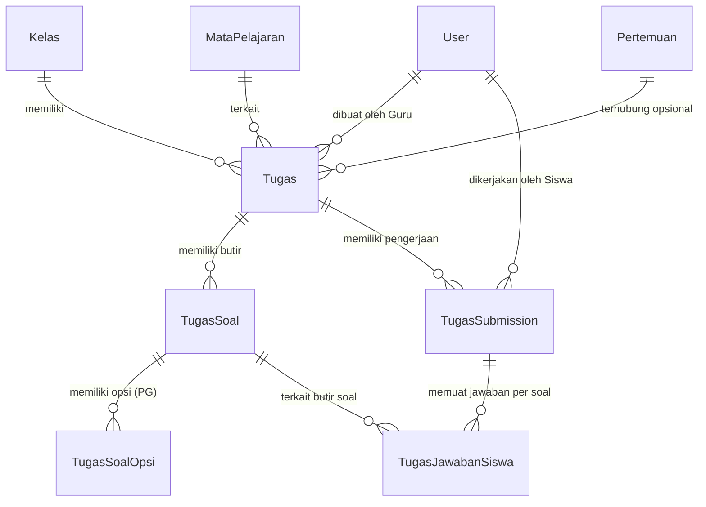
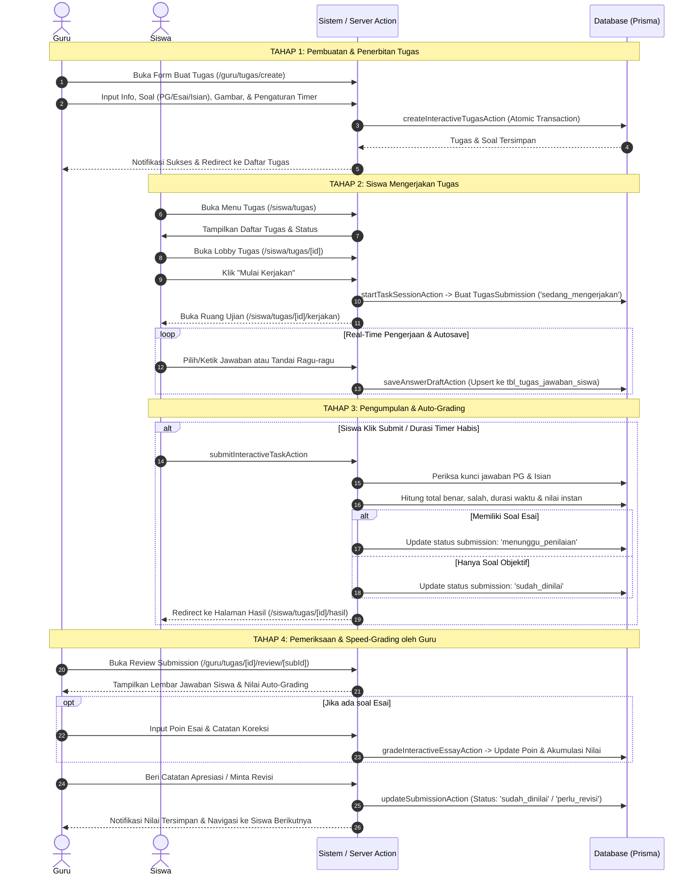

# Dokumentasi & Alur Kerja Bagian Tugas (Interactive Assessment System)
**Sistem Aplikasi Siswa & Guru Al-Azhar**

---

## 1. Ringkasan Eksekutif (Overview)

Modul **Tugas** adalah sistem asesmen dan Computer-Based Test (CBT) interaktif yang dirancang untuk mendukung pembelajaran digital bagi siswa dan guru. Modul ini terintegrasi penuh dengan data **Kelas**, **Mata Pelajaran (Mapel)**, dan **Pertemuan Pembelajaran**.

### Karakteristik Utama:
1. **Pengerjaan Interaktif In-App**: Siswa tidak perlu mengunggah berkas secara terpisah; mereka dapat langsung mengerjakan kuis atau latihan di aplikasi seperti simulasi CBT modern.
2. **Auto-Grading & Hybrid Evaluation**:
   - Soal objektif (*Pilihan Ganda*, *Pilihan Gambar*, *Isian Singkat*) dinilai **100% otomatis** secara instan saat siswa mengumpulkan tugas.
   - Soal subjektif (*Esai / Uraian*) diarahkan ke status *Menunggu Penilaian* agar guru dapat memberikan nilai manual dan catatan koreksi per butir soal.
3. **Fitur Ujian Modern**:
   - Live Countdown Timer dengan *Auto-Submit* saat durasi waktu habis.
   - Real-time Draft Autosave ke database dan cadangan *LocalStorage* anti-hilang.
   - Pilihan Acak Soal (*Shuffle Questions*) & Acak Opsi (*Shuffle Choices*).
   - Tinjauan Ragu-Ragu dan palet nomor soal interaktif.
   - Tampilan ramah anak (*Kids-friendly Celebration & Feedback*).
   - *Speed-Grader* untuk mempermudah guru memeriksa lembar kerja siswa satu per satu dengan navigasi cepat.

---

## 2. Struktur Data & Database (Prisma Schema)

Hubungan antar-tabel pada modul Tugas digambarkan sebagai berikut:

### Penjelasan Entitas Database:
1. **`tbl_tugas` (`model Tugas`)**:
   - `id`: Primary key unik tugas.
   - `kelas_id`, `mapel_id`, `guru_id`: Relasi ke kelas sasaran, mata pelajaran, dan guru pembuat.
   - `pertemuan_id`: Relasi opsional ke pertemuan materi belajar.
   - `judul`, `deskripsi`: Informasi judul dan instruksi pengerjaan.
   - `deadline`: Tenggat waktu pengumpulan (tanggal & jam).
   - `durasi_menit`: Batas waktu pengerjaan (timer CBT).
   - `acak_soal` & `acak_opsi`: Pengaturan acak urutan soal dan pilihan jawaban.
   - `tampilkan_nilai_instan`: Boolean penentu apakah nilai dan pembahasan langsung dapat dilihat siswa setelah submit.
   - `poin_maksimal`: Skor total maksimal (default 100).
   - `status`: Status publikasi tugas (`aktif`, dll).
   - `tipe_pengerjaan`: Jenis pengerjaan (default: `INTERAKTIF`).

2. **`tbl_tugas_soal` (`model TugasSoal`)**:
   - `nomor_urut`: Urutan butir soal.
   - `tipe_soal`: `PILIHAN_GANDA`, `PILIHAN_GAMBAR`, `ISIAN_SINGKAT`, atau `ESAI`.
   - `pertanyaan`: Teks pertanyaan soal.
   - `gambar_soal`: URL stimulus gambar (opsional).
   - `bobot_poin`: Poin untuk butir soal ini.
   - `kunci_jawaban`: Kunci jawaban pembanding (label opsi atau teks isian).
   - `pembahasan`: Penjelasan jawaban yang akan dipelajari siswa setelah selesai.

3. **`tbl_tugas_soal_opsi` (`model TugasSoalOpsi`)**:
   - Opsi jawaban untuk tipe soal pilihan ganda / gambar.
   - `label`: Label huruf (A, B, C, D, E).
   - `teks_opsi`: Konten teks opsi.
   - `gambar_opsi`: Gambar ilustrasi opsi jika ada.
   - `is_benar`: Menandai opsi yang merupakan kunci jawaban yang benar.

4. **`tbl_tugas_submission` (`model TugasSubmission`)**:
   - Mencatat sesi dan hasil pengerjaan satu orang siswa untuk satu tugas (unique `[tugas_id, siswa_id]`).
   - `status`:
     - `sedang_mengerjakan`: Siswa sedang dalam sesi pengerjaan.
     - `menunggu_penilaian`: Tugas telah dikumpulkan, menunggu pemeriksaan soal esai oleh guru.
     - `sudah_dinilai`: Penilaian final selesai (otomatis atau sudah dikoreksi guru).
     - `perlu_revisi`: Guru meminta siswa memperbaiki pengerjaan.
     - `terlambat`: Siswa mengumpulkan melewati batas deadline.
   - `mulai_mengerjakan_at` & `selesai_mengerjakan_at`: Jejak waktu mulai dan selesai.
   - `durasi_detik`: Lama waktu pengerjaan siswa.
   - `total_soal`, `total_benar`, `total_salah`: Statistik jawaban.
   - `nilai_otomatis`, `nilai_manual`, `nilai`: Perhitungan nilai akhir siswa.
   - `catatan_guru`: Catatan evaluasi/apresiasi umum dari guru.

5. **`tbl_tugas_jawaban_siswa` (`model TugasJawabanSiswa`)**:
   - Rekam jejak jawaban siswa per butir soal (unique `[submission_id, soal_id]`).
   - `jawaban_siswa`: Jawaban yang dipilih/diketik (misal: "B", isian pendek, atau teks esai panjang).
   - `is_ragu`: Penanda status tanda ragu-ragu di antarmuka ujian.
   - `is_benar`: Hasil validasi kebenaran (`true`, `false`, atau `null` untuk esai).
   - `poin_didapat`: Poin yang diperoleh untuk soal tersebut.
   - `catatan_koreksi`: Feedback khusus dari guru untuk jawaban siswa tersebut.

---

## 3. Alur Kerja Menyeluruh (End-to-End Workflow)

Berikut diagram alir pengerjaan tugas dari pembuatan hingga penerimaan nilai:

---

## 4. Rincian Teknis per Tahap Pengerjaan

### A. Alur Guru: Pembuatan Tugas (`InteractiveTaskBuilder`)
- **Lokasi Kode**:
  - Halaman: `src/app/(dashboard)/guru/tugas/create/page.tsx`
  - Komponen: `src/components/features/assignment/builder/`
  - Server Action: `createInteractiveTugasAction`, `uploadTaskImageAction` di `src/actions/assignment.ts`
- **Langkah-langkah**:
  1. **Langkah 1 (Info Tugas)**: Mengisi judul tugas, deskripsi instruksi, memilih kelas target, mata pelajaran, serta memilih pertemuan (opsional).
  2. **Langkah 2 (Penyusunan Soal)**:
     - Menambah soal dengan 4 variasi tipe:
       - `PILIHAN_GANDA`: Teks pertanyaan + minimal 2 opsi pilihan bertanda kunci benar.
       - `PILIHAN_GAMBAR`: Pilihan jawaban dapat berupa gambar visual (sangat cocok untuk murid SD).
       - `ISIAN_SINGKAT`: Jawaban berupa kata/angka kunci pasti.
       - `ESAI`: Jawaban teks bebas yang membutuhkan argumen siswa.
     - Mengunggah gambar stimulus untuk pertanyaan atau opsi (didukung upload hingga 10MB dengan format aman: PNG, JPG, WebP).
     - Menentukan bobot poin masing-masing butir soal.
     - Menuliskan pembahasan soal sebagai sarana edukasi siswa.
  3. **Langkah 3 (Pengaturan & Publikasi)**:
     - Durasi waktu pengerjaan (menit) atau tanpa batas waktu.
     - Opsi acak urutan butir soal (`acak_soal`).
     - Opsi acak posisi opsi jawaban (`acak_opsi`).
     - Pengaturan transparansi nilai instan ke siswa (`tampilkan_nilai_instan`).
  4. Penyimpanan database dilakukan secara atomik menggunakan Prisma Transaction (`prisma.$transaction`) untuk memastikan tidak terjadi data soal yang menggantung jika terjadi error jaringan.

---

### B. Alur Siswa: Pengerjaan Tugas (`InteractiveTaskRunner`)
- **Lokasi Kode**:
  - Halaman:
    - Daftar: `src/app/(dashboard)/siswa/tugas/page.tsx`
    - Lobby: `src/app/(dashboard)/siswa/tugas/[tugasId]/page.tsx`
    - Ujian: `src/app/(dashboard)/siswa/tugas/[tugasId]/kerjakan/page.tsx`
    - Hasil: `src/app/(dashboard)/siswa/tugas/[tugasId]/hasil/page.tsx`
  - Komponen: `src/components/features/assignment/runner/`
  - Server Action: `startTaskSessionAction`, `saveAnswerDraftAction`, `submitInteractiveTaskAction`
- **Fitur Unggulan Pengerjaan**:
  1. **Lobby Pengenalan**: Siswa membaca ringkasan tugas (guru pengampu, deadline, durasi, total soal) dan status submission sebelum memulai pengerjaan.
  2. **Inisialisasi Sesi Aman**: Saat menekan "Mulai Kerjakan", sistem mengunci sesi dan mencatat waktu mulai (`mulai_mengerjakan_at`).
  3. **Real-Time Autosave**:
     - Setiap kali siswa mengklik salah satu opsi jawaban atau mengetik teks jawaban, `saveAnswerDraftAction` langsung menyimpan data ke database.
     - Cadangan jawaban juga disimpan di `localStorage` peramban untuk mencegah kehilangan jawaban jika koneksi internet terputus seketika.
  4. **Penanda Ragu-Ragu & Palet Soal**: Siswa dapat menandai soal yang belum yakin dengan status *Ragu-Ragu* (berwarna kuning pada nomor soal) sehingga mudah ditemukan kembali.
  5. **Auto-Submit Timer**: Jika waktu durasi yang ditentukan telah habis, antarmuka otomatis memanggil fungsi pengumpulan tanpa menghilangkan jawaban yang telah dipilih.

---

### C. Alur Penilaian & Evaluasi Otomatis (Auto-Grading)
- **Mekanisme Penilaian**:
  $$\text{Nilai Akhir} = \left(\frac{\text{Total Poin Diperoleh}}{\text{Total Bobot Seluruh Soal}}\right) \times \text{Poin Maksimal}$$
- **Aturan Penentuan Status Hasil**:
  1. **Tugas Objektif Penuh (Hanya PG & Isian Singkat)**:
     - Begitu submit, sistem langsung mengoreksi seluruh jawaban dengan mencocokkan kunci jawaban.
     - Nilai dihitung instan, total benar dan salah dicatat.
     - Status submission langsung ditetapkan menjadi **`sudah_dinilai`**.
     - Siswa langsung dialihkan ke halaman hasil dan pembahasan.
  2. **Tugas Campuran / Esai**:
     - Jawaban PG tetap dikoreksi otomatis oleh sistem.
     - Jawaban esai disimpan dalam kondisi belum dinilai (`is_benar: null`).
     - Status submission ditetapkan menjadi **`menunggu_penilaian`**.
     - Nilai final baru ditetapkan setelah guru menyelesaikan pemeriksaan esai.

---

### D. Alur Guru: Evaluasi & Speed-Grader (`TeacherInteractiveTaskReview`)
- **Lokasi Kode**:
  - Halaman: `src/app/(dashboard)/guru/tugas/[tugasId]/review/[subId]/page.tsx`
  - Komponen: `src/components/features/assignment/teacher/`
  - Server Action: `gradeInteractiveEssayAction`, `updateSubmissionAction`
- **Fitur Pemeriksaan**:
  1. **Tabel Submisi Siswa**: Guru dapat melihat daftar seluruh siswa kelas dengan status filter (*Perlu Koreksi*, *Sudah Dinilai*, *Belum Mengumpulkan*).
  2. **Speed-Grader**:
     - Tombol navigasi **Siswa Sebelumnya** dan **Siswa Selanjutnya** memungkinkan guru memeriksa lembar kerja berurutan dengan cepat tanpa bolak-balik ke halaman daftar.
  3. **Penilaian Butir Esai**:
     - Guru membaca jawaban esai siswa berdampingan dengan kunci/panduan jawaban.
     - Guru menginput perolehan poin (0 s/d bobot maksimal soal) dan catatan feedback khusus untuk butir soal tersebut.
     - Sistem otomatis mengakumulasi ulang nilai total submission secara *real-time*.
  4. **Feedback & Revisi**:
     - Guru dapat memberikan catatan apresiasi umum.
     - Jika jawaban siswa kurang memuaskan, guru dapat memilih opsi **Minta Siswa Revisi** (`status: perlu_revisi`) dengan melampirkan alasan perbaikan.

---

## 5. Ringkasan File & Komponen Kunci

| Path Berkas | Peran & Tanggung Jawab |
|---|---|
| `src/actions/assignment.ts` | Server Actions logika bisnis: CRUD tugas, upload gambar, autosave draft, auto-grading, scoring esai, dan update feedback. |
| `src/app/(dashboard)/guru/tugas/page.tsx` | Dashboard daftar seluruh tugas guru beserta metrik penugasan (menunggu koreksi, selesai dinilai). |
| `src/app/(dashboard)/guru/tugas/create/page.tsx` | Halaman formulir pembuatan tugas interaktif baru. |
| `src/app/(dashboard)/guru/tugas/[tugasId]/page.tsx` | Halaman rincian tugas dan tabel pengerjaan seluruh siswa satu kelas. |
| `src/app/(dashboard)/guru/tugas/[tugasId]/review/[subId]/page.tsx` | Halaman *Speed-Grader* untuk mengevaluasi jawaban siswa tertentu secara mendalam. |
| `src/app/(dashboard)/siswa/tugas/page.tsx` | Halaman daftar tugas siswa yang sedang aktif dan riwayat nilai. |
| `src/app/(dashboard)/siswa/tugas/[tugasId]/page.tsx` | Halaman *Lobby Tugas* sebelum siswa memulai ujian. |
| `src/app/(dashboard)/siswa/tugas/[tugasId]/kerjakan/page.tsx` | Halaman pengerjaan ujian interaktif (*Computer Based Test*). |
| `src/app/(dashboard)/siswa/tugas/[tugasId]/hasil/page.tsx` | Halaman skor, perayaan hasil belajar, dan pembahasan jawaban. |
| `src/components/features/assignment/builder/*` | Komponen interaktif wizard pembuatan soal (Info, Soal, Opsi, Bobot, Pengaturan). |
| `src/components/features/assignment/runner/*` | Komponen ujian siswa: header timer, kartu soal, palet nomor, dan dialog konfirmasi. |
| `src/components/features/assignment/teacher/*` | Komponen review guru: koreksi esai instan, form nilai, catatan, dan tombol navigasi siswa. |
| `src/components/features/assignment/result/*` | Komponen penyajian nilai, animasi apresiasi anak, dan review pembahasan. |
