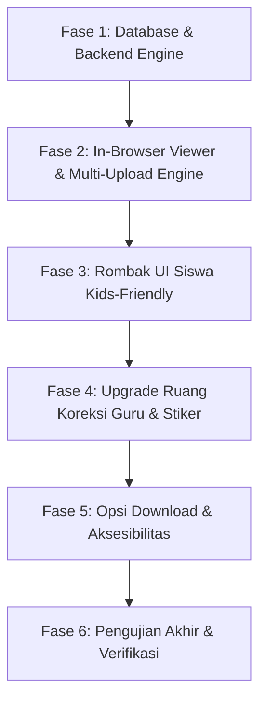

# Blueprint & Rencana Implementasi: Sistem Tugas Siswa Kids-Friendly, Pengumpulan & Koreksi Tanpa Download (In-Browser)

> **Aplikasi:** Student Apps — SD & SMP Islam Al-Azhar Cairo Palembang  
> **Target Berkas:** `c:\ruang-kerja-alazhar\student-app\plan-tugas-siswa.md`  
> **Status:** Siap Dieksekusi (*Ready for Implementation*)  
> **Sasaran Utama:** Mengganti (*revamp*) modul tugas siswa saat ini menjadi antarmuka ramah anak (*Kids-Friendly UI/UX*), mendukung alur pengumpulan & koreksi interaktif di dalam browser tanpa harus download (*Zero-Download In-Browser Workflow*), multi-foto/multi-halaman lembar tugas, stiker apresiasi guru, serta tetap menyediakan tombol download fleksibel bagi yang membutuhkan arsip offline.

---

## 1. Latar Belakang & Analisis Kondisi Saat Ini (*Current State vs Target*)

### Masalah pada Implementasi Saat Ini:
1. **Pengumpulan Hanya Mendukung 1 Berkas (*Single File Limitation*)**:
   - Di lapangan, siswa SD/SMP mengerjakan PR buku tulis/LKS yang terdiri dari 2–4 halaman foto. Saat ini sistem hanya memiliki kolom `file_url` tunggal di `TugasSubmission`. Siswa kesulitan jika harus menggabungkan foto menjadi PDF secara mandiri.
2. **Ketergantungan Download / Viewer Terbatas**:
   - Siswa sering kali harus mengunduh file petunjuk/soal guru ke perangkat sebelum bisa membacanya.
   - Pratinjau PDF di browser masih mengandalkan tag `<iframe>` standar yang sering macet di peramban seluler (Chrome Android/Safari iOS) atau memicu download otomatis oleh browser.
3. **UI/UX Monoton & Terlalu Formal (Belum Kids-Friendly)**:
   - Tampilan saat ini bernuansa aplikasi administrasi kantor (tabel abu-abu, teks kecil, istilah kaku seperti *"Submit", "Deadline", "Poin Maksimal"*).
   - Belum ada elemen gamifikasi, apresiasi visual, atau mikromotivasi yang membuat anak-anak senang dan bersemangat membuka tugas mereka.
4. **Koreksi Guru Belum Mendukung Multi-Halaman & Apresiasi Ramah Anak**:
   - Kanvas coretan guru di `in-browser-grader.tsx` baru bekerja pada satu gambar tunggal. Belum ada dukungan multi-halaman dan stiker koreksi Islami/edukatif (seperti *"Mumtaz! ⭐"*, *"Barakallah 🌸"*, centang hijau besar, atau stiker jempol).
   - Guru harus bolak-balik kembali ke daftar tugas untuk beralih ke siswa berikutnya (*tidak ada fitur Speed-Grader Next/Previous Student*).

---

## 2. Paradigma Baru: 4 Pilar Pengalaman Pengguna (*The 4 Core Pillars*)

```
┌─────────────────────────────────────────────────────────────────────────────────────────────┐
│                             MODUL TUGAS SISWA AL-AZHAR (NEW)                                │
├──────────────────────────────┬──────────────────────────────┬───────────────────────────────┤
│    1. KIDS-FRIENDLY UI/UX    │   2. ZERO-DOWNLOAD WORKFLOW  │   3. TEACHER SPEED-GRADER     │
│   • Misi Belajar Ceria       │   • In-Browser PDF/Img Viewer│   • Multi-Page Canvas Marking │
│   • Multi-Foto Lembar PR     │   • In-Browser Coretan Guru  │   • Stiker Pujian Islami      │
│   • Efek Konfeti & Bintang   │   • Live Pratinjau Jawaban   │   • Quick Feedback Presets    │
│   • Bahasa Hangat & Semangat │   • Tetap Ada Opsi Download  │   • Navigasi Murid Cepat (⇦ ⇨) │
└──────────────────────────────┴──────────────────────────────┴───────────────────────────────┘
```

### Pilar 1: Antarmuka Ramah Anak (*Kids-Friendly UI/UX*)
- **Metafora "Misi Belajar"**: Mengubah istilah birokratis menjadi petualangan belajar:
  - *Daftar Tugas* ➔ **"Pusat Misi & Tantangan Belajar" 🚀**
  - *Belum Dikerjakan* ➔ **"Tantangan Baru Siap Dikerjakan" 🎯**
  - *Menunggu Penilaian* ➔ **"Sedang Diperiksa Ustadz/Ustadzah" ⏳**
  - *Sudah Dinilai* ➔ **"Misi Selesai! Lihat Bintangmu" ⭐**
  - *Perlu Revisi* ➔ **"Yuk Poles & Perbaiki Sedikit Lagi!" ✏️**
- **Sentuhan Visual Menyenangkan**:
  - Kartu tugas berwarna hangat dengan icon mata pelajaran tematik (Matematika 📐, PAI 🕌, IPA 🔬, Bahasa Arab 📖, dll.).
  - Indikator langkah mudah (*Step 1: Pahami Soal ➔ Step 2: Foto Lembar Jawaban ➔ Step 3: Kirim ➔ Step 4: Dapat Bintang*).
  - Animasi perayaan (*Celebration Effect* via `canvas-confetti`) ketika siswa berhasil mengirim tugas dan saat menerima nilai tinggi (A/100).
  - Tombol-tombol berukuran besar (*touch-friendly*), sudut membulat lembut (`rounded-2xl`), dan teks instruksi yang ramah anak.

### Pilar 2: Pengumpulan & Pratinjau Tanpa Download (*Zero-Download In-Browser*)
- **In-Browser Soal Viewer**: Siswa dapat langsung melihat lampiran soal dari guru (dokumen PDF, lembar kerja bergambar, teks) dalam jendela pratinjau interaktif tanpa harus mengunduh file ke memori HP/laptop mereka.
- **Multi-Photo Homework Uploader**: Siswa dapat mengunggah beberapa foto lembar jawaban sekaligus (Halaman 1, Halaman 2, Halaman 3) langsung dari kamera HP atau galeri.
- **In-Browser Lembar Koreksi**: Saat tugas sudah diperiksa, siswa dapat langsung membuka lembar tugas mereka dan melihat coretan pena digital serta stiker apresiasi guru langsung di layar secara interaktif.
- **Opsi Download Cadangan**: Tombol *"Unduh Berkas"* tetap disematkan secara rapi bagi orang tua atau siswa yang ingin mencetak atau menyimpan dokumen secara offline.

### Pilar 3: Ruang Koreksi Guru Cepat (*Speed-Grader & Sticker Tool*)
- **Multi-Page Inspection**: Guru dapat memeriksa lembar kerja siswa halaman demi halaman tanpa keluar dari tampilan.
- **Digital Pen & Sticker Feedback**:
  - Pen digital warna merah (koreksi) dan hijau (benar).
  - **Stiker Apresiasi Digital**: Stiker *"Mumtaz!"*, *"Hebat Sekali!"*, *"Barakallah!"*, *"Bintang 5"*, *"Perlu Lebih Teliti"*.
- **Quick Comment Bank**: Satu klik untuk memasukkan ulasan khas Al-Azhar (*"Barakallah, pengerjaan sangat rapi dan tepat!"*, *"Alhamdulillah, konsep sudah dipahami dengan baik."*).
- **Fast Next/Prev Navigation**: Tombol panah atas/bawah atau tombol *"Siswa Berikutnya"* langsung memuat lembar kerja siswa lain tanpa refresh halaman atau bolak-balik tabel.

### Pilar 4: Opsi Download Fleksibel (*Flexible Download Access*)
- Setiap berkas (soal guru, jawaban siswa, dan lembar hasil koreksi guru) dilengkapi tautan download langsung dengan nama file yang rapi (contoh: `Soal-Matematika-Bab3.pdf`, `Tugas-Ahmad-Fauzan-Halaman-1.png`, `Koreksi-Ustadz-Ahmad.png`).

---

## 3. Desain Komponen & Antarmuka (*Component Architecture*)

### A. Komponen Sisi Siswa (`src/components/assignment/`)

| Nama Komponen | Status | Peran & Fitur Utama |
|---|---|---|
| `student-task-quest-list.tsx` | **Baru (Mengganti `student-task-list.tsx`)** | Menampilkan kartu tugas gaya misi ceria, filter tab berwarna cerah, badge status interaktif, progress bar pengerjaan, dan kartu kosong ramah anak. |
| `kids-submission-zone.tsx` | **Baru (Mengganti `file-submission-zone.tsx`)** | Zona unggah multi-foto/PDF/teks dengan pratinjau thumbnail, tombol ambil foto dari kamera, drag-and-drop ramah anak, dan konfirmasi ceria. |
| `in-browser-doc-viewer.tsx` | **Baru** | Komponen modal/inline viewer serbaguna untuk membaca PDF dan Foto (dengan fitur zoom in/out, rotasi, pan, navigasi multi-halaman, serta tombol download opsional). |
| `student-correction-viewer.tsx` | **Baru** | Tampilan hasil koreksi siswa di browser: memperlihatkan nilai besar, stiker dari guru, coretan pena guru di atas foto PR siswa, dan umpan balik guru. |
| `kids-celebration-modal.tsx` | **Baru** | Modal pop-up animasi bintang & konfeti (`canvas-confetti`) saat siswa berhasil mengumpulkan tugas atau memperoleh predikat "Mumtaz". |

### B. Komponen Sisi Guru (`src/components/assignment/`)

| Nama Komponen | Status | Peran & Fitur Utama |
|---|---|---|
| `in-browser-grader.tsx` | **Dirombak Total** | Workspace split-screen modern: mendukung koreksi multi-halaman, stiker apresiasi digital, pen merah/hijau, highlight, navigasi siswa berikutnya/sebelumnya tanpa pindah halaman. |
| `sticker-palette.tsx` | **Baru** | Palet stiker interaktif untuk guru menempelkan badge apresiasi pada lembar tugas siswa (Mumtaz, Barakallah, 100, Bintang Emas, Jempol). |
| `quick-feedback-picker.tsx` | **Baru** | Tombol cepat untuk memasukkan preset catatan evaluasi yang mendidik dan Islami. |
| `teacher-submissions-view.tsx` | **Disesuaikan** | Tampilan rekap pengumpulan kelas dengan thumbnail kecil jawaban siswa dan status visual yang lebih jelas. |

---

## 4. Penyesuaian Skema Database & Penyimpanan Berkas (*Database & Data Model*)

Untuk mendukung pengumpulan multi-foto lembar tugas dan stiker koreksi tanpa merusak data lama (*backward-compatible*), skema `TugasSubmission` disesuaikan:

```prisma
// Penambahan pada model TugasSubmission di prisma/schema.prisma:
model TugasSubmission {
  id                 BigInt    @id @default(autoincrement()) @db.UnsignedBigInt
  tugas_id           BigInt    @db.UnsignedBigInt
  siswa_id           BigInt    @db.UnsignedBigInt
  
  // Berkas Utama (Backward Compatible)
  file_url           String    @db.VarChar(500)
  file_name          String    @db.VarChar(255)
  file_type          String    @db.VarChar(50)
  file_size          Int?
  
  // FITUR BARU: Dukungan Multi-Berkas (JSON string array)
  // Format: [{"url": "/uploads/...", "name": "Lembar 1.jpg", "type": "image", "size": 120400}]
  attachments        String?   @db.Text
  
  catatan_siswa      String?   @db.Text
  status             String    @default("menunggu_penilaian") @db.VarChar(50)
  nilai              Float?
  catatan_guru       String?   @db.Text
  
  // Lembar beranotasi guru (bisa berupa gambar tunggal atau JSON multi-halaman beranotasi)
  annotated_file_url String?   @db.VarChar(500)
  annotated_data     String?   @db.Text // Menyimpan koordinat stiker/anotasi per halaman (JSON)
  
  submitted_at       DateTime  @default(now()) @db.Timestamp(0)
  graded_at          DateTime? @db.Timestamp(0)
  graded_by          BigInt?   @db.UnsignedBigInt
  
  tugas              Tugas     @relation(fields: [tugas_id], references: [id], onDelete: Cascade)
  siswa              User      @relation(fields: [siswa_id], references: [id], onDelete: Cascade)

  @@unique([tugas_id, siswa_id], map: "unique_submission_per_siswa")
  @@index([tugas_id, status])
  @@index([siswa_id])
  @@map("tbl_tugas_submission")
}
```

> **Catatan Kompatibilitas:** Jika `attachments` bernilai `null` (data tugas lama), sistem secara otomatis mengemas `file_url` lama ke dalam format multi-berkas virtual beranggotakan 1 berkas. Tidak ada data lama yang rusak!

---

## 5. Rincian Alur Pengalaman Pengguna (*Detailed User Journey*)

### A. Alur Siswa (Murid)

```
[1. Buka Menu Tugas] 
   └── Kartu Misi Interaktif dengan warna Mapel, Tenggat Waktu Ceria, & Badge Status
[2. Buka Detail Tugas] 
   ├── Baca Instruksi Guru
   └── [Tombol "Baca Soal di Layar"] ➔ Membuka In-Browser Viewer (Tanpa Download)
[3. Pengumpulan Lembar Jawaban (Kids-Friendly)]
   ├── Opsi 1: Ambil Foto / Upload Multi-Foto (Halaman 1, Halaman 2, dst.)
   ├── Opsi 2: Unggah PDF Tugas
   ├── Opsi 3: Tulis Jawaban Langsung di Kotak Jawaban
   └── Pratinjau Thumbnail (Bisa di-zoom/dicek sebelum kirim)
[4. Klik "Kumpulkan Misi Tugas! 🚀"]
   └── Efek Konfeti Ceria + Suara / Pesan Sukses Menggembirakan
[5. Setelah Dinilai Guru]
   ├── Skor Besar dengan Predikat (Mumtaz / Sangat Baik / Bintang 5)
   ├── Buka Lembar Jawaban ➔ Lihat coretan merah/hijau & stiker apresiasi guru langsung di layar!
   └── Opsi Tombol "Unduh Lembar Koreksi" jika ingin disimpan ke galeri/cetak
```

### B. Alur Guru

```
[1. Buka Daftar Tugas Kelas]
   └── Lihat statistik pengumpulan (Berapa yang sudah kumpul, menunggu dinilai, selesai)
[2. Masuk ke Ruang Koreksi (Speed Grader)]
   ├── Split Screen: Kiri = Lembar Kerja Siswa, Kanan = Panel Nilai & Feedback
   ├── Multi-Page Selector: Beralih antar Halaman 1, 2, 3 lembar kerja siswa
   ├── Alat Koreksi Kanvas:
   │    ├── Spidol Merah (Salah / Koreksi) & Spidol Hijau (Benar)
   │    ├── Alat Centang Cepat (✔)
   │    └── Stiker Apresiasi Guru ("Mumtaz! ⭐", "Barakallah!", "Bintang 5")
   ├── Quick Feedback Presets: Pilih catatan pujian/evaluasi dengan 1 klik
   ├── Input Nilai Angka (0 - 100)
   └── Klik "Simpan & Lanjut ke Siswa Berikutnya ➜" (Langsung memuat siswa berikutnya)
```

---

## 6. Inventaris Modifikasi & Pembuatan Berkas (*File Action Inventory*)

### A. Berkas yang Diganti / Dibuat Baru (*New & Replaced Files*)

1. **`src/components/assignment/in-browser-doc-viewer.tsx`** *(Baru)*:
   - Komponen pratinjau dokumen in-browser (PDF & Gambar) tanpa download.
   - Dilengkapi fungsi zoom, pan, rotate, multi-page slide, dan opsi download opsional di sudut kanan.
2. **`src/components/assignment/student-task-quest-list.tsx`** *(Baru)*:
   - Menggantikan `student-task-list.tsx`.
   - Mengusung tema kids-friendly, quest cards, progress pills, dan visual avatar/icon mata pelajaran.
3. **`src/components/assignment/kids-submission-zone.tsx`** *(Baru)*:
   - Menggantikan `file-submission-zone.tsx`.
   - Mendukung multi-photo upload (reorder, zoom preview, camera snap, document picker).
   - Menampilkan hasil koreksi guru beserta stiker apresiasi secara visual.
4. **`src/components/assignment/kids-celebration-modal.tsx`** *(Baru)*:
   - Animasi konfeti dan dialog selamat setelah siswa berhasil mengumpulkan tugas.
5. **`src/components/assignment/sticker-palette.tsx`** *(Baru)*:
   - Kumpulan stiker digital bernuansa Islami dan edukatif untuk ditempelkan guru pada lembar kerja murid.
6. **`src/components/assignment/quick-feedback-picker.tsx`** *(Baru)*:
   - Komponen preset komentar guru yang mendidik dan memotivasi anak-anak.

### B. Berkas yang Dirombak / Ditingkatkan (*Updated Files*)

1. **`src/app/(dashboard)/siswa/tugas/page.tsx`**:
   - Memakai `StudentTaskQuestList` baru, menambahkan salam ceria islami (*"Assalamu'alaikum, [Nama Siswa]! Siap menyelesaikan misi belajar hari ini?"*), dan statistik bintang siswa.
2. **`src/app/(dashboard)/siswa/tugas/[tugasId]/page.tsx`**:
   - Desain ulang tampilan detail tugas: Card soal dengan pratinjau in-browser instan, tombol *"Buka Soal"* tanpa download, dan integrasi `KidsSubmissionZone`.
3. **`src/components/assignment/in-browser-grader.tsx`**:
   - Peningkatan menjadi Speed-Grader: mendukung multi-halaman dokumen siswa, penempelan stiker apresiasi, navigasi antar siswa (*Next/Previous Student*), dan preset umpan balik.
4. **`src/app/(dashboard)/guru/tugas/[tugasId]/review/[subId]/page.tsx`**:
   - Menyediakan data siswa berikutnya & sebelumnya (*next/previous student ID*) agar guru dapat berpindah dengan mulus tanpa kembali ke daftar.
5. **`src/actions/assignment.ts`**:
   - Memperbarui `submitTugasAction` untuk memproses multi-file upload (`attachments` JSON).
   - Memperbarui `gradeTugasAction` untuk menyimpan anotasi multi-halaman dan stiker koreksi.
6. **`prisma/schema.prisma`**:
   - Menambahkan kolom `attachments` dan `annotated_data` pada model `TugasSubmission`.

---

## 7. Tahapan Implementasi Terstruktur (*Execution Phases*)



### Fase 1: Database & Backend Engine
- [ ] Tambahkan field `attachments` (`Text?`) dan `annotated_data` (`Text?`) ke `model TugasSubmission` di `prisma/schema.prisma`.
- [ ] Jalankan `npx prisma db push` atau migrasi skema.
- [ ] Perbarui `submitTugasAction` di `src/actions/assignment.ts` untuk menangani banyak file sekaligus (multi-foto lembar tugas siswa).
- [ ] Pastikan kompatibilitas mundur (*fallback* otomatis jika berkas berupa data lama).

### Fase 2: In-Browser Viewer & Multi-Upload Engine (Zero-Download Core)
- [ ] Bangun komponen `in-browser-doc-viewer.tsx` yang bersih, cepat, mendukung format gambar (JPG/PNG/WEBP) dan dokumen PDF dengan kontrol zoom, putar, dan fullscreen.
- [ ] Buat zona multi-upload lembar jawaban: siswa bisa klik tombol *"Tambah Lembar Foto"*, ambil dari kamera HP atau galeri, lihat urutan lembar (Lembar 1, Lembar 2, dst.), dan hapus lembar yang salah.
- [ ] Buat pratinjau langsung sebelum siswa mengirim tugas (siswa bisa memeriksa kembali apakah tulisan di fotonya terbaca jelas atau buram).

### Fase 3: Rombak UI Siswa (*Kids-Friendly Makeover*)
- [ ] Buat `student-task-quest-list.tsx` dengan gaya kartu misi berwarna pastel Al-Azhar, icon ceria, dan tab filter yang ramah anak.
- [ ] Perbarui `src/app/(dashboard)/siswa/tugas/page.tsx` dengan sapaan hangat Al-Azhar dan ringkasan misi tugas.
- [ ] Perbarui `src/app/(dashboard)/siswa/tugas/[tugasId]/page.tsx` dengan layout petualangan belajar, tombol pratinjau soal di layar, dan integrasi `kids-submission-zone.tsx`.
- [ ] Pasang efek konfeti gembira (`canvas-confetti`) saat tugas berhasil dikirim dan ketika siswa membuka tugas yang memperoleh nilai 100 / predikat "Mumtaz".

### Fase 4: Upgrade Ruang Koreksi Guru (*Speed-Grader & Stiker Apresiasi*)
- [ ] Upgrade `in-browser-grader.tsx` agar mendukung pemilihan halaman lembar siswa (jika siswa mengirim lebih dari 1 foto lembar kerja).
- [ ] Buat komponen `sticker-palette.tsx` (Stiker: Mumtaz ⭐, Barakallah 🕌, Bintang 5, Jempol 👍, Catatan Teliti ✏️).
- [ ] Buat komponen `quick-feedback-picker.tsx` dengan template ulasan guru Al-Azhar yang memotivasi siswa.
- [ ] Tambahkan tombol navigasi siswa cepat: *"⬅ Siswa Sebelumnya"* dan *"Siswa Berikutnya ➡"* di bilah atas koreksi.
- [ ] Perbarui `src/app/(dashboard)/guru/tugas/[tugasId]/review/[subId]/page.tsx` untuk menghitung urutan siswa di kelas tugas tersebut.

### Fase 5: Opsi Download Fleksibel & Arsip
- [ ] Pastikan tombol download tetap ada di setiap berkas (soal guru, lembar tugas siswa asli, lembar tugas beranotasi guru).
- [ ] Pastikan tautan download menggunakan endpoint `/api/download` dengan header `Content-Disposition: attachment` agar file terunduh dengan nama yang informatif dan tidak membuka tab kosong.

### Fase 6: Pengujian & Validasi
- [ ] Uji skenario siswa mengunggah 3 foto buku tulis dari HP/browser desktop.
- [ ] Uji pembacaan soal PDF dan foto langsung di layar tanpa download.
- [ ] Uji guru mencoret lembar kerja, menempelkan stiker, memberi nilai, dan berpindah ke siswa berikutnya.
- [ ] Uji tampilan siswa saat melihat nilai, catatan guru, dan lembar tugas berstiker di layar.
- [ ] Uji fungsi tombol download untuk memastikan file tetap dapat diunduh jika diinginkan.
- [ ] Uji responsivitas pada layar smartphone, tablet (iPad), dan desktop.

---

## 8. Panduan Desain & Palet Warna (*Kids-Friendly Visual Tokens*)

| Elemen / Token | Nilai / Kelas Tailwind | Deskripsi & Suasana |
|---|---|---|
| **Warna Utama (Al-Azhar Emerald)** | `#059669` / `bg-emerald-600` | Nuansa Islami yang segar, sejuk, dan terpercaya. |
| **Warna Misi Baru (Amber Gold)** | `#f59e0b` / `bg-amber-500` | Menarik perhatian anak untuk memulai misi baru. |
| **Warna Menunggu (Sky Blue)** | `#0284c7` / `bg-sky-500` | Ketenangan saat tugas sedang diperiksa guru. |
| **Warna Sukses (Emerald Green)** | `#10b981` / `bg-emerald-500` | Kepuasan & kebanggaan atas capaian belajar yang tuntas. |
| **Warna Revisi (Coral Soft)** | `#f97316` / `bg-orange-500` | Nada hangat yang menyemangati anak untuk memperbaiki tanpa rasa takut salah. |
| **Sudut Kartu (*Border Radius*)** | `rounded-2xl` s/d `rounded-3xl` | Sudut melengkung ramah anak (*playful & friendly*). |
| **Ukuran Sentuh (*Touch Target*)** | Minimal `h-11` (44px) | Nyaman disentuh oleh jari anak-anak di tablet/smartphone. |

---

## 9. Kesimpulan & Langkah Eksekusi Berikutnya

Rencana ini memberikan transformasi menyeluruh dari sistem penugasan yang kaku menjadi ekosistem belajar digital yang **menyenangkan, ramah anak, dan sangat efisien**:
- Siswa tidak lagi terbebani batasan 1 file atau kesulitan mengunduh lembar soal.
- Guru mengoreksi dengan cepat (*Speed-Grader*) disertai stiker pujian yang membahagiakan anak.
- Seluruh interaksi terjadi langsung di dalam browser (*In-Browser*), dengan opsi download cadangan yang tetap lengkap.

Setelah plan ini disetujui, eksekusi dapat dimulai secara bertahap sesuai **Tahapan Implementasi (Fase 1 s/d Fase 6)**.
