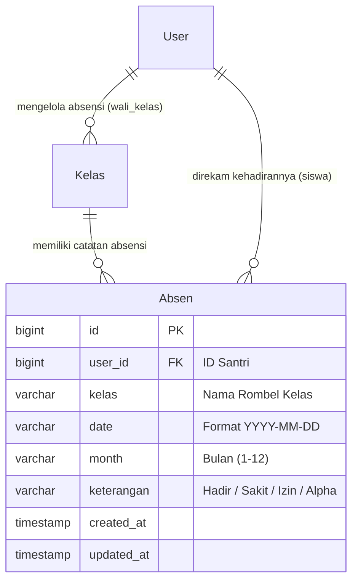
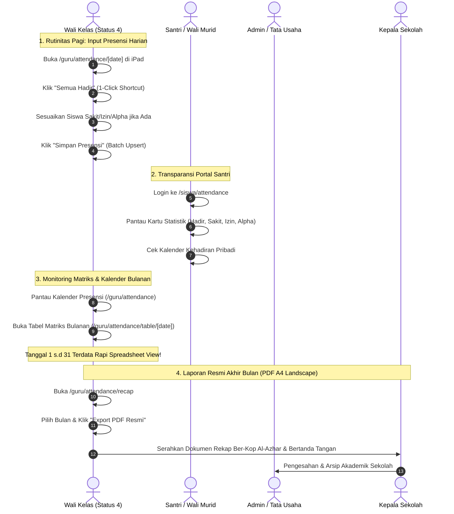

# Dokumentasi & Workflow Fitur Presensi Kehadiran (Sistem Absensi Siswa)
### SD - SMP Islam Al-Azhar Cairo Palembang
*Sistem Informasi Akademik & Portal Pembelajaran Digital (Student Apps)*

---

## 📌 1. Pendahuluan & Gambaran Umum

Dalam tradisi pendidikan **SD & SMP Islam Al-Azhar Cairo Palembang**, penegakan kedisiplinan dan pembiasaan adab (*ta'dib*) dimulai dari ketepatan waktu hadir di sekolah sebelum rangkaian ibadah sholat Dhuha, dzikir pagi, dan tadarus Al-Qur'an. Oleh karena itu, **Sistem Presensi Kehadiran Siswa (Sistem Absensi)** dirancang sebagai pilar monitoring harian yang akurat, transparan, dan terintegrasi penuh ke dalam ekosistem digital **Student Apps**.

Sistem absensi ini menggantikan buku absen fisik konvensional yang rentan hilang, rusak, atau lambat direkap. Menggunakan arsitektur modern berbasis web yang responsif di tablet iPad maupun smartphone guru, sistem menyediakan **4 pilar status kehadiran baku**:
1. **Hadir (H)**: Santri hadir tepat waktu mengikuti seluruh rangkaian KBM dan ibadah.
2. **Sakit (S)**: Santri berhalangan hadir disertai surat keterangan dokter atau konfirmasi wali murid.
3. **Izin (I)**: Santri berhalangan hadir karena kepentingan keluarga/syar'i dengan pemberitahuan resmi.
4. **Alpha (A)**: Santri tidak hadir tanpa keterangan (*unexcused absence*).

Fitur ini dirancang dengan empat sudut pandang antarmuka yang saling melengkapi: **Form Input Harian Cepat** dengan tombol *1-Click Set All Hadir*, **Kalender Presensi Bulanan Interaktif**, **Tabel Matriks Bulanan Spreadsheet (Tanggal 1–31)**, serta **Mesin Export PDF Resmi (A4 Landscape)** berstandar cetak dinas dan yayasan Al-Azhar.

---

## 🏗️ 2. Arsitektur Data & Model Relasi (Database Schema)

Seluruh aktivitas presensi disimpan dan dikelola pada tabel `tbl_absen` (`Absen`) dengan relasi kuat ke entitas Pengguna (`User`) dan Rombel Kelas (`Kelas`):

### Penjelasan Entitas Database Terkait:

1. **`tbl_absen` (`Absen`)**:
   - `id`: Primary key unik record absensi (BigInt autoincrement).
   - `user_id`: Foreign key merujuk ke tabel `users` (ID akun santri).
   - `kelas`: String nama rombel kelas santri saat presensi diambil (misal: `Kelas 4 - Mehmed Al Fatih`).
   - `date`: Tanggal presensi dalam format standar ISO `YYYY-MM-DD` (contoh: `2026-10-08`).
   - `month`: Indeks bulan kalender (`1` sampai `12`) untuk akselerasi query rekapitulasi bulanan.
   - `keterangan`: Nilai status kehadiran santri: `'Hadir'`, `'Sakit'`, `'Izin'`, atau `'Alpha'`.
   - `@@unique([user_id, date])`: Menjamin satu santri hanya memiliki satu status kehadiran per tanggal (mencegah duplikasi data absensi).

2. **Mekanisme Transaksi Batch Atomic (`prisma.$transaction`)**:
   - Saat Wali Kelas menyimpan presensi untuk seluruh santri di rombelnya (25–30 santri sekaligus), sistem mengeksekusi operasi `upsert` secara batch di dalam transaksi tunggal (`AttendanceService.recordAttendance`).
   - Hal ini menjamin integritas data: seluruh data kehadiran rombel tersimpan sempurna, atau dibatalkan sepenuhnya jika terjadi kendala jaringan (*ACID compliance*).

---

## 👥 3. Workflow Lengkap Pengelolaan Presensi Siswa

Alur kerja presensi mencakup siklus harian, bulanan, hingga pelaporan semesteran antara **Wali Kelas**, **Siswa/Orang Tua**, **Administrator**, dan **Pimpinan Sekolah**:

---

### A. Alur Kerja Guru & Wali Kelas: Penanggung Jawab Presensi Rombel

Wali Kelas (guru dengan status `"4"`) memegang otoritas eksklusif atas pencatatan dan pelaporan kehadiran rombel binaannya melalui menu `/guru/attendance`.

#### 1. Dashboard Kalender Presensi (`/guru/attendance`)
Ketika membuka menu presensi, Wali Kelas disajikan navigasi visual yang informatif:
- **Tiga Kartu Pintas Cepat (*Quick Navigation*)**:
  1. *Form Absen Hari Ini* ➔ Membuka form tanggal berjalan secara instan.
  2. *Tabel Absen Bulanan* ➔ Membuka spreadsheet matriks tanggal 1–31.
  3. *Rekap Absen & PDF* ➔ Membuka generator laporan resmi cetak PDF.
- **Kalender Presensi Bulanan Interaktif**:
  - Tanggal yang **sudah diisi** presensinya ditandai dengan warna hijau (*Filled*).
  - Tanggal yang **belum diisi** presensinya ditandai dengan warna netral.
  - Wali Kelas dapat mengklik tanggal manapun di kalender untuk melihat atau mengedit kembali absensi pada tanggal tersebut.

#### 2. Form Presensi Harian Cepat (`/guru/attendance/[date]`)
Form ini dirancang untuk kecepatan dan kepraktisan pengisian di pagi hari (selesai dalam waktu kurang dari 30 detik):
- **Otomasi Daftar Siswa**: Seluruh santri aktif di rombel binaan otomatis ditampilkan berurutan sesuai abjad nama.
- **Tombol Sakti "Semua Hadir" (*1-Click Set All*)**:
  Wali Kelas cukup mengklik tombol *Semua Hadir*, maka seluruh santri seketika tersetel berstatus Hadir.
- **Penyesuaian Fleksibel**:
  Wali Kelas cukup mengubah opsi santri yang tidak masuk menjadi **Sakit**, **Izin**, atau **Alpha**.
- **Ringkasan Real-Time (*Live Counter Badges*)**:
  Menampilkan jumlah santri Hadir, Sakit, Izin, dan Alpha secara langsung di bagian atas form sebelum data disimpan.
- **Pencarian Cepat Siswa**: Input pencarian nama atau NIS untuk rombel berkapasitas besar.
- **Hapus Data Presensi Tanggal**: Tombol hapus aman jika terjadi kesalahan input tanggal.

#### 3. Tabel Matriks Presensi Bulanan (`/guru/attendance/table/[date]`)
- Tampilan matriks komprehensif bergaya lembar kerja (*spreadsheet view*) yang membentang dari tanggal 1 hingga tanggal 28/30/31 bulan bersangkutan.
- Setiap kolom tanggal menampilkan kode inisial:
  - **H** (Hijau): Hadir
  - **S** (Biru): Sakit
  - **I** (Kuning): Izin
  - **A** (Merah): Alpha
  - **-** (Abu-abu): Hari libur atau belum ada KBM
- Memudahkan wali kelas melihat santri yang sering sakit berturut-turut atau santri yang terindikasi sering membolos (*alpha*).

#### 4. Generator Dokumen Rekapitulasi PDF Resmi (`/guru/attendance/recap`)
Modul pembuatan laporan cetak resmi berstandar tata kelola Al-Azhar:
- **Kalkulasi Otomatis**:
  Sistem menghitung total Hadir, Sakit, Izin, Alpha, serta **Persentase Kehadiran (%)** per santri:
  $$\text{Persentase Kehadiran} = \left( \frac{\text{Total Hadir}}{\text{Total Hari KBM}} \right) \times 100\%$$
- **Spesifikasi Dokumen PDF Berstandar Cetak**:
  - Format: **A4 Landscape**.
  - **Kop Surat Resmi**: `SD / SMP ISLAM AL-AZHAR CAIRO PALEMBANG`.
  - Judul Resmi: `REKAPITULASI PRESENSI KEHADIRAN SISWA`.
  - Sub-Header: Informasi Rombel Kelas, Tahun Pelajaran, Semester, dan Bulan Pelaporan.
  - Tabel Bergaris Rapi (*Striped Theme*): Kolom No, Nama Lengkap Siswa, NIS, L/P, Hadir, Sakit, Izin, Alpha, dan Persentase Kehadiran.
  - **Kolom Pengesahan Tanda Tangan**: Tempat dan tanggal pelaporan di Palembang, lengkap dengan kolom tanda tangan resmi Wali Kelas.

---

### B. Alur Kerja Siswa & Orang Tua: Pemantauan Kehadiran Mandiri

Portal santri di `/siswa/attendance` memberikan akses transparansi penuh terhadap kehadiran diri sendiri:
1. **Empat Kartu Metrik Kehadiran Bulanan**:
   - *Total Hari Hadir* (Angka besar dengan badge hijau).
   - *Total Hari Sakit* (Badge biru).
   - *Total Hari Izin* (Badge kuning).
   - *Total Hari Alpha* (Badge merah).
2. **Kalender Kehadiran Personal**:
   - Menampilkan kalender visual bulan berjalan dengan titik penanda status di setiap tanggal.
   - Santri dan orang tua dapat memverifikasi bahwa izin sakit yang dikirimkan telah tercatat dengan benar oleh pihak sekolah.

---

### C. Alur Kerja Administrator: Pengawasan & Integritas Data

1. **Dashboard Metrik Kehadiran Sekolah**:
   - Administrator memantau persentase kehadiran harian seluruh rombel kelas di SD dan SMP Islam Al-Azhar Cairo Palembang.
2. **Penetapan Otoritas & Pencegahan Manipulasi**:
   - Guru yang bukan Wali Kelas (status `"2"`) **diblokir** dari mengubah presensi rombel kelas lain.
   - Server Action `checkWaliKelasOrAdmin()` memastikan tidak ada manipulasi absensi sepihak.

---

## 🔄 4. Keterhubungan Fitur Absensi dengan Modul Sistem Lainnya

Sistem presensi menjadi rujukan penting bagi berbagai modul lain di Student Apps:

| Modul Terkait | Bentuk Integrasi dengan Sistem Absensi |
| :--- | :--- |
| **Manajemen Rombel Kelas (`/admin/classes`, `/guru/my-class`)** | Presensi terikat erat pada rombel kelas (`tbl_absen.kelas`). Mutasi siswa otomatis memindahkan rekam presensi ke rombel baru. |
| **Status Guru & Perwalian (`/admin/teachers`)** | Hanya guru berstatus `"4"` yang berwenang membuka form dan mengisi absensi rombel binaan. |
| **Buku Disiplin Santri (`/guru/my-class/[id]`)** | Santri yang terakumulasi status Alpha tanpa keterangan dapat ditindaklanjuti dengan pencatatan pembinaan kedisiplinan. |
| **Laporan Rapor & Evaluasi Semester** | Total sakit, izin, dan alpa ditarik otomatis dari rekapitulasi `tbl_absen` ke lembar rapor semester santri. |
| **Dashboard Siswa (`/siswa`)** | Rekap persentase kehadiran santri tampil di dashboard utama santri sebagai pengingat motivasi adab belajar. |

---

## 💡 5. Skenario Nyata di Lapangan (Real-World Use Cases)

Berikut adalah skenario penerapan alur kerja presensi dalam rutinitas sekolah di SD - SMP Islam Al-Azhar Cairo Palembang:

### 🎭 Skenario 1: Rutinitas Pagi Wali Kelas Sebelum Sholat Dhuha Berjamaah
- **Situasi**: Pukul 07.15 WIB, bel masuk berbunyi di *Kelas 4 - Mehmed Al Fatih*. Wali Kelas (Ustadzah Fatimah) melakukan presensi sebelum mendampingi santri ke masjid sekolah.
- **Workflow Sistem**:
  1. Ustadzah Fatimah membuka iPad miliknya dan menuju menu **Absensi Kelas** (`/guru/attendance`).
  2. Beliau mengklik kartu **"Form Absen Hari Ini"** (`/guru/attendance/2026-10-08`).
  3. Beliau menekan tombol **"Semua Hadir"**. Seketika 28 santri berstatus Hadir.
  4. Beliau memeriksa pesan WhatsApp dari wali murid ananda Zaidan yang melampirkan surat dokter. Ustadzah Fatimah mengubah status Zaidan menjadi **Sakit**.
  5. Beliau menekan tombol **"Simpan Presensi"**.
- **Hasil**: Proses presensi 28 siswa selesai dalam 20 detik. Kalender kehadiran tanggal tersebut langsung berubah warna hijau di dashboard guru.

---

### 🎭 Skenario 2: Laporan Rekapitulasi Presensi Akhir Bulan ke Kepala Sekolah
- **Situasi**: Pada akhir bulan September, Bagian Tata Usaha meminta seluruh wali kelas menyerahkan lembar rekapitulasi kehadiran kelas untuk arsip bulanan yayasan.
- **Workflow Sistem**:
  1. Wali Kelas membuka `/guru/attendance/recap`.
  2. Beliau memilih bulan *September 2026*.
  3. Sistem secara otomatis menghitung kehadiran 28 santri selama 22 hari efektif KBM.
  4. Wali Kelas menekan tombol **"Export PDF Resmi"**.
  5. File PDF A4 Landscape langsung terunduh rapi, ber-kop surat resmi Al-Azhar Cairo Palembang, lengkap dengan kolom persentase dan tempat tanda tangan.
- **Hasil**: Wali kelas cukup mencetak atau mengirimkan file PDF tersebut ke bagian Tata Usaha tanpa perlu menyusun tabel Excel manual.

---

### 🎭 Skenario 3: Santri dan Orang Tua Memantau Akumulasi Izin dari Rumah
- **Situasi**: Orang tua ananda Rayhan ingin memastikan apakah surat izin yang dititipkan saat kepulangan ke luar kota sudah dicatat dengan benar oleh pihak sekolah.
- **Workflow Sistem**:
  1. Rayhan bersama orang tuanya login ke portal santri di tablet iPad `/siswa/attendance`.
  2. Pada kartu statistik, terlihat: *Hadir: 20 Hari*, *Izin: 2 Hari*, *Sakit: 0 Hari*, *Alpha: 0 Hari*.
  3. Pada kalender interaktif, tanggal saat izin ditandai dengan badge kuning.
- **Hasil**: Terjalin transparansi dan kepercayaan penuh antara wali murid dan pihak sekolah.

---

### 🎭 Skenario 4: Koreksi Data Presensi Hari Kemarin yang Keliru
- **Situasi**: Kemarin ananda Yusuf dicatat *Alpha* karena belum ada kabar. Siang harinya, wali murid baru mengonfirmasi bahwa Yusuf mengalami demam tinggi dan tidak sempat memberi kabar di pagi hari.
- **Workflow Sistem**:
  1. Wali Kelas membuka kalender presensi `/guru/attendance`.
  2. Beliau mengklik tanggal kemarin di kalender interaktif.
  3. Form presensi tanggal kemarin terbuka kembali dengan data yang sudah terisi.
  4. Wali Kelas mengubah status Yusuf dari *Alpha* menjadi *Sakit*.
  5. Beliau menekan tombol **"Simpan Presensi"**.
- **Hasil**: Data langsung ter-update secara *real-time*, dan rekapitulasi bulanan otomatis terkoreksi.

---

## 🎯 6. Masalah Krusial yang Diselesaikan Sistem Ini

Sistem presensi terpadu ini menuntaskan berbagai masalah klasik pada pengelolaan absensi sekolah:

| Masalah Konvensional | Solusi Cerdas yang Dihadirkan Sistem Ini |
| :--- | :--- |
| **Pencatatan Manual di Kertas yang Lambat** Guru membutuhkan waktu 10–15 menit di awal jam pelajaran hanya untuk mencentang daftar absen kertas satu per satu. | **Tombol Sakti "Semua Hadir" (*1-Click Batch*)** Wali kelas cukup menekan satu tombol, lalu hanya perlu mengubah nama murid yang tidak masuk. Selesai dalam 20 detik. |
| **Rekapitulasi Manual Akhir Bulan yang Rawan Salah** Wali kelas menghabiskan waktu berjam-jam menghitung manual rumus total kehadiran di Excel pada akhir bulan. | **Kalkulasi Otomatis & Export PDF Resmi A4** Sistem otomatis mengagregasi total Hadir, Sakit, Izin, Alpha, serta persentase kehadiran ke dalam dokumen PDF resmi siap cetak. |
| **Orang Tua Tidak Tahu Anak Membolos (Alpha)** Orang tua mengira anak berangkat ke sekolah, padahal anak tidak masuk kelas tanpa keterangan. | **Transparansi Portal Santri (*Real-Time Access*)** Riwayat kehadiran dapat dipantau langsung dari rumah melalui dashboard siswa dan orang tua. |
| **Manipulasi Absensi Antar Guru** Guru mata pelajaran tanpa sengaja mengotak-atik absensi rombel kelas yang bukan wewenangnya. | **Proteksi Ketat (*Server-Level Guard*)** Fungsi `checkWaliKelasOrAdmin()` mengunci hak edit presensi hanya untuk Wali Kelas resmi rombel bersangkutan. |
| **Data Absensi Hilang atau Rusak** Buku jurnal absen fisik kelas terselip, basah, atau rusak saat semester berjalan. | **Database MySQL Terpusat & Terenkripsi** Seluruh data presensi tersimpan permanen di basis data server dengan backup berkala. |

---

## 📋 7. Ringkasan Hak Akses & Matriks Fitur

Tabel matriks wewenang hak akses terhadap modul sistem presensi:

| Fitur / Modul | Administrator | Wali Kelas (Status 4) | Guru Mapel (Status 2) | Siswa | Lokasi Halaman |
| :--- | :---: | :---: | :---: | :---: | :--- |
| **Buka Kalender Presensi Rombel** | ✅ Semua Kelas | ✅ Rombel Sendiri | ❌ Ditolak Guard | ❌ Kalender Sendiri | `/guru/attendance` |
| **Isi Presensi Harian (*Daily Form*)** | ✅ Penuh | ✅ Rombel Sendiri | ❌ Ditolak Guard | ❌ Tidak | `/guru/attendance/[date]` |
| **Gunakan Tombol "Semua Hadir"** | ✅ Ya | ✅ Ya | ❌ Tidak | ❌ Tidak | Form absensi harian |
| **Hapus Presensi Tanggal Tertentu** | ✅ Penuh | ✅ Rombel Sendiri | ❌ Tidak | ❌ Tidak | `/guru/attendance/[date]` |
| **Lihat Matriks Bulanan Spreadsheet** | ✅ Semua Kelas | ✅ Rombel Sendiri | ❌ Ditolak Guard | ❌ Tidak | `/guru/attendance/table/[date]` |
| **Generate & Export PDF Rekap Resmi** | ✅ Semua Kelas | ✅ Rombel Sendiri | ❌ Tidak | ❌ Tidak | `/guru/attendance/recap` |
| **Lihat Riwayat Presensi Pribadi** | ✅ Semua | ✅ Data Mengajar | ❌ Tidak | ✅ Data Sendiri | `/siswa/attendance` |
| **Koreksi Data Absensi yang Lalu** | ✅ Penuh | ✅ Rombel Sendiri | ❌ Tidak | ❌ Tidak | Form tanggal bersangkutan |

---

*Dokumen ini disusun secara resmi sebagai standar operasional prosedur (SOP) dan dokumentasi teknis sistem Student Apps SD - SMP Islam Al-Azhar Cairo Palembang.*
