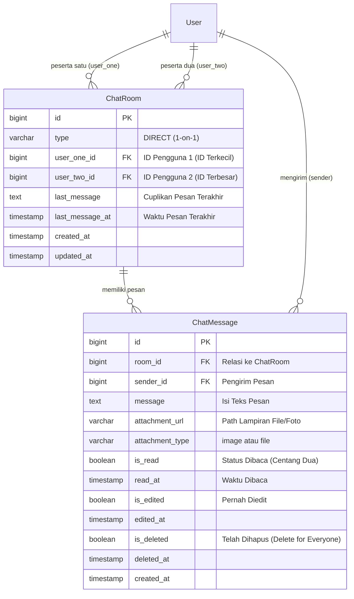
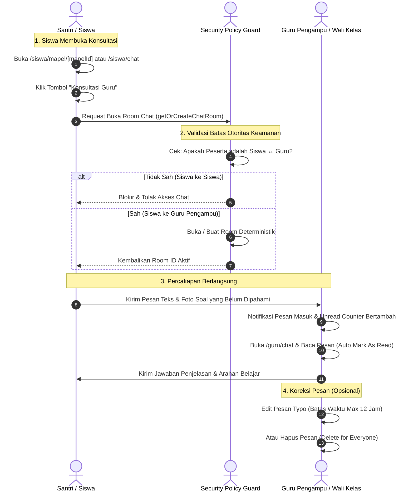

# Dokumentasi & Workflow Fitur Chat Interaktif (Konsultasi Privat Guru - Siswa)
### SD - SMP Islam Al-Azhar Cairo Palembang
*Sistem Informasi Akademik & Portal Pembelajaran Digital (Student Apps)*

---

## 📌 1. Pendahuluan & Gambaran Umum

Dalam lingkungan pendidikan digital terpadu **SD & SMP Islam Al-Azhar Cairo Palembang**, interaksi komunikasi antara pendidik dan peserta didik merupakan sarana krusial untuk bimbingan belajar, konsultasi materi KBM, penguatan adab, hingga pendampingan psikologis santri. Namun, penggunaan saluran pesan instan konvensional (seperti grup WhatsApp pribadi) kerap menimbulkan masalah privasi, terdistraksi di luar jam belajar, serta tidak terpantau dalam standar perlindungan anak (*child safeguarding*).

Sistem **Student Apps** menghadirkan modul **Chat Interaktif (Private 1-on-1 Consultation)** yang tertanam langsung di dalam aplikasi portal sekolah. Fitur ini dirancang dengan mematuhi **Kebijakan Keselamatan & Etika Digital Santri (*School Child Protection & Safety Policy*)**:
1. **Aturan Komunikasi Eksklusif Siswa $\leftrightarrow$ Guru**:
   Sistem secara tegas **hanya mengizinkan komunikasi 1-on-1 antara Siswa dan Guru** (baik Guru Mata Pelajaran maupun Wali Kelas).
2. **Pencegahan Obrolan Antar-Siswa (*No Student-to-Student Chat*)**:
   Sistem secara otomatis menutup dan memblokir opsi obrolan bebas antar-santri untuk mencegah risiko perundungan siber (*cyberbullying*), obrolan nirfaedah, atau penyalahgunaan saat jam KBM sekolah berlangsung.
3. **Penyaringan Kontak Berbasis Hubungan Akademik Resmi**:
   Santri hanya dapat menghubungi guru yang memiliki jadwal mengajar resmi di rombel kelasnya atau Wali Kelas binaannya. Sebaliknya, dewan guru hanya dapat menghubungi santri di kelas yang diampunya.
4. **Integrasi Cepat dari Halaman Mata Pelajaran (*Direct Consultation Link*)**:
   Saat santri mempelajari modul di `/siswa/mapel/[mapelId]`, santri dapat mengklik satu tombol cepat **"Konsultasi Guru"** untuk membuka ruang percakapan privat dengan guru pengampu secara instan.

---

## 🏗️ 2. Arsitektur Data & Model Relasi (Database Schema)

Fitur Chat beroperasi di atas dua tabel utama di dalam database MySQL melalui Prisma ORM: `tbl_chat_rooms` (`ChatRoom`) dan `tbl_chat_messages` (`ChatMessage`):

### Penjelasan Entitas & Logika Ruang Percakapan:

1. **Struktur Deterministik Room Unik (`@@unique([user_one_id, user_two_id])`)**:
   - Untuk mencegah terciptanya dua ruang obrolan berbeda antara dua pengguna yang sama, sistem selalu mengurutkan ID peserta:
     $$u_1 = \min(\text{myId}, \text{otherId}), \quad u_2 = \max(\text{myId}, \text{otherId})$$
   - Dengan formula ini, kapan pun Siswa A menghubungi Guru B atau Guru B menghubungi Siswa A, sistem selalu membuka record `ChatRoom` yang sama secara konsisten.

2. **Dukungan Multi-Media Lampiran File**:
   - Pengiriman berkas foto modul, coretan rumus, atau foto lembar jawaban disimpan secara terstruktur di `/public/uploads/chat/` dengan penamaan aman (*timestamp sanitization*).
   - Tipe lampiran diklasifikasikan otomatis menjadi `image` (gambar/foto) atau `file` (dokumen PDF/DOCX).

---

## 👥 3. Workflow Lengkap Chat Interaktif & Konsultasi

Alur kerja dirancang menjamin komunikasi berlangsung santun, cepat, dan terlindungi:

---

### A. Alur Kerja Santri: Konsultasi Materi & Bimbingan Belajar

Santri menikmati kemudahan bertanya tanpa hambatan canggung:

#### 1. Pembukaan Chat Instan dari Halaman Mata Pelajaran
- Ketika santri sedang membaca modul materi di `/siswa/mapel/[mapelId]` dan menemui istilah atau latihan yang sulit, santri cukup menekan tombol **"Konsultasi Guru"** di pojok kanan atas banner pelajaran.
- Sistem secara otomatis mengarahkan ke `/siswa/chat?guruId=[id]`, membuka room percakapan dengan guru pengampu mata pelajaran tersebut tanpa perlu mencari manual.

#### 2. Penyaringan Kontak Eksklusif Guru (`getContactsForCurrentUser`)
- Pada menu navigasi utama `/siswa/chat`, santri disajikan daftar kontak yang bersih dan terfokus:
  - **Wali Kelas**: Pembina rombel santri (dilengkapi badge khusus *"Wali Kelas"*).
  - **Guru Mata Pelajaran**: Seluruh guru yang terjadwal mengajar di rombel kelas santri semester ini.
- Santri **tidak dapat** melihat atau mencari santri lain di kolom pencarian kontak.

#### 3. Pengiriman Pertanyaan & Foto Tugas
- Santri dapat mengetik pertanyaan teks dengan dukungan emoji edukasi yang santun.
- Santri dapat melampirkan foto buku catatan, lembar kerja santri, atau tangkapan layar iPad (*screenshot*) berformat JPG, PNG, atau WebP.

#### 4. Indikator Status & Tanda Terbaca (*Read Receipts*)
- Setiap pesan yang dikirim dilengkapi stempel waktu (*timestamp*) dan status baca:
  - Belum dibaca: Centang tunggal abu-abu.
  - Sudah dibaca guru: Centang dua hijau (*Read Receipts*) dan mencatat waktu baca `read_at`.

---

### B. Alur Kerja Dewan Guru: Merespons Pertanyaan Santri (`/guru/chat`)

Guru memiliki antarmuka terorganisir untuk membedakan pertanyaan santri dari berbagai rombel:

#### 1. Daftar Percakapan Aktif & Indikator Belum Dibaca (*Unread Counter*)
- Ruang obrolan terurut otomatis berdasarkan pesan terbaru (*most recent message*).
- Setiap kontak santri menampilkan identitas lengkap: Nama Santri, Rombel Kelas, NIS, dan foto avatar.
- Menampilkan badge angka warna hijau jika ada pesan baru santri yang belum dibaca (*unread message count*).

#### 2. Pembatasan Kontak Santri yang Diampu
- Pada menu pencarian kontak guru, sistem menyaring kontak santri:
  - Santri di **Kelas Binaan** (bagi guru yang bertugas sebagai Wali Kelas).
  - Santri di **Kelas-Kelas yang Diajar** (sesuai alokasi jadwal pelajaran mingguan).
- Guru terlindungi dari menerima pesan spam dari santri tingkat atau rombel lain yang tidak diajarnya.

#### 3. Fitur Edit Pesan Terkirim (`editMessageAction`)
- Jika guru keliru mengetik rumus atau penjelasan (*typo*), guru dapat mengedit isi pesan yang telah dikirim.
- **Kebijakan Batas Waktu 12 Jam**: Pengeditan hanya diizinkan dalam rentang 12 jam setelah pesan terkirim guna menjaga validitas riwayat percakapan.
- Pesan yang diedit memiliki tanda transparan `(diedit)` dan waktu pengeditan `edited_at`.

#### 4. Fitur Hapus Pesan untuk Semua (*Delete for Everyone*)
- Jika ada berkas lampiran yang salah kirim, guru dapat memilih opsi **"Hapus Pesan"**.
- Sistem menerapkan penghapusan transparan: isi pesan berubah menjadi `"🚫 Pesan ini telah dihapus"`, lampiran file dihapus dari server, dan cuplikan obrolan di daftar room diperbarui.

---

### C. Proteksi Keamanan Sistem & Penegakan Kebijakan (*Security Guards*)

Seluruh aksi perpesanan dilindungi oleh verifikasi ganda di level server (`src/actions/chat.ts`):

1. **Validasi Pembuatan Room (`getOrCreateChatRoom`)**:
   - Jika pengguna berstatus Siswa (`status = "1"`) mencoba membuka obrolan dengan pengguna berstatus Siswa lainnya, server langsung memutus koneksi dan melempar pesan penolakan:
     > *"Siswa hanya dapat berkomunikasi dengan Guru atau Ustadz/Ustadzah."*
2. **Validasi Pengiriman Pesan (`sendMessageAction`)**:
   - Server memverifikasi bahwa pengirim pesan terdaftar resmi sebagai salah satu peserta dari `room_id` bersangkutan (`user_one_id` atau `user_two_id`).
   - Mencegah manipulasi ID (*tampering attack*) antar ruang obrolan.

---

## 🔄 4. Keterhubungan Fitur Chat dengan Modul Sistem Lainnya

Fitur chat terikat erat dengan ekosistem akademik Student Apps:

| Modul Terkait | Bentuk Integrasi dengan Chat Interaktif |
| :--- | :--- |
| **Mata Pelajaran (`/siswa/mapel/[mapelId]`)** | Tombol cepat *"Konsultasi Guru"* pada modul pelajaran langsung mengarahkan santri ke ruang chat dengan guru pengampu mapel tersebut. |
| **Data Guru & Wali Kelas (`/admin/teachers`)** | Pengenalan peran guru (Status 2 vs 4) dan bidang studi pengampu tampil sebagai sub-judul resmi pada profil chat guru. |
| **Manajemen Rombel Kelas (`/admin/classes`)** | Pengelompokan kontak santri yang dapat dihubungi guru disaring secara otomatis berdasarkan rombel kelas yang diajarnya. |
| **Tugas & Kuis (`/siswa/tugas`)** | Santri dapat mendiskusikan petunjuk teknis atau kendala pengumpulan tugas kepada guru pengampu via chat. |
| **Profil Avatar Pengguna** | Tampilan foto profil santri dan guru disesuaikan dengan foto resmi atau avatar kesantunan berbasis gender (`L/P`). |

---

## 💡 5. Skenario Nyata di Lapangan (Real-World Use Cases)

Berikut adalah skenario penerapan fitur chat interaktif dalam keseharian sekolah di SD - SMP Islam Al-Azhar Cairo Palembang:

### 🎭 Skenario 1: Santri Bertanya Pemahaman Soal Matematika di Rumah
- **Situasi**: Ananda Fatih (santri Kelas 4) sedang mempelajari latihan materi pecahan di rumah pada malam hari. Ada satu soal cerita yang membingungkan.
- **Workflow Sistem**:
  1. Fatih membuka aplikasi Student Apps di tablet iPad, lalu membuka mata pelajaran Matematika.
  2. Fatih mengklik tombol **"Konsultasi Guru"** di kanan atas halaman materi.
  3. Ruang obrolan dengan guru Matematika (Ustadzah Fatimah) langsung terbuka secara otomatis.
  4. Fatih memotret buku tulisnya menggunakan kamera iPad dan mengirimkan foto tersebut dengan pesan: *"Assalamu'alaikum Ustadzah, untuk soal nomor 5 apakah penyebutnya harus disamakan terlebih dahulu?"*
  5. Keesokan paginya, Ustadzah Fatimah membalas: *"Wa'alaikumussalam Fatih. Betul sekali, samakan penyebutnya ke angka 12 ya nak."*
- **Hasil**: Komunikasi belajar terfasilitasi dengan adab santun tanpa santri harus memiliki nomor telepon pribadi guru di WhatsApp.

---

### 🎭 Skenario 2: Bimbingan Konseling & Adab Bersama Wali Kelas
- **Situasi**: Wali Kelas (Ustadz Farhan) melihat ananda Rayhan tampak murung dan kurang bersemangat saat jam pembelajaran sekolah.
- **Workflow Sistem**:
  1. Ustadz Farhan membuka menu `/guru/chat` dan memilih kontak Rayhan dari daftar siswa binaannya.
  2. Ustadz Farhan mengirim pesan santun: *"Assalamu'alaikum Rayhan, bapak perhatikan hari ini Rayhan kurang bersemangat. Apakah ada hal yang sedang dipikirkan atau ada kendala belajar nak?"*
  3. Rayhan merasa diperhatikan dan menceritakan bahwa dirinya sedang kurang enak badan namun memaksakan diri masuk sekolah.
  4. Ustadz Farhan segera berkoordinasi dengan petugas UKS sekolah dan wali murid Rayhan.
- **Hasil**: Bimbingan perwalian yang humanis, cepat, dan tercatat rapi di dalam sistem sekolah.

---

### 🎭 Skenario 3: Penolakan Otomatis Upaya Chat Bebas Antar-Santri
- **Situasi**: Seorang santri mencoba memanipulasi URL peramban untuk membuka ruang obrolan dengan santri lain di kelasnya.
- **Workflow Sistem**:
  1. Sistem menjalankan verifikasi peran di `getOrCreateChatRoom`.
  2. Sistem mendeteksi kedua pengguna berstatus `"1"` (Siswa).
  3. Server langsung menolak pembuatan room dan menampilkan notifikasi:
     `"Siswa hanya dapat berkomunikasi dengan Guru atau Ustadz/Ustadzah."`
- **Hasil**: Ekosistem perpesanan sekolah terlindung dari obrolan bebas tanpa pengawasan, menjaga ketertiban digital para santri.

---

### 🎭 Skenario 4: Koreksi Pesan Typo oleh Dewan Guru
- **Situasi**: Ustadzah Fatimah mengumumkan jadwal penyerahan tugas melalui chat: *"Tugas dikumpulkan paling lambat hari Selasa pukul 12.00 WIB"*, namun seharusnya adalah hari Rabu.
- **Workflow Sistem**:
  1. Ustadzah Fatimah mengklik opsi **Edit Pesan** pada pesan yang baru saja dikirim.
  2. Beliau mengubah kata *Selasa* menjadi *Rabu* lalu menekan simpan.
  3. Sistem meng-update database, menambahkan label `(diedit)`, dan memperbarui cuplikan pesan di daftar obrolan santri.
- **Hasil**: Informasi KBM terkoreksi seketika tanpa perlu menghapus pesan atau membingungkan santri.

---

## 🎯 6. Masalah Krusial yang Diselesaikan Sistem Ini

Modul chat internal ini mengatasi berbagai dampak negatif dari penggunaan aplikasi pesan instan luar:

| Masalah Konvensional (WhatsApp / Medsos) | Solusi Cerdas Chat Student Apps |
| :--- | :--- |
| **Pencampuran Kontak Pribadi & Profesional** Nomor telepon pribadi dewan guru tersebar luas dan rawan dihubungi di luar batas privasi wajar. | **Identitas Terpadu Akun Sekolah** Komunikasi dilakukan menggunakan akun login sekolah tanpa mengekspos nomor telepon pribadi dewan guru. |
| **Resiko Perundungan Siber (*Cyberbullying*) Antar-Siswa** Santri membuat grup obrolan tertutup tanpa pengawasan guru untuk mengucilkan teman. | **Blokir Obrolan Antar-Siswa (*No Student Chat*)** Sistem menutup jalur obrolan antarsantri; obrolan hanya diperbolehkan satu arah antara Siswa dan Guru. |
| **Materi Pertanyaan Tercecer di Obrolan Santai** Pertanyaan seputar modul tertumpuk oleh pesan keluarga atau status di media sosial. | **Kanal Khusus Akademik Terfokus** Seluruh riwayat konsultasi murni berisi bimbingan pelajaran, tertata per mata pelajaran dan rombel. |
| **Manipulasi & Penghapusan Pesan Tanpa Batas** Pengguna dapat mengedit pesan lama kapan saja sehingga mengaburkan riwayat instruksi tugas. | **Batas Waktu Edit 12 Jam & Jejak Transparan** Pengeditan dibatasi maksimal 12 jam, dan pesan yang dihapus tetap meninggalkan penanda transparan. |

---

## 📋 7. Ringkasan Hak Akses & Matriks Fitur

Tabel matriks hak akses terhadap modul perpesanan chat interaktif:

| Fitur / Modul | Administrator | Dewan Guru | Siswa | Keterangan / Lokasi |
| :--- | :---: | :---: | :---: | :--- |
| **Kirim Pesan ke Guru Pengampu** | ✅ Penuh | ❌ Tidak | ✅ Penuh | Akses di `/siswa/chat` |
| **Kirim Pesan ke Santri Binaan/Ajar** | ✅ Penuh | ✅ Penuh | ❌ Tidak | Akses di `/guru/chat` |
| **Kirim Pesan Antar-Santri** | ❌ Dilarang | ❌ Dilarang | ❌ Dilarang (Diblokir) | Perlindungan anak (*safeguarding*) |
| **Buka Chat Cepat dari Detail Mapel**| ✅ Penuh | ❌ Tidak | ✅ 1-Klik Instan | Tombol *"Konsultasi Guru"* |
| **Kirim Lampiran Gambar & Dokumen** | ✅ Penuh | ✅ Penuh | ✅ Penuh | Foto soal / lembar kerja |
| **Tanda Pesan Terbaca (*Read Receipts*)**| ✅ Otomatis | ✅ Otomatis | ✅ Otomatis | Centang dua hijau terverifikasi |
| **Edit Pesan Terkirim (Max 12 Jam)** | ✅ Pesan Sendiri | ✅ Pesan Sendiri | ✅ Pesan Sendiri | Menjaga integritas riwayat |
| **Hapus Pesan untuk Semua (*Delete*)**| ✅ Pesan Sendiri | ✅ Pesan Sendiri | ✅ Pesan Sendiri | Jejak transparan di room |

---

*Dokumen ini disusun secara resmi sebagai standar operasional prosedur (SOP) dan dokumentasi teknis sistem Student Apps SD - SMP Islam Al-Azhar Cairo Palembang.*
