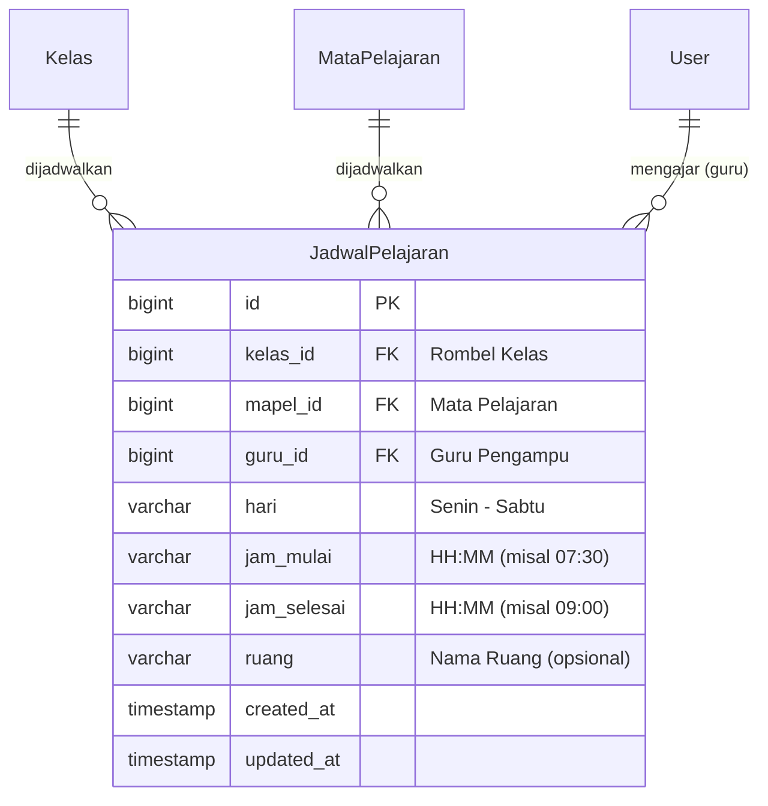
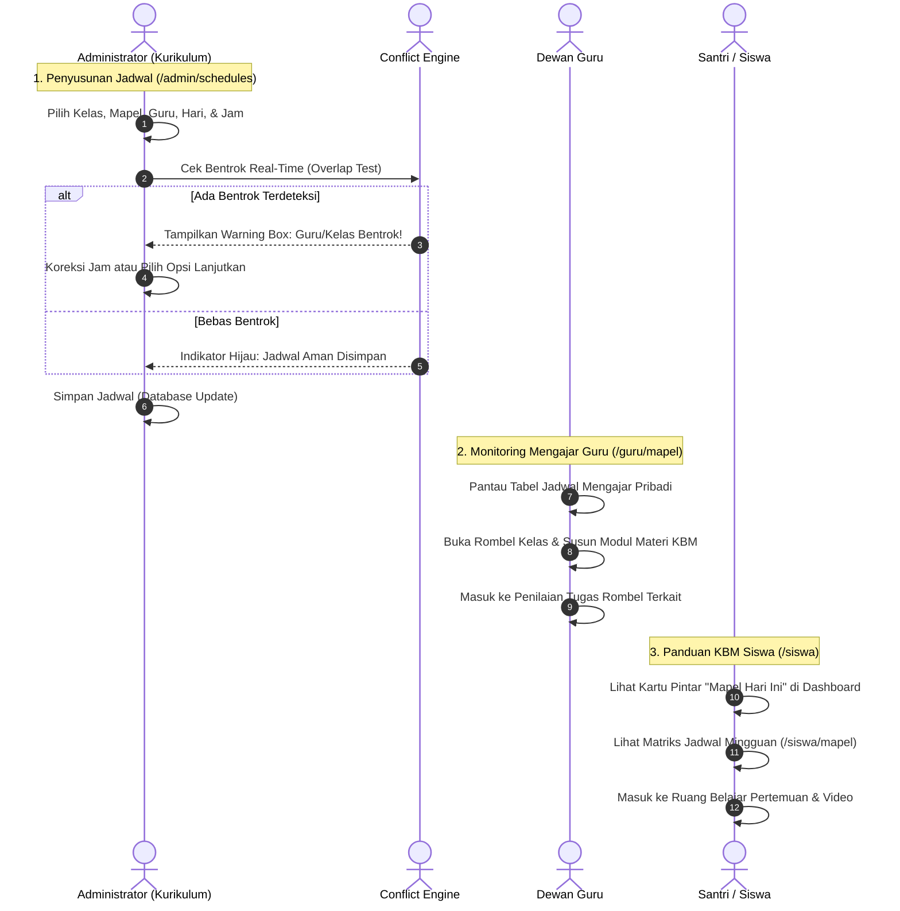

# Dokumentasi & Workflow Fitur Penjadwalan Pelajaran (Jadwal KBM & Deteksi Bentrok)
### SD - SMP Islam Al-Azhar Cairo Palembang
*Sistem Informasi Akademik & Portal Pembelajaran Digital (Student Apps)*

---

## 📌 1. Pendahuluan & Gambaran Umum

Dalam manajemen akademik **SD & SMP Islam Al-Azhar Cairo Palembang**, penyusunan jadwal pelajaran merupakan kegiatan orkestrasi kurikulum yang paling krusial dan kompleks. Jadwal Kegiatan Belajar Mengajar (KBM) tidak hanya mengatur kapan sebuah mata pelajaran diajarkan, melainkan menghubungkan **5 dimensi entitas secara presisi**:
1. **Rombongan Belajar (Kelas)**: Sasaran peserta didik (SD Kelas 4–6 dan SMP Kelas 7–9).
2. **Mata Pelajaran (Kurikulum)**: Bidang studi resmi Al-Azhar (Agama, Sains, Bahasa, Umum).
3. **Guru Pengampu**: Dewan guru dengan SK mengajar resmi yang kompeten di bidangnya.
4. **Alokasi Hari**: Hari efektif KBM sekolah (Senin s.d. Sabtu).
5. **Alokasi Rentang Waktu**: Jam mulai hingga jam selesai tatap muka KBM (format `HH:MM`).

Tantangan terbesar penyusunan jadwal di sekolah modern adalah **resiko bentrok waktu (*scheduling conflict*)**, seperti seorang guru dijadwalkan mengajar di dua kelas berbeda pada jam yang sama, atau satu rombel kelas dijadwalkan menerima dua mata pelajaran berbeda secara bersamaan. Untuk menyelesaikan masalah ini secara permanen, sistem **Student Apps** dilengkapi dengan **Mesin Deteksi Bentrok Otomatis (*Schedule Conflict Engine*)** berbasis algoritma evaluasi interval waktu matematis yang beroperasi secara *real-time*, baik di sisi klien (*browser*) maupun di sisi server (*Server Actions*).

---

## 🏗️ 2. Arsitektur Data & Model Relasi (Database Schema)

Jadwal pelajaran dimodelkan pada tabel `tbl_jadwal_pelajaran` (`JadwalPelajaran`) yang berperan sebagai tabel penghubung (*junction table*) antara Kelas, Mata Pelajaran, dan Guru:

### Algoritma Deteksi Bentrok Waktu (*Overlap Interval Engine*)
Sistem menggunakan konversi waktu ke menit harian (`parseTimeToMinutes`) dan evaluasi matematis interval waktu terbuka:

$$\text{Bentrok Terjadi} \iff (S_1 < E_2) \land (S_2 < E_1)$$

*Keterangan:*
- $S_1, E_1$: Jam mulai dan jam selesai jadwal yang sedang diinput/diedit.
- $S_2, E_2$: Jam mulai dan jam selesai jadwal yang sudah ada di database pada hari yang sama.

Jika kondisi bentrok terpenuhi, sistem mengklasifikasikan ke dalam 2 jenis bentrok:
1. **Bentrok Guru**: `guru_id` sama $\rightarrow$ Guru sudah mengajar di kelas lain pada jam yang bertabrakan.
2. **Bentrok Kelas**: `kelas_id` sama $\rightarrow$ Rombel kelas sudah terisi mata pelajaran lain pada jam yang bertabrakan.

---

## 👥 3. Workflow Lengkap Pengelolaan Jadwal Pelajaran

Alur kerja penyusunan dan konsumsi jadwal melibatkan kolaborasi antara **Administrator Kurikulum**, **Guru Pengampu**, dan **Siswa**:

---

### A. Peran Administrator: Arsitek Jadwal & Pengendali Bentrok

Administrator kurikulum mengontrol jadwal pelajaran sekolah secara terpusat di menu `/admin/schedules`.

#### 1. Form Alokasi Jadwal Baru (`createJadwalAction`)
- **Pemilihan Entitas Terintegrasi**:
  - Memilih **Rombel Kelas** (dilengkapi badge jenjang SD/SMP).
  - Memilih **Mata Pelajaran** (dilengkapi kode unik pelajaran).
  - Memilih **Guru Pengampu** (dilengkapi fitur pencarian instan nama & bidang studi guru).
  - Menentukan **Hari KBM** (Senin, Selasa, Rabu, Kamis, Jumat, Sabtu).
  - Menentukan **Jam Mulai & Jam Selesai** (format `HH:MM`).
- **Validasi Logika Waktu**:
  Sistem menolak penyimpanan jika jam selesai lebih awal atau sama dengan jam mulai.

#### 2. Evaluasi Bentrok Real-Time & Modal Interaktif
- Saat Admin memilih kombinasi guru, kelas, hari, dan jam di dialog modal, fungsi `getScheduleConflicts` langsung berjalan di latar belakang:
  - **Peringatan Bentrok Guru**:
    > *"Guru Ustadz Ahmad bentrok: sudah mengajar di kelas 8A (Matematika, 08.00 - 09.30 WIB)."*
  - **Peringatan Bentrok Kelas**:
    > *"Kelas 7B bentrok: sudah terjadwal mapel IPA bersama Ustadzah Fatimah (08.45 - 10.15 WIB)."*
- **Opsi Konfirmasi Cerdas**:
  Sistem secara default memblokir tombol simpan untuk mencegah human error, namun tetap menyediakan opsi darurat (*override checkbox*: `"Izinkan simpan meskipun ada catatan bentrok"`) untuk kondisi khusus seperti kelas gabungan atau ujian serentak.

#### 3. Manajemen Tampilan & Filter Canggih
- **Filter Cepat Multi-Dimensi**:
  - Filter Jenjang: Semua, SD, atau SMP.
  - Filter Hari KBM: Senin s.d. Sabtu.
  - Filter Kelas Spesifik.
  - Filter Guru Pengampu.
  - Pencarian Teks Bebas: Cari berdasarkan nama pelajaran, nama guru, atau nama kelas.
- **Pengurutan Kronologis Cerdas (`compareScheduleTime`)**:
  Jadwal otomatis terurut rapi berdasarkan urutan hari kalender (Senin $\rightarrow$ Sabtu) dan urutan jam mulai KBM (dari jam paling pagi hingga jam siang/sore).

---

### B. Peran Dewan Guru: Monitoring Jadwal Mengajar Pribadi (`/guru/mapel`)

Bagi dewan guru, jadwal pelajaran menjadi panduan kerja harian:
1. **Tabel Jadwal Mengajar Personal**:
   - Guru disajikan daftar jadwal mengajar miliknya yang terorganisir per hari dan jam.
   - Dilengkapi filter pencarian instan berdasarkan mata pelajaran, rombel kelas, atau hari KBM.
2. **Aksi Terintegrasi 1-Klik**:
   - **Tombol Materi**: Membuka silabus pertemuan, modul iPad, dan video KBM rombel bersangkutan.
   - **Tombol Tugas**: Langsung menuju halaman penilaian tugas dan kuis untuk rombel tersebut.

---

### C. Peran Siswa: Panduan Belajar Harian & Mingguan

Bagi santri, jadwal pelajaran menjadi penuntun persiapan belajar mandiri:
1. **Kartu Pintar "Mapel Hari Ini" di Dashboard (`/siswa`)**:
   - Secara otomatis mendeteksi hari kalender berjalan (misal: Hari Kamis).
   - Menampilkan mata pelajaran apa saja yang akan dipelajari hari ini, jam KBM, nama guru pengampu, serta badge tugas yang belum diselesaikan.
2. **Matriks Silabus Mingguan (`/siswa/mapel`)**:
   - Santri dapat melihat seluruh mata pelajaran yang diikutinya selama satu semester penuh lengkap dengan foto profil guru pengampu.

---

## 🔄 4. Keterhubungan Fitur Jadwal dengan Modul Sistem Lainnya

Jadwal pelajaran menjadi pondasi sinkronisasi lintas modul di Student Apps:

| Modul Terkait | Bentuk Integrasi dengan Jadwal Pelajaran |
| :--- | :--- |
| **Mata Pelajaran (`/admin/subjects`)** | Master mapel harus terdaftar sebelum dapat dialokasikan ke jadwal kelas. |
| **Data Guru (`/admin/teachers`)** | Hanya guru yang berstatus resmi (`"2"` atau `"4"`) yang dapat dipilih sebagai guru pengampu jadwal. |
| **Rombel Kelas (`/admin/classes`)** | Jadwal mengikat spesifik pada rombel kelas tertentu. Perubahan nama rombel otomatis terefleksi di jadwal. |
| **Materi & Silabus (`/guru/mapel/[id]`)** | Guru hanya berhak mengelola silabus pertemuan pada rombel kelas yang terjadwal resmi di bawah pengampuannya. |
| **Tatap Muka Virtual (`/guru/kelas-online`)** | Jadwal KBM menjadi rujukan saat guru membuka ruang video conference interaktif Daily.co. |
| **Kalender Akademik Sekolah (`/calendar`)** | Siswa dan guru dapat melihat agenda KBM mereka tersinkronisasi di kalender digital sekolah. |

---

## 💡 5. Skenario Nyata di Lapangan (Real-World Use Cases)

Berikut adalah skenario penerapan alur kerja penjadwalan di SD - SMP Islam Al-Azhar Cairo Palembang:

### 🎭 Skenario 1: Pencegahan Bentrok Guru Mengajar di Dua Kelas Berbeda
- **Situasi**: Bagian Kurikulum (Admin) sedang menyusun jadwal semester ganjil. Secara tidak sengaja, Admin mendaftarkan Ustadz Ahmad (Guru Matematika) mengajar di *Kelas 8A* pada hari Senin pukul 08.00–09.30 WIB, dan mendaftarkannya lagi di *Kelas 7B* pada hari Senin pukul 08.45–10.15 WIB.
- **Workflow Sistem**:
  1. Saat Admin memilih Ustadz Ahmad pada jadwal Kelas 7B, sistem secara instan mendeteksi irisan waktu selama 45 menit (pukul 08.45–09.30 WIB).
  2. Sistem langsung menampilkan kotak peringatan merah di form:
     `"Guru Ustadz Ahmad bentrok: sudah mengajar di kelas 8A (Matematika, 08.00 - 09.30 WIB)."`
  3. Tombol simpan dinonaktifkan secara otomatis.
  4. Admin menggeser jam pelajaran Kelas 7B menjadi pukul 09.45–11.15 WIB. Peringatan bentrok hilang dan tombol simpan kembali aktif.
- **Hasil**: Tidak ada insiden guru dipanggil bersamaan oleh dua kelas berbeda saat jam sekolah berlangsung.

---

### 🎭 Skenario 2: Pencegahan Bentrok Satu Kelas Menerima Dua Pelajaran Bersamaan
- **Situasi**: Staf kurikulum baru ingin memasukkan jadwal Bahasa Inggris untuk *Kelas 4 - Mehmed Al Fatih* pada hari Selasa pukul 10.00–11.30 WIB, tanpa menyadari bahwa di jam tersebut Kelas 4 sudah dijadwalkan pelajaran PAI bersama Ustadzah Fatimah.
- **Workflow Sistem**:
  1. Saat form diisi, mesin evaluasi waktu mendeteksi kesamaan `kelas_id` pada hari Selasa dan jam yang sama.
  2. Peringatan kelas bentrok muncul seketika:
     `"Kelas 4 - Mehmed Al Fatih bentrok: sudah terjadwal mapel PAI bersama Ustadzah Fatimah (10.00 - 11.30 WIB)."`
  3. Staf kurikulum segera membatalkan jadwal tersebut dan mencari jam kosong lainnya.
- **Hasil**: Santri tidak mengalami kebingungan karena kedatangan dua guru berbeda di satu ruang kelas.

---

### 🎭 Skenario 3: Santri Mempersiapkan Modul Belajar Melalui Kartu "Mapel Hari Ini"
- **Situasi**: Ananda Rayhan bangun tidur di pagi hari dan ingin memeriksa jadwal pelajaran hari ini di tablet iPad miliknya.
- **Workflow Sistem**:
  1. Rayhan membuka aplikasi Student Apps di `/siswa`.
  2. Kartu pintar **"Mata Pelajaran Hari Ini"** otomatis mendeteksi hari ini adalah hari Rabu.
  3. Rayhan melihat jadwal urut: Jam 07.30–09.00 adalah IPA, dilanjutkan jam 09.30–11.00 adalah Bahasa Arab.
  4. Rayhan langsung mengklik kartu IPA untuk membaca modul pertemuan yang disiapkan ustadz pengampunya.
- **Hasil**: Santri mandiri, siap belajar, dan membawa perlengkapan KBM yang tepat.

---

## 🎯 6. Masalah Krusial yang Diselesaikan Sistem Ini

Penyusunan jadwal otomatis ini menyelesaikan berbagai kendala operasional konvensional:

| Masalah Konvensional | Solusi Cerdas yang Dihadirkan Sistem Ini |
| :--- | :--- |
| **Jadwal Guru & Kelas Sering Bertabrakan** Penyusunan manual di Microsoft Excel kerap menimbulkan bentrok jam mengajar guru di dua ruangan berbeda. | **Algoritma Deteksi Bentrok Real-Time** Sistem otomatis mengevaluasi irisan waktu guru dan kelas secara instan saat form diisi. |
| **Siswa Lupa Jadwal & Salah Membawa Buku/Modul** Siswa harus melihat tabel kertas jadwal mingguan yang rumit untuk mengetahui pelajaran besok. | **Kartu Pintar "Mapel Hari Ini" di Dashboard** Sistem otomatis menampilkan daftar pelajaran hari berjalan lengkap dengan jam dan tautan materi modul. |
| **Klaim Sepihak Jam Mengajar Antar Guru** Guru mengajar di kelas atau jam yang bukan hak kurikulumnya. | **Otoritas Tunggal Admin dengan Validasi SK** Hanya Administrator yang berwenang mengatur dan menetapkan alokasi jadwal mengajar guru. |
| **Penyusunan Jadwal Ulang yang Rumit Saat Rotasi** Perubahan satu jadwal guru mengacaukan seluruh jadwal kelas lainnya. | **Penyaringan Multi-Dimensi (Jenjang, Hari, Guru, Kelas)** Admin dapat memfilter jadwal spesifik guru atau kelas tertentu untuk melakukan penyesuaian cepat. |

---

## 📋 7. Ringkasan Hak Akses & Matriks Fitur

Tabel matriks wewenang hak akses terhadap modul penjadwalan pelajaran:

| Fitur / Modul | Administrator | Dewan Guru | Siswa | Lokasi Halaman |
| :--- | :---: | :---: | :---: | :--- |
| **Tambah / Edit Master Jadwal KBM** | ✅ Penuh | ❌ Tidak | ❌ Tidak | `/admin/schedules` |
| **Hapus Alokasi Jadwal Pelajaran** | ✅ Penuh | ❌ Tidak | ❌ Tidak | `/admin/schedules` |
| **Deteksi & Peringatan Bentrok Waktu**| ✅ Real-Time | ❌ Otomatis | ❌ Otomatis | Mesin Conflict Engine |
| **Override Bentrok Darurat (Allow Conflict)**| ✅ Penuh | ❌ Tidak | ❌ Tidak | Form modal jadwal |
| **Filter Jadwal Jenjang, Hari, Guru, Kelas**| ✅ Penuh | ❌ Milik Sendiri | ❌ Rombel Sendiri | `/admin/schedules` |
| **Lihat Jadwal Mengajar Pribadi** | ✅ Semua | ✅ Sesuai Akun | ❌ Tidak | `/guru/mapel` |
| **Lihat Kartu "Mapel Hari Ini"** | ✅ Semua | ❌ Sesuai Akun | ✅ Sesuai Rombel | Dashboard `/siswa` |
| **Lihat Matriks Jadwal Mingguan Rombel**| ✅ Semua | ❌ Sesuai Akun | ✅ Sesuai Rombel | `/siswa/mapel` |

---

*Dokumen ini disusun secara resmi sebagai standar operasional prosedur (SOP) dan dokumentasi teknis sistem Student Apps SD - SMP Islam Al-Azhar Cairo Palembang.*
