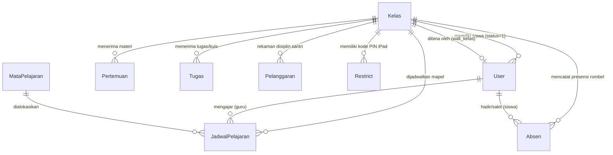
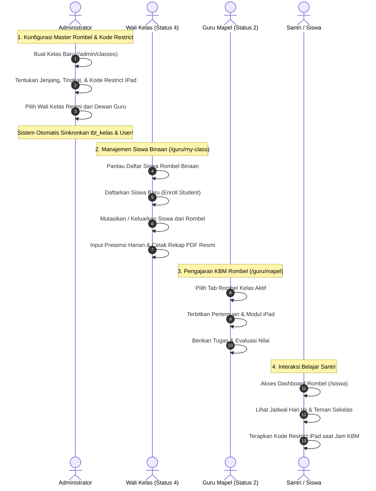

# Dokumentasi & Workflow Fitur Rombongan Belajar (Manajemen Kelas)
### SD - SMP Islam Al-Azhar Cairo Palembang
*Sistem Informasi Akademik & Portal Pembelajaran Digital (Student Apps)*

---

## 📌 1. Pendahuluan & Gambaran Umum

Dalam struktur kelembagaan pendidikan **SD & SMP Islam Al-Azhar Cairo Palembang**, **Rombongan Belajar (Kelas / Rombel)** merupakan wadah organisasi fundamental yang menaungi seluruh aktivitas akademik, pembinaan adab santri, jadwal Kegiatan Belajar Mengajar (KBM), presensi kehadiran, hingga manajemen perangkat tablet edukasi Apple iPad.

Sistem **Student Apps** merancang manajemen kelas tidak sekadar sebagai label administratif, melainkan sebagai **poros relasi data (*data hub*)** yang menghubungkan kurikulum sekolah dengan warga belajar:
1. **Identitas Rombel Berkarakter Islami**:
   Penamaan kelas di Al-Azhar Cairo mengadopsi nama-nama tokoh besar peradaban Islam dan penakluk sejarah, seperti *Kelas 4 - Mehmed Al Fatih*, *Kelas 5 - Salahuddin Al Ayyubi*, *Kelas 7 - Ibnu Sina*, dan *Kelas 8 - Al Khawarizmi*, yang menanamkan spirit kepemimpinan sejak dini.
2. **Cakupan Berjenjang SD & SMP**:
   Mendukung struktur berjenjang dari **SD (Kelas 4–6)** hingga **SMP (Kelas 7–9)**, dengan deteksi otomatis jenjang (*Jenjang Detection Engine*) dan tingkatan kelas berbasis nama rombel.
3. **Pengelolaan Perangkat iPad (*Apple Classroom & Restrict Code*)**:
   Setiap rombel kelas dilengkapi dengan atribut khusus **Kode Restrict iPad (`code_restrict`)**, yaitu PIN 4-digit yang berfungsi mengatur profil pembatasan aplikasi pada iPad santri saat KBM berlangsung di ruangan kelas.
4. **Sentralisasi Distribusi Belajar**:
   Menjadi acuan tunggal bagi alokasi jadwal pelajaran mingguan, silabus modul pertemuan materi KBM, tugas & kuis interaktif, presensi harian rombel, serta pencatatan kedisiplinan dan mutasi santri.

---

## 🏗️ 2. Arsitektur Data & Model Relasi (Database Schema)

Entitas Kelas (`tbl_kelas`) terhubung secara relasional dan operasional dengan hampir seluruh tabel utama di dalam database MySQL melalui Prisma ORM:

### Penjelasan Entitas Database Terkait:

1. **`tbl_kelas` (`Kelas`)**:
   - `id`: Primary key unik rombel (BigInt).
   - `nama_kelas`: Nama resmi rombel (contoh: `Kelas 4 - Mehmed Al Fatih`, `Kelas 7 - Ibnu Sina`).
   - `jenjang`: Jenjang pendidikan (`SD` atau `SMP`), otomatis dideteksi dari format nama kelas.
   - `tingkat`: Angka tingkat kelas (`4`, `5`, `6` untuk SD; `7`, `8`, `9` untuk SMP).
   - `wali_kelas`: Nama lengkap dewan guru yang bertugas sebagai Wali Kelas. Tersinkronisasi otomatis dengan akun `User` berstatus `"4"`.
   - `jumlah_siswa`: Daya tampung atau kuantitas santri aktif di dalam rombel.
   - `code_restrict`: Kode PIN 4-digit untuk pembatasan perangkat iPad santri di kelas.

2. **`tbl_restrict` (`Restrict`)**:
   - Menyimpan kode PIN pembatasan iPad per rombel: `nama_kelas` dan `code_restrict`.
   - Terintegrasi dengan manajemen profil Apple Configurator / MDM sekolah.

3. **Keterikatan dengan Entitas Lain**:
   - **`users` (Siswa)**: Field `kelas` pada akun siswa (`status = "1"`) merujuk langsung ke `nama_kelas`.
   - **`tbl_jadwal_pelajaran`**: Menghubungkan `kelas_id` dengan `mapel_id` dan `guru_id`.
   - **`tbl_pertemuan`**: Silabus materi ajar didistribusikan per `kelas_id`.
   - **`tbl_tugas`**: Evaluasi penugasan dialokasikan spesifik ke `kelas_id`.
   - **`tbl_absen`**: Riwayat presensi kehadiran dicatat berdasarkan string `kelas`.

---

## 👥 3. Workflow Lengkap Berdasarkan Peran Pengguna

Manajemen kelas melibatkan kolaborasi terpadu antara **Administrator**, **Wali Kelas**, **Guru Mata Pelajaran**, dan **Siswa**:

---

### A. Peran Administrator: Arsitek Rombel & Pengendali Keamanan iPad

Administrator memiliki hak tertinggi dalam menciptakan, mengubah, dan mengontrol master kelas di menu `/admin/classes`.

#### 1. Pembuatan Kelas Baru (`createClassAction`)
- **Nama Rombel**: Admin menginput nama rombel yang mencerminkan nama tokoh Islam (contoh: *Kelas 4 - Mehmed Al Fatih*).
- **Deteksi Cerdas Jenjang & Tingkat (*Auto-Detection Engine*)**:
  Fungsi `ClassService.createClass` secara otomatis menganalisis string nama kelas:
  - Jika diawali angka `7`, `8`, `9` atau kata `SMP`, sistem otomatis menetapkan `jenjang = "SMP"` dan `tingkat = 7/8/9`.
  - Jika diawali angka `4`, `5`, `6`, sistem otomatis menetapkan `jenjang = "SD"` dan `tingkat = 4/5/6`.
- **Penetapan Wali Kelas**: Admin memilih salah satu dewan guru aktif dari daftar dropdown. Sistem otomatis menghubungkan relasi dua arah antara akun guru tersebut dan rombel kelas.
- **Konfigurasi Kode Restrict iPad (`code_restrict`)**:
  Admin memasukkan kode PIN 4-digit (misal: `2739`). Sistem secara otomatis menyimpan kode ini ke `tbl_kelas` dan membuat entri sinkronisasi di `tbl_restrict`.

#### 2. Tabel Pemantauan Kelas & Filter Jenjang
- **Filter Tab Jenjang Instan**:
  Admin dapat memfilter tampilan dengan satu klik:
  - **Semua Kelas**: Menampilkan total seluruh rombel di sekolah.
  - **Jenjang SD**: Menyaring khusus rombel SD (Kelas 4–6).
  - **Jenjang SMP**: Menyaring khusus rombel SMP (Kelas 7–9).
- **Pencarian Cepat**: Filter *real-time* berdasarkan nama kelas atau nama wali kelas.
- **Statistik Siswa Real-Time**:
  Sistem menghitung jumlah santri terdaftar secara dinamis dengan mengagregasi data santri aktif (`status = "1"` dan `kelas = nama_kelas`).

#### 3. Halaman Detail Rombel (`/admin/classes/[id]`)
Ketika Admin membuka salah satu rombel kelas:
- **Tiga Kartu Informasi Utama**:
  1. *Nama Kelas & Jenjang*: Identitas rombel.
  2. *Wali Kelas*: Nama lengkap beserta email login wali kelas yang bertugas.
  3. *Kode Restrict iPad*: PIN pembatasan aktif perangkat kelas tersebut.
- **Tabel Seluruh Siswa Terdaftar**:
  Menampilkan tabel lengkap seluruh santri rombel tersebut (Foto avatar, Nama, NIS, Email, Gender, Status Akun) dengan penghitung total siswa otomatis.

#### 4. Pengelolaan Cepat Kode Restrict iPad (`/admin`)
- Di dashboard utama admin, tersedia tabel khusus **Restrict iPad (`restrict-table`)**.
- Admin dapat memperbarui PIN pembatasan kelas secara instan (*inline edit*) saat jam pelajaran khusus atau ujian berlangsung tanpa perlu membuka formulir edit kelas lengkap.

---

### B. Peran Guru & Wali Kelas: Pengelola Operasional Rombel (`/guru/my-class`)

Wali Kelas (guru dengan status `"4"`) bertindak sebagai pengayom dan penanggung jawab langsung santri di rombel binaannya.

#### 1. Penerimaan Otoritas Rombel Otomatis
- Ketika Admin menetapkan seorang guru sebagai Wali Kelas *Kelas 4 - Mehmed Al Fatih*, menu **Kelas Saya (`/guru/my-class`)** dan **Absensi Kelas (`/guru/attendance`)** otomatis terbuka di bilah navigasi sidebar guru.
- Jika guru berstatus Guru Mapel biasa (status `"2"`) mencoba mengakses rute tersebut, sistem menyajikan kartu edukasi yang menjelaskan bahwa fitur tersebut dikhususkan bagi Wali Kelas.

#### 2. Pendaftaran Santri Baru (*Enroll Student to Class*)
- Jika ada santri baru, santri mutasi pindahan, atau santri yang belum memiliki rombel:
  - Wali Kelas membuka modal **"Tambah Siswa ke Kelas"**.
  - Sistem menampilkan daftar santri yang belum terdaftar di rombel manapun.
  - Wali Kelas memilih santri dan mengeksekusi pendaftaran (`enrollStudentAction`). Santri tersebut seketika resmi terdaftar di rombel binaannya.

#### 3. Mutasi / Pengeluaran Santri dari Rombel (*Remove Student*)
- Wali Kelas dapat memilih satu atau beberapa santri sekaligus menggunakan fitur *multi-select checkbox*.
- Tombol **"Keluarkan dari Kelas"** mengeksekusi `removeStudentsAction`.
- **Proteksi Otoritas Keamanan**: Wali Kelas dilarang keras memanipulasi atau mengeluarkan santri dari rombel lain. Sistem memverifikasi kecocokan rombel di level server.

#### 4. Kartu Bimbingan Santri Rombel (`/guru/my-class/[studentId]`)
- Wali Kelas dapat membuka kartu kendali pribadi santri binaannya:
  - **Catatan Wali Kelas (*Notes*)**: Memberikan catatan perkembangan karakter, akhlak, dan catatan bimbingan berkala.
  - **Pencatatan Pelanggaran Kedisiplinan**: Mencatat jenis pelanggaran santri di buku disiplin digital sekolah.

---

### C. Peran Guru Mata Pelajaran: Pengajar Lintas Rombel (`/guru/mapel`)

Guru Mata Pelajaran menggunakan entitas kelas sebagai target penyampaian materi kurikulum:
1. **Navigasi Rombel yang Diampu**:
   Guru dapat berpindah antar rombel kelas yang diajarnya (misal: beralih dari Kelas 7A ke Kelas 7B) melalui tab pilihan kelas di `/guru/mapel/[mapelId]`.
2. **Penyusunan Materi per Rombel**:
   Setiap rombel memiliki silabus pertemuannya sendiri sehingga materi dapat disesuaikan dengan ritme belajar santri di kelas tersebut.
3. **Duplikasi Materi Antar Rombel Paralel**:
   Guru dapat menyalin pertemuan dan modul PDF dari satu kelas ke rombel paralel lainnya hanya dalam 3 detik menggunakan fitur *Copy Meeting*.

---

### D. Peran Siswa: Peserta Didik Rombel

Bagi santri, kelas menjadi identitas belajar mereka di dalam aplikasi:
1. **Dashboard Khusus Rombel (`/siswa`)**:
   Santri disajikan jadwal pelajaran harian, nama guru pengampu, serta identitas wali kelas mereka.
2. **Kepatuhan Pembatasan iPad**:
   Santri menggunakan `code_restrict` rombel mereka untuk menyinkronkan profil keamanan iPad saat jam KBM di bawah arahan guru/instruktur IT.
3. **Penyaringan Tugas & Materi Otomatis**:
   Seluruh modul ajar, tugas PR, kuis, dan pengumuman sekolah yang tampil di portal santri disaring otomatis sesuai dengan rombel kelas yang mereka tempati.

---

## 🔄 4. Keterhubungan Fitur Kelas dengan Modul Sistem Lainnya

Kelas menjadi poros penghubung bagi hampir seluruh fitur di Student Apps:

| Modul Terkait | Bentuk Integrasi dengan Manajemen Kelas |
| :--- | :--- |
| **Kelola Guru & Wali Kelas (`/admin/teachers`)** | Penugasan status `"4"` mewajibkan pemilihan kelas binaan. Sistem menyinkronkan nama guru ke `tbl_kelas.wali_kelas` secara otomatis. |
| **Kelola Siswa (`/admin/students`)** | Setiap akun santri wajib memiliki atribut kelas. Import Excel siswa otomatis menempatkan anak ke rombel yang sesuai. |
| **Jadwal Pelajaran (`/admin/schedules`)** | Jadwal KBM disusun berdasarkan irisan: Rombel Kelas + Mata Pelajaran + Guru Pengampu + Hari & Jam. |
| **Presensi & Rekap PDF (`/guru/attendance`)** | Presensi harian dicatat per rombel kelas. Dokumen cetak rekap PDF A4 Landscape mencantumkan nama rombel dan tanda tangan wali kelas. |
| **Buku Disiplin & Pelanggaran (`/guru/my-class/[id]`)** | Pelanggaran santri dikelompokkan berdasarkan rombel kelas santri untuk memudahkan evaluasi wali kelas. |
| **Integrasi iPad & MDM (`tbl_restrict`)** | Kode restrict per rombel disinkronkan ke sistem pembatasan aplikasi iPad kelas Al-Azhar Cairo Palembang. |
| **Live Tatap Muka Virtual (`/guru/kelas-online`)** | Ruang Daily.co video conference dibuka dengan target rombel kelas tertentu. |

---

## 💡 5. Skenario Nyata di Lapangan (Real-World Use Cases)

Berikut adalah skenario penerapan fitur manajemen kelas dalam operasional sekolah sehari-hari:

### 🎭 Skenario 1: Pembentukan Rombel Baru & Penetapan Wali Kelas Tahun Ajaran Baru
- **Situasi**: Menjelang tahun ajaran baru, sekolah membuka rombel baru untuk jenjang SMP: *Kelas 7 - Al Khawarizmi*. Ustadzah Aisyah ditugaskan sebagai Wali Kelasnya.
- **Workflow Sistem**:
  1. Bagian Kurikulum (Admin) membuka `/admin/classes` dan mengklik tombol **"Tambah Kelas"**.
  2. Admin mengetikkan nama kelas: `Kelas 7 - Al Khawarizmi`.
  3. Sistem secara otomatis mendeteksi bahwa kelas ini berjenjang **SMP** dan tingkatan **7**.
  4. Admin memilih *Ustadzah Aisyah* dari dropdown wali kelas, memasukkan estimasi kapasitas 28 siswa, dan memasukkan kode restrict iPad `3142`.
  5. Admin menekan tombol **"Simpan Data Kelas"**.
- **Hasil**: Rombel kelas baru langsung terbentuk. Di akun Ustadzah Aisyah, menu *Kelas Saya* dan *Absensi Kelas* langsung aktif membina Kelas 7 - Al Khawarizmi.

---

### 🎭 Skenario 2: Santri Pindahan Baru Masuk di Pertengahan Semester (Enrollment)
- **Situasi**: Ananda Zaki adalah santri pindahan baru yang baru menyelesaikan administrasi sekolah di bulan Oktober dan ditempatkan di *Kelas 4 - Mehmed Al Fatih*.
- **Workflow Sistem**:
  1. Admin mendaftarkan akun ananda Zaki di menu `/admin/students` tanpa langsung mengunci kelasnya.
  2. Wali Kelas Kelas 4 (Ustadz Ridwan) membuka menu **Kelas Saya** (`/guru/my-class`).
  3. Beliau mengklik tombol **"Tambah Siswa ke Kelas"**.
  4. Pada daftar santri yang belum memiliki rombel, Ustadz Ridwan memilih nama *Zaki* lalu menekan tombol **"Daftarkan"**.
- **Hasil**: Ananda Zaki resmi terdaftar di rombel Kelas 4. Seluruh jadwal pelajaran, materi KBM, dan absensi Kelas 4 langsung muncul di tablet iPad milik Zaki.

---

### 🎭 Skenario 3: Penegakan Kedisiplinan iPad Menggunakan Kode Restrict Rombel
- **Situasi**: Pukul 08.00 WIB jam pelajaran Matematika di *Kelas 8 - Ibnu Rusyd* dimulai. Guru meminta santri mengaktifkan mode pembatasan iPad agar santri tidak membuka aplikasi game atau media sosial.
- **Workflow Sistem**:
  1. Guru mengumumkan kode restrict kelas: `2739` (yang tertera di informasi kelas).
  2. Santri memasukkan kode restrict tersebut pada profil Apple Classroom iPad mereka.
  3. Jika suatu hari kode tersebut bocor atau ingin diganti, Admin cukup membuka `/admin` dan memperbarui kode PIN di tabel **Restrict iPad** menjadi kode baru dalam waktu 5 detik.
- **Hasil**: Penggunaan iPad santri terkontrol penuh, aman, dan terarah untuk media belajar KBM sekolah.

---

### 🎭 Skenario 4: Mutasi Santri Antar Rombel Paralel
- **Situasi**: Untuk penyeimbangan jumlah murid, santri bernama Rayhan dipindahkan dari *Kelas 4A* ke *Kelas 4B*.
- **Workflow Sistem**:
  1. Wali Kelas 4A membuka menu `/guru/my-class`, mencentang nama Rayhan, dan menekan tombol **"Keluarkan dari Kelas"**. Status kelas Rayhan kembali netral.
  2. Wali Kelas 4B membuka menu `/guru/my-class`, memilih modal pendaftaran siswa baru, memilih nama Rayhan, dan mendaftarkannya ke Kelas 4B.
- **Hasil**: Proses mutasi tuntas rapi tanpa menghapus akun atau nilai yang sudah diperoleh Rayhan. Seluruh data raport tersinkronisasi ke rombel baru.

---

## 🎯 6. Masalah Krusial yang Diselesaikan Sistem Ini

Manajemen kelas terpadu ini memecahkan berbagai tantangan operasional klasik sekolah:

| Masalah Konvensional | Solusi Cerdas yang Dihadirkan Sistem Ini |
| :--- | :--- |
| **Duplikasi & Kerancuan Rombel Kelas** Nama kelas di daftar absen, daftar rapor, dan jadwal pelajaran berbeda ejaan (misal: *4A* vs *IV-A* vs *Kelas 4 Al-Fatih*). | **Standardisasi Entitas Master Tunggal** Satu nama rombel resmi terdaftar di `tbl_kelas` dan digunakan konsisten di seluruh jadwal, tugas, absen, dan rapor. |
| **Penyalahgunaan iPad Santri Saat Jam KBM** Santri bermain game atau berselancar di internet di luar materi pelajaran. | **Manajemen Kode Restrict iPad per Rombel** Setiap kelas memiliki `code_restrict` resmi yang dapat diperbarui secara dinamis oleh sekolah. |
| **Ketidaksinkronan Data Wali Kelas** Wali kelas berganti tetapi nama di lembar rapor dan presensi masih tercetak nama guru lama. | **Sinkronisasi Dua Arah (*Two-Way Automatic Sync*)** Perubahan wali kelas di data guru atau di data kelas langsung meng-update kedua entitas secara instan. |
| **Santri "Tersesat" Tanpa Rombel** Santri baru tidak terdata di presensi guru karena belum dimasukkan ke rombel kelas. | **Fitur Pendaftaran Cepat (*Enroll Student Modal*)** Wali kelas dapat melihat daftar santri tanpa rombel dan memasukkannya ke kelas binaan dengan 1 klik. |
| **Kesalahan Akses Antar Kelas** Guru mengutak-atik daftar siswa di rombel yang bukan hak perwaliannya. | **Proteksi Berlapis di Tingkat Server** Fungsi `checkWaliKelasOrAdmin()` memblokir akses manipulasi santri dari rombel lain. |

---

## 📋 7. Ringkasan Hak Akses & Matriks Fitur

Tabel matriks wewenang hak akses terhadap modul manajemen rombel kelas:

| Fitur / Modul | Administrator | Wali Kelas (Status 4) | Guru Mapel (Status 2) | Siswa | Lokasi Halaman |
| :--- | :---: | :---: | :---: | :---: | :--- |
| **Tambah & Hapus Master Kelas** | ✅ Penuh | ❌ Tidak | ❌ Tidak | ❌ Tidak | `/admin/classes` |
| **Edit Data Kelas & Jenjang** | ✅ Penuh | ❌ Tidak | ❌ Tidak | ❌ Tidak | `/admin/classes` |
| **Atur & Ubah Kode Restrict iPad** | ✅ Penuh | ❌ Hanya Memakai | ❌ Hanya Memakai | ❌ Input PIN Saja| `/admin`, `/admin/classes` |
| **Lihat Detail Seluruh Siswa Rombel** | ✅ Semua Kelas | ✅ Rombel Sendiri | ❌ Rombel Mengajar | ❌ Teman Sekelas | `/admin/classes/[id]`, `/guru/my-class` |
| **Daftarkan Siswa ke Rombel (*Enroll*)** | ✅ Penuh | ✅ Rombel Sendiri | ❌ Tidak | ❌ Tidak | `/guru/my-class` |
| **Keluarkan Siswa dari Rombel (*Remove*)**| ✅ Penuh | ✅ Rombel Sendiri | ❌ Tidak | ❌ Tidak | `/guru/my-class` |
| **Kelola Presensi Rombel Harian** | ✅ Penuh | ✅ Rombel Sendiri | ❌ Ditolak Guard | ❌ Hanya Milik Sendiri| `/guru/attendance` |
| **Export Rekap Presensi PDF Rombel** | ✅ Penuh | ✅ Rombel Sendiri | ❌ Tidak | ❌ Tidak | `/guru/attendance/recap` |
| **Pilih Rombel Mengajar untuk KBM** | ✅ Semua | ✅ Sesuai Jadwal | ✅ Sesuai Jadwal | ❌ Sesuai Rombel | `/guru/mapel` |
| **Salin Materi Antar Rombel Paralel** | ✅ Ya | ✅ Ya | ✅ Ya | ❌ Tidak | Modal Copy Meeting |

---

*Dokumen ini disusun secara resmi sebagai standar operasional prosedur (SOP) dan dokumentasi teknis sistem Student Apps SD - SMP Islam Al-Azhar Cairo Palembang.*
