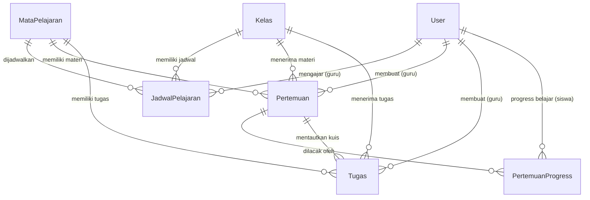
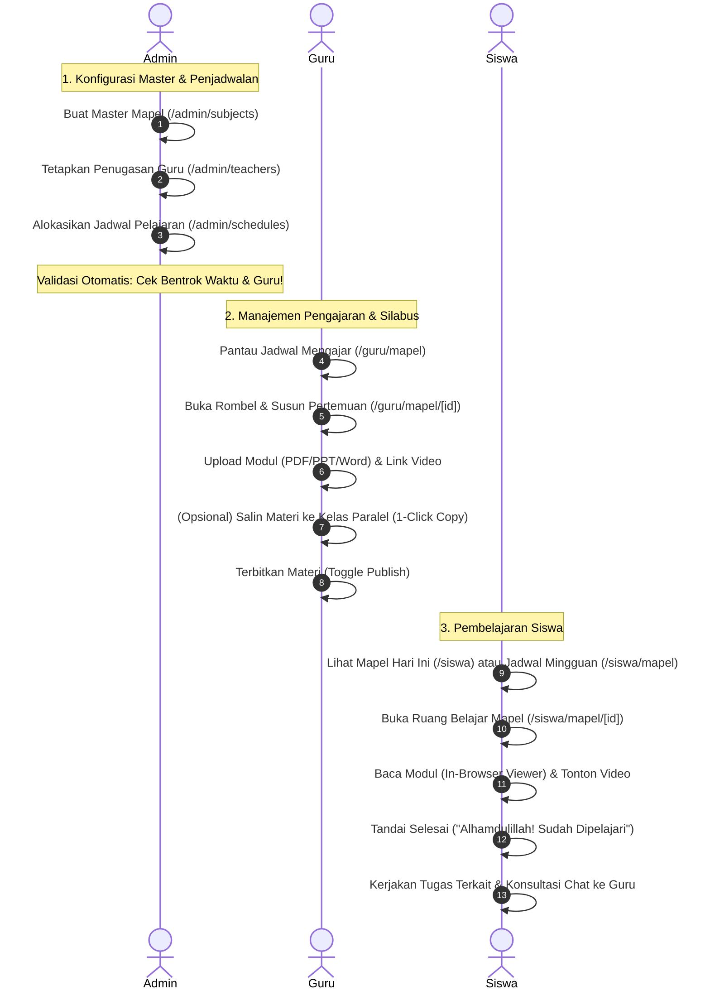

# Dokumentasi & Workflow Fitur Mata Pelajaran
### SD - SMP Islam Al-Azhar Cairo Palembang
*Sistem Informasi Akademik & Portal Pembelajaran Digital (Student Apps)*

---

## 📌 1. Pendahuluan & Gambaran Umum

Fitur **Mata Pelajaran (Subject Management)** adalah pilar fundamental pembelajaran akademik (KBM) dalam ekosistem **Student Apps SD & SMP Islam Al-Azhar Cairo Palembang**. Modul ini tidak hanya berfungsi sebagai katalog daftar pelajaran, melainkan bertindak sebagai **jantung integrasi pembelajaran terpadu** yang menghubungkan kurikulum sekolah, jadwal KBM tatap muka, distribusi modul/materi digital, penugasan kuis/ujian, ruang tatap maya (*live video conference*), hingga saluran konsultasi privat siswa dengan guru pengampu.

Sistem dirancang khusus untuk memenuhi standar sekolah digital modern dengan integrasi iPad, mendukung kurikulum berjenjang **SD (Kelas 4–6)** dan **SMP (Kelas 7–9)**, serta mengedepankan kemudahan guru dalam mendistribusikan materi ajar tanpa redundansi kerja.

---

## 🏗️ 2. Arsitektur Data & Model Relasi (Database Schema)

Fitur Mata Pelajaran terikat kuat dengan berbagai tabel utama di dalam database MySQL melalui Prisma ORM:

### Penjelasan Entitas Database Terkait:
1. **`tbl_mata_pelajaran` (`MataPelajaran`)**:
   - `id`: Primary key unik (BigInt).
   - `kode_mapel`: Kode unik pelajaran (contoh: `PAI-SD`, `MTK-SMP`, `ENG-07`).
   - `nama_mapel`: Nama lengkap mata pelajaran.
   - `jenjang`: Cakupan jenjang (`SD`, `SMP`, atau `SEMUA`).
   - `warna` & `icon`: Identitas visual dinamis untuk antarmuka pengguna (contoh: warna emerald, sky, amber, rose).
   - `deskripsi`: Informasi silabus ringkas mata pelajaran.

2. **`tbl_jadwal_pelajaran` (`JadwalPelajaran`)**:
   - Menghubungkan secara spesifik: **Mata Pelajaran + Rombel Kelas + Guru Pengampu**.
   - Dilengkapi atribut alokasi waktu: `hari`, `jam_mulai`, `jam_selesai`, dan `ruang`.

3. **`tbl_pertemuan` (`Pertemuan`)**:
   - Struktur silabus modular per sesi/minggu KBM (`pertemuan_ke`, `judul`, `tanggal`, `deskripsi`).
   - Lampiran multi-sumber: Dokumen materi (`file_url`), Video ajar YouTube/Cloud (`video_url`), dan Referensi link luar (`link_eksternal`).
   - Pengontrol visibilitas: `is_published` (Boolean: Draft atau Terbit).

4. **`tbl_pertemuan_progress` (`PertemuanProgress`)**:
   - Rekam jejak belajar mandiri siswa (`pertemuan_id`, `siswa_id`, `is_completed`, `completed_at`).

5. **`tbl_tugas` (`Tugas`)**:
   - Penugasan terikat pada `mapel_id` dan `kelas_id`, serta dapat ditautkan ke pertemuan tertentu (`pertemuan_id`).

---

## 👥 3. Workflow Lengkap Berdasarkan Peran Pengguna

Sistem membedakan hak akses dan alur kerja berdasarkan 3 peran utama: **Admin**, **Guru**, dan **Siswa**.

---

### A. Peran Administrator: Arsitek Kurikulum & Pengendali Jadwal

Administrator memiliki otoritas penuh atas standardisasi mata pelajaran dan penugasan pengajar.

#### 1. Manajemen Master Mata Pelajaran (`/admin/subjects`)
* **Registrasi Mapel Baru**:
  - Admin menginput **Kode Mapel** unik (otomatis dikonversi menjadi huruf kapital, misal: `IPA-SMP`), **Nama Mapel**, **Jenjang** (`SEMUA`, `SD`, atau `SMP`), **Icon**, **Warna Label**, serta **Deskripsi Singkat**.
  - Sistem memiliki validasi pencegahan duplikasi kode (`P2002 Unique Constraint`).
* **Pemantauan Integrasi Data**:
  - Admin dapat memantau berapa banyak jadwal aktif dan berapa banyak tugas yang sudah dibuat untuk mata pelajaran tersebut.
* **Penghapusan Aman**:
  - Mapel yang sudah memiliki jadwal atau tugas tidak dapat dihapus sembarangan untuk menjaga integritas riwayat nilai siswa.

#### 2. Penugasan Bidang Studi Guru (`/admin/teachers`)
* Admin menentukan bidang studi resmi (`guru_bidang`) setiap akun guru.
* **Pemberlakuan Kebijakan Integritas**: Akun guru **tidak dapat** mengubah bidang studinya sendiri di menu profil. Hal ini menjamin hanya guru dengan SK resmi yang dapat mewakili mata pelajaran terkait.

#### 3. Alokasi Jadwal & Sistem Pencegah Bentrok Cerdas (`/admin/schedules`)
* Admin menyusun jadwal mingguan dengan menentukan:
  `Kelas Rombel` ➔ `Mata Pelajaran` ➔ `Guru Pengampu` ➔ `Hari` ➔ `Jam Mulai & Jam Selesai` ➔ `Ruang Kelas`.
* **Algoritma Deteksi Bentrok Otomatis (*Schedule Conflict Engine*)**:
  Sebelum jadwal tersimpan, sistem menjalankan algoritma `findScheduleConflicts`:
  1. **Bentrok Guru**: Mencegah guru yang sama dijadwalkan mengajar di dua kelas berbeda pada hari dan jam yang bertabrakan.
  2. **Bentrok Kelas**: Mencegah satu rombel kelas memiliki dua mata pelajaran berbeda di jam yang bertabrakan.
  3. **Pemberitahuan Interaktif**: Menampilkan peringatan mendetail mengenai siapa guru yang bentrok atau kelas mana yang bertabrakan, dengan opsi konfirmasi penyesuaian.

---

### B. Peran Guru: Pengelola KBM, Materi, & Evaluasi

Guru (baik **Guru Mata Pelajaran** murni maupun **Guru & Wali Kelas**) memiliki akses penuh terhadap modul pengajaran di `/guru/mapel`.

#### 1. Monitoring Jadwal Mengajar (`/guru/mapel`)
* Guru disajikan tabel jadwal mengajar personal yang tertata rapi berdasarkan urutan hari dan jam.
* Dilengkapi filter pencarian instan berdasarkan nama mata pelajaran, nama rombel, atau hari KBM.
* Tombol aksi cepat:
  - **Materi**: Membuka modul silabus pertemuan kelas tersebut.
  - **Tugas**: Langsung menuju halaman penilaian tugas untuk rombel bersangkutan.

#### 2. Penyusunan Pertemuan & Modul KBM (`/guru/mapel/[mapelId]?kelasId=...`)
* **Struktur Silabus Berbasis Pertemuan**:
  Guru mengorganisir pembelajaran per pertemuan (contoh: *Pertemuan 1: Pengenalan Operasi Aljabar*, *Pertemuan 2: Latihan Faktorisasi*).
* **Multi-Format Media Pembelajaran**:
  - **File Dokumen**: Unggah modul PDF, PPTX, DOCX, gambar panduan (langsung tersimpan rapi di storage server).
  - **Video Pembelajaran**: Mendukung tautan video edukatif (YouTube atau Google Drive) yang dapat diputar langsung di aplikasi.
  - **Link Eksternal**: Sumber bacaan artikel, website ensiklopedia, atau laboratorium virtual.
  - **Tautkan Tugas / Kuis**: Guru dapat menghubungkan tugas interaktif yang telah dibuat ke dalam pertemuan tertentu.
* **Kontrol Visibilitas (Draft vs Published)**:
  - Mode **Draft**: Guru dapat menyusun materi jauh-jauh hari tanpa terlihat oleh siswa.
  - Mode **Published**: Materi langsung tampil di portal siswa saat jam pembelajaran dimulai.
* **Fitur Duplikasi Materi ke Rombel Paralel (*One-Click Duplicate Meeting*)**:
  - Jika seorang guru mengampu mata pelajaran yang sama di beberapa kelas paralel (misal: *Kelas 7A, 7B, 7C*), guru **cukup membuat materi sekali di Kelas 7A**.
  - Guru kemudian mengklik ikon **Salin Materi (Copy)**, memilih kelas tujuan (*7B dan 7C*), dan sistem secara otomatis menduplikasi seluruh data pertemuan, lampiran file, dan referensi video tanpa perlu upload ulang satu per satu.

---

### C. Peran Siswa: Peserta Didik Digital

Bagi siswa, antarmuka dirancang ramah anak, interaktif, dan optimal untuk layar tablet iPad maupun laptop.

#### 1. Jadwal Hari Ini di Dashboard Utama (`/siswa`)
* Menampilkan kartu pintar **"Mata Pelajaran Hari Ini"** yang otomatis mendeteksi hari berjalan.
* Menampilkan jam KBM, nama guru pengampu, ruang kelas, serta badge indikator berapa jumlah tugas yang belum diselesaikan.

#### 2. Matriks Jadwal & Silabus Mingguan (`/siswa/mapel`)
* Menampilkan daftar lengkap seluruh mata pelajaran yang diikuti siswa sesuai rombel kelasnya.
* Menampilkan informasi guru pengampu lengkap dengan foto avatar.
* Tombol **Materi** untuk masuk ke ruang silabus pertemuan, dan tombol **Tugas** untuk daftar PR/kuis.

#### 3. Ruang Belajar Digital Interaktif (`/siswa/mapel/[mapelId]`)
Ketika siswa membuka salah satu mata pelajaran:
* **Identitas Visual Mapel & Profil Guru**: Siswa melihat nama pelajaran, kode mapel, serta profil guru pengampunya.
* **Konsultasi Chat Langsung (*Direct Chat*)**: Tersedia tombol cepat **"Konsultasi Guru"** yang langsung menghubungkan siswa ke ruang pesan pribadi (*1-on-1 chat*) dengan guru pengampu untuk bertanya perihal materi.
* **Timeline Pertemuan Belajar**: Menampilkan urutan pertemuan yang telah diterbitkan guru.
* **Pratinjau Dokumen Tanpa Download (*In-Browser Document Viewer*)**:
  Siswa dapat membaca dokumen modul (PDF, slide PPT, atau dokumen Word) langsung di dalam peramban/iPad tanpa perlu mengunduh file atau memasang aplikasi pihak ketiga yang memberatkan memori iPad.
* **Pemutar Video Terintegrasi**: Menonton video penjelasan materi langsung di antarmuka pertemuan.
* **Pelacak Progress Mandiri (*Mark as Studied*)**:
  Siswa dapat mengklik tombol **"Tandai Sudah Dipelajari"**. Sistem akan menyimpan status ini ke database dan menampilkan notifikasi motivasi Islami: *"Alhamdulillah! Pertemuan ini telah kamu selesaikan ⭐"*.
* **Status Tugas Terintegrasi**: Kartu tugas yang ditautkan ke pertemuan langsung menampilkan tenggat waktu dan status pengerjaan (Belum Dikerjakan, Menunggu Penilaian, atau Sudah Dinilai lengkap dengan skor).

---

## 🔄 4. Keterhubungan Fitur Mapel dengan Modul Sistem Lainnya

Mata Pelajaran menjadi poros utama bagi fitur-fitur lain di Student Apps:

| Fitur Terkait | Bentuk Integrasi dengan Mata Pelajaran |
| :--- | :--- |
| **Tugas & Kuis (`/guru/tugas`, `/siswa/tugas`)** | Setiap tugas, kuis pilihan ganda interaktif, dan esai wajib terikat pada `mapel_id`. Tugas dapat disaring berdasarkan mata pelajaran dan disematkan langsung ke dalam pertemuan belajar. |
| **Kelas Online Tatap Muka (`/guru/kelas-online`)** | Ketika guru membuka ruang tatap muka virtual (Daily.co Video Conference), guru memilih nama mata pelajaran yang sedang berlangsung. Siswa yang bergabung melihat banner identitas mapel di ruang video. |
| **Chat Interaktif (`/guru/chat`, `/siswa/chat`)** | Halaman detail mapel siswa menyediakan tautan instan ke ruang obrolan dengan guru pengampu mata pelajaran tersebut. |
| **Kalender & Agenda Akademik (`/calendar`)** | Siswa dan guru dapat melihat jadwal KBM mingguan mereka tersinkronisasi di kalender akademik sekolah. |
| **Catatan Prestasi & Pelanggaran** | Guru mata pelajaran berhak mencatat prestasi akademik murid atau melaporkan pelanggaran perilaku murid saat jam KBM berlangsung. |

---

## 💡 5. Skenario Nyata di Lapangan (Real-World Use Cases)

Berikut adalah beberapa skenario nyata penggunaan fitur mata pelajaran dalam keseharian sekolah:

### 🎭 Skenario 1: Guru Mengajar Rombel Paralel (Efisiensi Pengunggahan)
* **Situasi**: Ustadzah Fatimah mengajar mata pelajaran IPA di tiga rombel kelas 6, yaitu Kelas 6A, 6B, dan 6C. Materi minggu ini adalah bab *"Sistem Tata Surya"* dengan modul PDF berukuran 15 MB dan video penjelasan berdurasi 15 menit.
* **Workflow Sistem**:
  1. Ustadzah Fatimah membuka menu `/guru/mapel` dan memilih IPA untuk Kelas 6A.
  2. Beliau membuat *"Pertemuan 4: Mengenal Karakteristik Planet"*, mengunggah file PDF modul, menempelkan link video YouTube, dan menautkan kuis interaktif.
  3. Tanpa perlu mengulangi proses upload di Kelas 6B dan 6C, beliau cukup mengklik tombol **Salin Materi (Copy)**, mencentang Kelas 6B dan 6C, lalu menekan tombol Salin.
* **Hasil**: Dalam 3 detik, materi di kelas 6B dan 6C langsung terbit lengkap dengan lampiran yang sama. Hemat waktu, hemat kuota internet, dan seragam di semua rombel.

---

### 🎭 Skenario 2: Pencegahan Bentrok Jadwal Mengajar oleh Admin
* **Situasi**: Bagian Kurikulum (Admin) sedang menyusun jadwal semester baru. Secara tidak sengaja, Admin mendaftarkan Ustadz Ahmad (Guru Matematika) mengajar di Kelas 8A pada hari Senin pukul 08.00–09.30 WIB, dan juga mendaftarkannya di Kelas 7B pada hari Senin pukul 08.45–10.15 WIB.
* **Workflow Sistem**:
  1. Saat Admin menekan tombol *"Simpan Jadwal"* untuk Kelas 7B, sistem `subject.ts` secara instan mengevaluasi overlap waktu menggunakan fungsi `checkTimeOverlap`.
  2. Sistem menolak penyimpanan dan menampilkan modal peringatan tegas:
     `"Guru Ustadz Ahmad bentrok: sudah mengajar di kelas 8A (Matematika, 08.00 - 09.30 WIB)."`
* **Hasil**: Admin dapat segera mengoreksi jam pelajaran sebelum jadwal dirilis ke guru dan siswa. Tidak ada lagi insiden guru dipanggil bersamaan oleh dua kelas berbeda.

---

### 🎭 Skenario 3: Siswa Belajar Mandiri & Konsultasi Melalui iPad
* **Situasi**: Ananda Rayhan (siswa Kelas 5) sedang berada di rumah pada malam hari dan ingin mempersiapkan pelajaran PAI untuk esok hari.
* **Workflow Sistem**:
  1. Rayhan login ke `/siswa`, melihat jadwal besok adalah PAI bersama Ustadz Ridwan.
  2. Rayhan mengklik mata pelajaran PAI dan membuka *"Pertemuan 3: Kisah Teladan Khulafaur Rasyidin"*.
  3. Rayhan membaca modul slide tanpa perlu download melalui fitur **In-Browser Document Viewer**.
  4. Ada satu istilah bahasa Arab yang belum dipahaminya. Rayhan mengklik tombol **"Konsultasi Guru"** di pojok kanan atas, yang langsung membuka chat pribadi dengan Ustadz Ridwan.
  5. Setelah selesai mempelajari modul, Rayhan menekan tombol **"Tandai Sudah Dipelajari"**.
* **Hasil**: Rayhan mendapatkan apresiasi visual progress (*Alhamdulillah! Pertemuan telah selesai*), dan guru dapat memantau siswa mana yang aktif belajar mandiri.

---

### 🎭 Skenario 4: Persiapan Silabus Tersembunyi (Mode Draft Guru)
* **Situasi**: Seorang guru ingin menyiapkan materi Penilaian Akhir Semester (PAS) dua minggu sebelum ujian dilaksanakan, namun siswa tidak boleh melihat materi tersebut terlebih dahulu.
* **Workflow Sistem**:
  1. Guru membuat pertemuan baru dengan judul *"Kisi-Kisi & Pendalaman Materi PAS"*.
  2. Pada pengaturan visibilitas, guru menonaktifkan toggle *"Terbitkan Materi"* (status `is_published = false`).
  3. Pertemuan tersimpan di dashboard guru dengan label **Draft (Belum Terbit)**.
  4. Ketika dicoba login menggunakan akun siswa, pertemuan tersebut sama sekali tidak muncul.
  5. Pada hari H jam pelajaran, guru cukup mengklik satu kali tombol **Toggle Terbitkan**.
* **Hasil**: Materi hanya dapat diakses tepat pada waktu yang dikehendaki guru.

---

### 🎭 Skenario 5: Pelaksanaan Tatap Muka Virtual Terintegrasi Mata Pelajaran
* **Situasi**: Karena ada kegiatan khusus atau pembelajaran jarak jauh (PJJ), guru membuka sesi kelas online interaktif.
* **Workflow Sistem**:
  1. Guru membuka `/guru/kelas-online` dan membuat ruang tatap muka dengan memilih mata pelajaran *"Bahasa Inggris - Kelas 9"*.
  2. Seluruh siswa kelas 9 yang login di `/siswa` melihat banner notifikasi bahwa ruang belajar virtual mata pelajaran Bahasa Inggris sedang aktif bersama guru pengampu mereka.
  3. Siswa masuk ke kelas online dengan satu klik tanpa perlu membagikan link Zoom/Meet luar yang rawan disusupi pihak luar.
* **Hasil**: Pembelajaran virtual berlangsung aman, terdata presensinya, dan terhubung dengan mata pelajaran yang bersangkutan.

---

## 🎯 6. Masalah Krusial yang Diselesaikan Sistem Ini

Sebelum adanya integrasi fitur mata pelajaran terpadu ini, sekolah menghadapi sejumlah kendala operasional:

| Masalah Konvensional | Solusi Cerdas yang Dihadirkan Sistem Ini |
| :--- | :--- |
| **Materi Tercecer di Grup WhatsApp** File PDF, foto tugas, dan video terselip di obrolan chat wali murid sehingga sulit dicari kembali. | **Repositori Terstruktur Berbasis Pertemuan** Seluruh dokumen, video, dan link tersusun rapi per pertemuan (Pertemuan 1, 2, dst.) dan dapat diakses kapan saja sepanjang semester. |
| **Kerja Berulang Mengunggah File Sama** Guru yang mengajar 4 rombel paralel harus upload file yang sama berkali-kali. | **Fitur Duplikasi 1-Klik (*Copy Meeting*)** Guru cukup membuat di satu kelas, lalu menyalinnya ke seluruh kelas paralel dalam hitungan detik. |
| **Jadwal Guru & Kelas Sering Bertabrakan** Penyusunan jadwal manual di Excel kerap menimbulkan bentrok jam mengajar guru di dua ruangan berbeda. | **Validasi Algoritma Bentrok Real-Time** Sistem otomatis memblokir penyimpanan jika ada irisan waktu jam mengajar guru atau jam pelajaran kelas. |
| **Beban Memori & Kebutuhan Aplikasi Pihak Ketiga di iPad Siswa** Siswa harus mendownload file puluhan megabyte dan menginstal aplikasi Office/PDF viewer terpisah. | **Pratinjau Dokumen Langsung (*In-Browser Viewer*)** Siswa dapat membaca PDF, Word, dan PPT langsung di browser Safari/Chrome iPad tanpa download paksa. |
| **Ketidakjelasan Riwayat Belajar Siswa** Guru tidak memiliki tolok ukur apakah siswa sudah membaca materi ajar di rumah atau belum. | **Pelacak Progress Siswa (*Student Progress Tracker*)** Siswa dapat menandai materi yang sudah tuntas dipelajari, terekam di database `tbl_pertemuan_progress`. |
| **Klaim Sepihak & Kesalahan Penugasan Guru** Guru mengklaim kelas atau mata pelajaran yang bukan haknya. | **Otoritas Tunggal Admin (Read-Only di Profil Guru)** Penetapan guru bidang studi dikunci sepenuhnya di tangan Admin untuk menjamin integritas pembagian tugas kurikulum sekolah. |

---

## 📋 7. Ringkasan Hak Akses & Matriks Fitur

| Fitur / Modul | Administrator | Guru Pengampu | Siswa | Keterangan |
| :--- | :---: | :---: | :---: | :--- |
| **Tambah / Hapus Master Mata Pelajaran** | ✅ Penuh | ❌ Tidak | ❌ Tidak | Dikelola di `/admin/subjects` |
| **Atur Bidang Studi Resmi Guru** | ✅ Penuh | ❌ Tidak | ❌ Tidak | Dikelola di `/admin/teachers` |
| **Atur Alokasi Jadwal Pelajaran Mingguan** | ✅ Penuh | ❌ Tidak | ❌ Tidak | Dilengkapi deteksi bentrok pintar |
| **Lihat Jadwal Mengajar Pribadi** | ✅ Semua | ✅ Sesuai Akun | ❌ Tidak | Tampil di tabel `/guru/mapel` |
| **Lihat Jadwal Pelajaran Rombel Sendiri** | ✅ Semua | ❌ Tidak | ✅ Sesuai Rombel | Tampil di `/siswa/mapel` |
| **Buat / Edit Silabus Pertemuan & Materi** | ✅ Penuh | ✅ Sesuai Rombel | ❌ Hanya Baca | Upload dokumen, video, link |
| **Salin Materi ke Rombel Paralel** | ✅ Ya | ✅ Ya | ❌ Tidak | Tombol copy pada pertemuan |
| **Ubah Status Visibilitas (Draft/Terbit)** | ✅ Ya | ✅ Ya | ❌ Tidak | Mengontrol akses murid |
| **Pratinjau Dokumen In-Browser (PDF/PPT)** | ✅ Ya | ✅ Ya | ✅ Ya | Terbuka instan tanpa download |
| **Tandai Pertemuan Selesai Dipelajari** | ❌ Tidak | ❌ Tidak | ✅ Ya | Mencatat progress belajar siswa |
| **Konsultasi Chat Langsung Guru-Siswa** | ❌ Tidak | ✅ Ya | ✅ Ya | Akses instan dari detail mapel |
| **Tautkan Tugas / Kuis ke Pertemuan** | ✅ Ya | ✅ Ya | ❌ Hanya Menjawab| Terhubung langsung ke ujian/tugas |

---

*Dokumen ini dibuat secara resmi untuk standarisasi operasional dan pengembangan fitur sistem akademik SD & SMP Islam Al-Azhar Cairo Palembang.*
