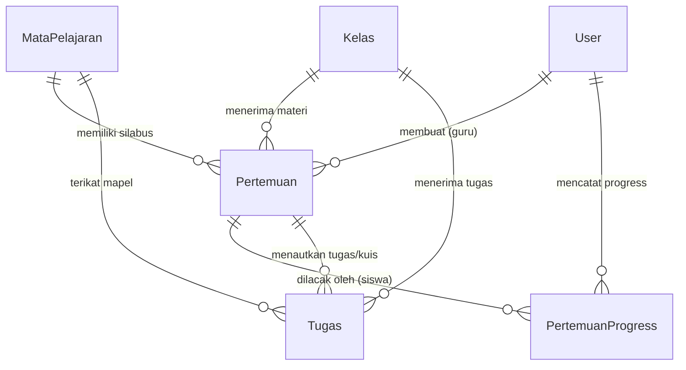
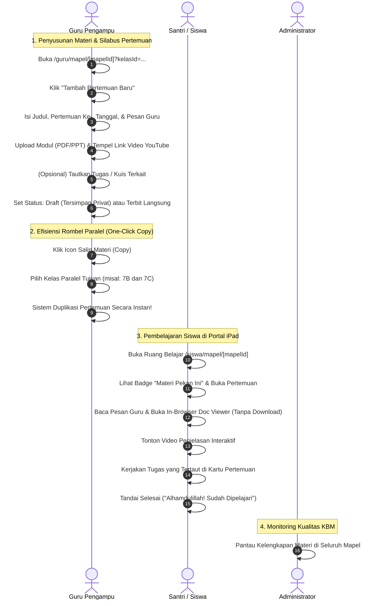

# Dokumentasi & Workflow Fitur Materi Pembelajaran (Pertemuan & Modul Digital)
### SD - SMP Islam Al-Azhar Cairo Palembang
*Sistem Informasi Akademik & Portal Pembelajaran Digital (Student Apps)*

---

## 📌 1. Pendahuluan & Gambaran Umum

Fitur **Materi Pembelajaran (Pertemuan & Modul Digital)** merupakan poros inti dari aktivitas Kegiatan Belajar Mengajar (KBM) digital dalam ekosistem **Student Apps SD & SMP Islam Al-Azhar Cairo Palembang**. Modul ini dirancang khusus untuk memfasilitasi model pembelajaran modern berbasis iPad (*iPad-integrated learning*), kurikulum terpadu berstandar nasional dan keagamaan Al-Azhar, serta efisiensi manajemen materi ajar bagi dewan guru.

Alih-alih menyebarkan file secara terpisah melalui grup pesan instan (WhatsApp) yang rawan tertimbun dan membebani memori penyimpanan tablet siswa, sistem menyatukan seluruh siklus bahan ajar ke dalam **Silabus Modular Berbasis Pertemuan (`tbl_pertemuan`)**. Setiap pertemuan bertindak sebagai satu kesatuan ruang belajar (*digital learning capsule*) yang memadukan:
1. **Pesan & Arahan Guru**: Pengantar belajar, tujuan instruksional, dan panduan belajar dari Ustadz/Ustadzah.
2. **Modul Dokumen Multi-Format**: Berkas presentasi (PPT/PPTX), modul buku saku (PDF), lembar kerja santri (DOCX/XLSX), dan infografis gambar.
3. **Pratinjau Dokumen In-Browser (*In-Browser Document Viewer*)**: Membaca dokumen langsung di peramban tanpa memaksa siswa mengunduh file atau menginstal aplikasi pihak ketiga.
4. **Video Pembelajaran Interaktif**: Pemutar video terintegrasi (YouTube dan Cloud Video) yang bebas dari gangguan rekomendasi luar.
5. **Referensi Tautan Web Eksternal**: Tautan ensiklopedia, laboratorium virtual sains, atau bahan bacaan pengayaan.
6. **Integrasi Tugas & Kuis Interaktif**: Keterikatan langsung antara materi ajar dengan evaluasi pemahaman santri.
7. **Kontrol Publikasi (Draft vs Terbit)** & **Duplikasi 1-Klik ke Rombel Paralel**: Memangkas waktu kerja administratif guru tanpa mengurangi mutu pembelajaran.

---

## 🏗️ 2. Arsitektur Data & Model Relasi (Database Schema)

Struktur data materi pembelajaran terhubung secara relasional di dalam database MySQL melalui Prisma ORM:

### Penjelasan Entitas Database Terkait:

1. **`tbl_pertemuan` (`Pertemuan`)**:
   - `id`: Primary key unik materi pertemuan (BigInt).
   - `kelas_id`: Relasi ke rombel kelas yang menerima materi (`tbl_kelas`).
   - `mapel_id`: Relasi ke mata pelajaran kurikulum (`tbl_mata_pelajaran`).
   - `guru_id`: Akun guru pembuat dan penanggung jawab materi (`users`).
   - `pertemuan_ke`: Urutan sesi pembelajaran (angka integer, misal: `1`, `2`, `3`).
   - `judul`: Topik utama KBM (contoh: *Pertemuan 3: Mengenal Rukun Iman & Karakteristik Malaikat*).
   - `deskripsi`: Arahan dan pesan pengantar belajar dari Ustadz/Ustadzah.
   - `tanggal`: Tanggal pelaksanaan jadwal KBM pertemuan tersebut.
   - `file_url`, `file_name`, `file_size`, `file_type`: Metadata lampiran berkas dokumen modul (PDF, PPTX, DOCX, XLSX, gambar).
   - `video_url`: Tautan video ajar YouTube atau cloud video hosting.
   - `link_eksternal`: Tautan referensi pengayaan luar (laboratorium virtual, artikel edukasi).
   - `is_published`: Kontrol visibilitas (Boolean: `false` = Draft Guru, `true` = Terbit untuk Siswa).

2. **`tbl_pertemuan_progress` (`PertemuanProgress`)**:
   - `id`: Primary key unik (BigInt).
   - `pertemuan_id`: Pertemuan yang dipelajari.
   - `siswa_id`: Akun santri yang telah menuntaskan pembelajaran.
   - `is_completed`: Status penyelesaian mandiri santri (Boolean).
   - `completed_at`: Stempel waktu saat santri menandai selesai belajar.
   - `@@unique([pertemuan_id, siswa_id])`: Menjamin satu santri hanya memiliki satu rekaman status per pertemuan.

3. **`tbl_tugas` (`Tugas`)**:
   - Terikat dengan `mapel_id`, `kelas_id`, dan opsional terikat langsung dengan `pertemuan_id`.
   - Mengaitkan latihan soal pilihan ganda interaktif atau esai ke dalam pertemuan belajar yang relevan.

---

## 👥 3. Workflow Lengkap Pengelolaan Materi Pembelajaran

Alur penyusunan, distribusi, dan pemanfaatan materi melibatkan interaksi antara **Guru Pengampu**, **Siswa**, dan pengawasan oleh **Administrator**:

---

### A. Alur Kerja Guru: Perancang Konten & Distribusi Materi

Guru memiliki kontrol penuh atas silabus materi pada seluruh kelas rombel yang diampunya di menu `/guru/mapel/[mapelId]`.

#### 1. Pemilihan Rombel Kelas Aktif
- Guru yang mengajar mata pelajaran sama di beberapa kelas (misal: *Matematika di Kelas 4A, 4B, dan 4C*) disajikan antarmuka pemilihan tab rombel yang intuitif.
- Setiap rombel memiliki daftar pertemuannya masing-masing, memungkinkan guru menyesuaikan ritme KBM per kelas bila ada perbedaan hari libur atau kecepatan serap santri.

#### 2. Pembuatan Pertemuan Baru (`createPertemuanAction`)
- **Nomor Pertemuan Cerdas (*Suggested Pertemuan Ke*)**:
  Sistem secara otomatis mendeteksi jumlah pertemuan yang sudah ada dan menyarankan angka berikutnya (misal: otomatis terisi angka `4` jika sudah ada pertemuan 1–3).
- **Multi-Format Lampiran Materi**:
  - **Dokumen Modul**: Mengunggah berkas modul ajar (PDF ringkasan, slide presentasi PPTX, lembar kerja Word/Excel) dengan batas ukuran aman. Berkas disimpan terstruktur di direktori penyimpanan server (`/uploads/material/`).
  - **Video Pembelajaran**: Menempelkan tautan video YouTube (mendukung format link standar maupun *shorts/embed*) atau tautan hosting video cloud.
  - **Tautan Referensi Eksternal**: Menautkan website ensiklopedia edukasi, laboratorium sains interaktif PhET, atau artikel bacaan Islami.
- **Tautkan Tugas / Kuis Terkait (*Task Linkage*)**:
  Guru dapat memilih salah satu tugas yang sudah dibuat di rombel tersebut untuk ditempelkan langsung ke dalam pertemuan ini. Siswa tidak perlu berpindah ke menu tugas terpisah untuk mengetahui pekerjaan rumahnya.
- **Kontrol Status Publikasi (*Draft Mode vs Published*)**:
  - Mode **Draft**: Materi tersimpan aman di database namun disembunyikan 100% dari portal siswa. Guru dapat menyusun materi semesteran jauh-jauh hari.
  - Mode **Published**: Materi langsung aktif dan dapat diakses siswa seketika. Tersedia tombol cepat **Toggle Publish** untuk mengubah status dengan 1 kali klik.

#### 3. Fitur Duplikasi Materi ke Rombel Paralel (*One-Click Copy Meeting*)
- Mengatasi problem kerja berulang (*redundant work*) ketika seorang guru mengajar 3–4 kelas paralel.
- **Alur Duplikasi**:
  1. Guru menyusun materi secara sempurna di kelas pertama (misal: *Kelas 7A*).
  2. Guru mengklik tombol **Salin Materi (Copy)** pada kartu pertemuan tersebut.
  3. Dialog modal menampilkan daftar rombel paralel yang diampu guru tersebut (*Kelas 7B*, *Kelas 7C*).
  4. Guru mencentang kelas-kelas tujuan dan menekan tombol **"Salin Materi"**.
  5. Fungsi `duplicatePertemuanToKelasAction` secara otomatis menggandakan seluruh record data pertemuan, lampiran modul, dan video ke rombel tujuan dalam hitungan 2–3 detik tanpa perlu upload ulang file besar.

#### 4. Pengujian Pratinjau Dokumen Guru (*In-Browser Viewer Test*)
- Guru dapat langsung mengklik tombol **"Baca Materi"** pada daftar pertemuannya untuk memverifikasi apakah tata letak slide presentasi atau format berkas PDF sudah tampil dengan sempurna sebelum dibuka oleh siswa.

---

### B. Alur Kerja Siswa: Pengalaman Belajar Digital Ramah iPad

Antarmuka siswa di `/siswa/mapel/[mapelId]` dirancang bersih, modern, dan optimal untuk layar sentuh iPad (*touch-friendly*).

#### 1. Garis Waktu Pertemuan (*Timeline & Session Number Squircle*)
- Setiap pertemuan ditampilkan dalam format kartu terstruktur dengan nomor sesi bergaya *squircle* modern (01, 02, 03...).
- **Badge Cerdas**:
  - *Materi Pekan Ini* (dilengkapi animasi *sparkles* lembut) untuk memandu santri langsung ke materi yang sedang aktif diajarkan guru minggu ini.
  - *Tanggal KBM*, *Badge Modul Dokumen*, *Badge Video*, dan *Badge Jumlah Tugas*.
- Pertemuan pertama secara otomatis terbuka (*auto-expanded*), sementara pertemuan lain dapat dibuka-tutup (*accordion toggle*) untuk menghemat ruang layar.

#### 2. Pesan Pengantar Guru (*Pesan Ustadz / Ustadzah*)
- Menampilkan pesan nasihat belajar, target pencapaian bab, atau panduan pengerjaan yang ditulis langsung oleh guru pengampu dengan tipografi yang nyaman dibaca.

#### 3. Pratinjau Dokumen In-Browser (*In-Browser Document Viewer*)
Fitur unggulan sistem yang menghilangkan kebutuhan instalasi aplikasi pembaca dokumen berat di iPad siswa:
- **Teknologi Universal Viewer**:
  - Berkas **PDF**: Dirender secara native dengan ketajaman teks tinggi.
  - Berkas **Office (PPTX, DOCX, XLSX)**: Menggunakan integrasi mesin penampil cloud terenkripsi (*Office/Docs Web Viewer*) sehingga slide presentasi tampil presisi sesuai format aslinya.
  - Berkas **Gambar / Infografis**: Mendukung format modern (WebP, PNG, JPG, AVIF).
- **Fitur Kontrol Penampil iPad**:
  - **Zoom In / Zoom Out**: Perbesaran tampilan dari 0.5x hingga 3.0x.
  - **Rotasi Dokumen (90° Increments)**: Menyesuaikan orientasi modul landscape atau portrait.
  - **Mode Layar Penuh (*Fullscreen Mode*)**: Memaksimalkan kenyamanan membaca santri di iPad.
  - **Navigasi Keyboard / Touch**: Mendukung tombol ESC untuk keluar dan panah navigasi.
  - **Unduh Opsional**: Tombol unduh tetap disediakan jika siswa ingin menyimpan salinan offline di memori iPad.

#### 4. Pemutar Video Edukasi Terintegrasi
- Siswa menonton penjelasan materi langsung di dalam ruang belajar tanpa perlu diarahkan ke aplikasi YouTube luar.
- Hal ini menjaga konsentrasi belajar santri dari godaan algoritma rekomendasi tontonan lain yang tidak edukatif.

#### 5. Kartu Tugas Terintegrasi Pertemuan
- Tugas yang ditautkan ke pertemuan langsung menampilkan kartu status:
  - Badge *Belum Dikerjakan* (dengan tombol langsung ke lembar pengerjaan tugas).
  - Badge *Sedang Dinilai* (jika santri sudah mengirimkan jawaban).
  - Badge *Nilai Diperoleh* (contoh: *Nilai: 95 / 100 ⭐*).

#### 6. Pelacak Progress Mandiri (*Mark as Studied*)
- Santri dapat menekan tombol **"Tandai Sudah Dipelajari"** setelah selesai membaca modul.
- Sistem merekam pencapaian santri ke dalam `tbl_pertemuan_progress` dan memberikan umpan balik motivasi Islami: *"Alhamdulillah! Pertemuan ini telah kamu selesaikan ⭐"*.

---

### C. Alur Kerja Administrator: Pengawasan & Standardisasi Kurikulum

Administrator memantau penyelenggaraan materi di tingkat sekolah:
1. **Pemeriksaan Konsistensi Silabus**:
   Admin dapat memeriksa keterisian materi KBM pada seluruh mata pelajaran di jenjang SD maupun SMP.
2. **Kemandirian Pengajar**:
   Admin menjamin seluruh berkas materi tersimpan rapi pada repositori terpusat sekolah, sehingga jika terjadi pergantian pengajar di tengah semester, materi yang telah disusun oleh guru sebelumnya tetap aman dan dapat dilanjutkan oleh pengajar pengganti tanpa kehilangan rekam jejak.

---

## 🔄 4. Keterhubungan Fitur Materi dengan Modul Sistem Lainnya

Materi pembelajaran menjadi pengikat utama antar-modul di Student Apps:

| Modul Terkait | Bentuk Integrasi dengan Fitur Materi |
| :--- | :--- |
| **Mata Pelajaran (`/admin/subjects`, `/guru/mapel`)** | Materi selalu terikat pada kurikulum mata pelajaran tertentu (`mapel_id`) dan rombel kelas tertentu (`kelas_id`). |
| **Jadwal Pelajaran (`/admin/schedules`)** | Guru yang memiliki SK jadwal mengajar pada suatu rombel berhak mengelola seluruh materi pertemuan di rombel tersebut. |
| **Tugas & Kuis Interaktif (`/guru/tugas`, `/siswa/tugas`)** | Tugas dapat disematkan langsung ke dalam pertemuan pembelajaran tertentu (`pertemuan_id`), menciptakan kesinambungan antara teori dan latihan. |
| **Kelas Online Tatap Muka Virtual (`/guru/kelas-online`)** | Ketika guru membuka sesi tatap maya video Daily.co, guru dan santri merujuk pada nomor pertemuan materi yang sedang dibahas bersama. |
| **Chat Konsultasi Privat Guru-Siswa (`/guru/chat`)** | Santri yang mengalami kesulitan saat membaca modul materi dapat langsung mengklik tombol konsultasi ke guru pengampu. |
| **Perangkat iPad Edukasi Sekolah** | Format file, viewer, dan pemutar video dirancang ringan guna memaksimalkan performa baterai dan kapasitas memori iPad santri. |

---

## 💡 5. Skenario Nyata di Lapangan (Real-World Use Cases)

Berikut adalah skenario penerapan fitur materi KBM dalam keseharian sekolah di SD - SMP Islam Al-Azhar Cairo Palembang:

### 🎭 Skenario 1: Duplikasi Modul Bahasa Arab ke Empat Rombel Paralel
- **Situasi**: Ustadz Ahmad mengajar Bahasa Arab untuk seluruh rombel kelas 8 (Kelas 8A, 8B, 8C, dan 8D). Modul minggu ini adalah materi *"Qawa'id: Isim Dhomir"* dengan modul presentasi PPTX berukuran 18 MB dan tautan video penjelasan makhraj huruf berdurasi 12 menit.
- **Workflow Sistem**:
  1. Ustadz Ahmad membuka `/guru/mapel` dan memilih Bahasa Arab untuk Kelas 8A.
  2. Beliau mengunggah berkas PPTX, menempelkan link YouTube, dan menyematkan kuis latihan 10 soal.
  3. Alih-alih mengulang upload 3 kali di kelas 8B, 8C, dan 8D, Ustadz Ahmad cukup mengklik tombol **Salin Materi (Copy)**.
  4. Beliau mencentang rombel 8B, 8C, dan 8D, lalu menekan tombol **Salin Materi**.
- **Hasil**: Dalam 3 detik, materi di seluruh kelas 8 paralel langsung terbit seragam tanpa menghabiskan kuota internet guru dan tanpa buang waktu.

---

### 🎭 Skenario 2: Santri Membaca Modul IPA di iPad Tanpa Aplikasi Office
- **Situasi**: Ananda Faris (santri Kelas 5) sedang berada di asrama/rumah dan ingin mempelajari modul IPA bab *"Siklus Air"* di tablet iPad miliknya. iPad santri memiliki kebijakan pembatasan instalasi aplikasi luar (*device management*).
- **Workflow Sistem**:
  1. Faris membuka portal `/siswa/mapel` dan memilih pelajaran IPA.
  2. Faris mengklik kartu **Pertemuan 2: Siklus Hidrologi Bumi**.
  3. Faris menekan tombol **"Baca Materi"**.
  4. Modul slide presentasi langsung terbuka di peramban iPad menggunakan **In-Browser Document Viewer**.
  5. Faris dapat memperbesar teks (*zoom-in*), menggeser halaman slide, dan membaca dengan nyaman tanpa perlu mengunduh file dokumen atau memasang Microsoft PowerPoint.
  6. Setelah selesai, Faris menekan tombol **"Tandai Sudah Dipelajari"**.
- **Hasil**: Santri belajar mandiri dengan lancar, memori iPad tetap lega, dan tidak terkendala lisensi aplikasi tambahan.

---

### 🎭 Skenario 3: Penyiapan Materi Penilaian Akhir Semester (Mode Draft)
- **Situasi**: Seorang guru ingin menyiapkan rangkuman materi kisi-kisi dan pembahasan soal ujian akhir dua pekan sebelum jadwal PAS berlangsung, namun siswa tidak boleh mengaksesnya terlebih dahulu.
- **Workflow Sistem**:
  1. Guru membuat pertemuan baru berjudul *"Pendalaman Materi & Kisi-Kisi PAS Semester Ganjil"*.
  2. Guru mematikan saklar toggle **"Terbitkan Materi"** (status `is_published = false`).
  3. Pertemuan tersimpan di dashboard guru dengan label **Draf Guru**.
  4. Di portal seluruh siswa, pertemuan tersebut sama sekali tidak terlihat.
  5. Pada pagi hari jadwal KBM pendalaman dimulai, guru cukup mengklik satu kali tombol **Toggle Publish**.
- **Hasil**: Kerahasiaan bahan ajar terjaga sempurna hingga waktu yang tepat ditentukan guru.

---

### 🎭 Skenario 4: Integrasi Modul Teori dengan Kuis Langsung
- **Situasi**: Pada mata pelajaran Fiqih bab *"Tata Cara Sholat Jenazah"*, Ustadzah Maryam ingin santri membaca panduan bacaan niat dan doa terlebih dahulu sebelum mengerjakan kuis evaluasi pemahaman.
- **Workflow Sistem**:
  1. Ustadzah Maryam menyusun Pertemuan 4 dengan melampirkan modul PDF panduan doa sholat jenazah dan video peragaan takbir.
  2. Pada opsi form materi, beliau memilih tugas yang telah dibuat: *"Kuis Pemahaman Sholat Jenazah"*.
  3. Ketika siswa membuka Pertemuan 4, kartu tugas kuis langsung tampil tepat di bawah materi bacaan.
- **Hasil**: Siswa memiliki alur belajar terpandu: membaca teori, menonton peragaan, lalu langsung menguji kemampuan tanpa tersesat mencari tautan kuis.

---

## 🎯 6. Masalah Krusial yang Diselesaikan Sistem Ini

Sebelum adanya modul materi terpadu ini, kegiatan pembelajaran digital sekolah menghadapi sejumlah kendala:

| Masalah Konvensional | Solusi Cerdas yang Dihadirkan Sistem Ini |
| :--- | :--- |
| **Materi Tercecer di Grup WhatsApp** File modul PDF dan rekaman video terselip di obrolan chat grup wali murid sehingga sulit ditemukan kembali saat ujian. | **Repositori Silabus Terstruktur Berbasis Pertemuan** Semua bahan ajar tersusun rapi dari Pertemuan 1 hingga akhir semester dan dapat diakses santri kapan saja. |
| **Memori Penyimpanan iPad Siswa Cepat Penuh** Siswa terpaksa mengunduh puluhan berkas PDF dan PPT berukuran besar ke memori lokal tablet. | **Pratinjau Dokumen In-Browser (*Zero-Download Viewer*)** Santri membaca dokumen langsung di dalam aplikasi browser dengan kontrol zoom, rotasi, dan layar penuh. |
| **Ketergantungan Aplikasi Pihak Ketiga di iPad** iPad santri harus dipasangi berbagai aplikasi viewer terpisah (Word, PowerPoint, PDF reader) yang membutuhkan lisensi. | **Universal Web Doc Engine** Mendukung format PDF, PPT, Word, Excel, dan gambar tanpa membutuhkan instalasi aplikasi tambahan. |
| **Kerja Berulang Mengunggah File Sama di Rombel Paralel** Guru yang mengajar 4 kelas paralel harus upload materi yang sama berulang kali. | **Fitur Duplikasi 1-Klik (*One-Click Copy Meeting*)** Cukup buat di satu kelas, lalu gandakan ke seluruh kelas paralel dalam waktu 3 detik. |
| **Gangguan Distraksi Tontonan di YouTube** Membagikan link video YouTube biasa membuat santri teralihkan ke video hiburan atau iklan yang tidak pantas. | **Pemutar Video Khusus Terintegrasi** Video disematkan langsung di dalam ruang belajar Al-Azhar tanpa rekomendasi video luar. |
| **Kuis dan Materi Terpisah Tanpa Konteks** Siswa bingung tugas PR yang diberikan guru mengacu pada materi atau bab yang mana. | **Penautan Tugas Terpadu (*Task Linkage*)** Tugas dan kuis ditempelkan langsung di dalam kartu pertemuan materi bersangkutan. |

---

## 📋 7. Ringkasan Hak Akses & Matriks Fitur

Tabel matriks hak akses berikut merangkum wewenang masing-masing peran terhadap modul materi pembelajaran:

| Fitur / Modul | Administrator | Guru Pengampu | Siswa | Keterangan / Lokasi |
| :--- | :---: | :---: | :---: | :--- |
| **Lihat Daftar Pertemuan Mapel** | ✅ Semua Rombel | ✅ Rombel yang Diampu | ✅ Rombel Sendiri | `/guru/mapel/[id]`, `/siswa/mapel/[id]` |
| **Buat Pertemuan & Unggah Modul Ajar** | ✅ Penuh | ✅ Rombel yang Diampu | ❌ Tidak | Form modal pertemuan baru |
| **Edit Data Pertemuan & Ganti File** | ✅ Penuh | ✅ Hanya Materi Miliknya | ❌ Tidak | Update data materi pertemuan |
| **Hapus Pertemuan Pembelajaran** | ✅ Penuh | ✅ Hanya Materi Miliknya | ❌ Tidak | Aman: tugas terkait tidak ikut terhapus |
| **Salin Materi ke Rombel Paralel (Copy)** | ✅ Penuh | ✅ Rombel yang Diampu | ❌ Tidak | Dialog modal salin pertemuan |
| **Ubah Status Publikasi (Draft / Terbit)** | ✅ Penuh | ✅ Rombel yang Diampu | ❌ Tidak | Tombol cepat toggle publish |
| **Baca Dokumen In-Browser (PDF/PPT/DOC)** | ✅ Penuh | ✅ Penuh | ✅ Penuh | Mesin InBrowserDocViewer universal |
| **Tonton Video Pembelajaran Terintegrasi** | ✅ Penuh | ✅ Penuh | ✅ Penuh | Pemutar video tanpa distraksi iklan |
| **Buka Tautan Tugas dari Pertemuan** | ✅ Penuh | ✅ Penuh | ✅ Kerjakan Tugas | Tautan langsung ke lembar tugas |
| **Tandai Selesai ("Alhamdulillah!")** | ❌ Tidak | ❌ Tidak | ✅ Khusus Siswa | Rekam progress `tbl_pertemuan_progress` |

---

*Dokumen ini disusun secara resmi sebagai standar operasional prosedur (SOP) dan dokumentasi teknis sistem Student Apps SD - SMP Islam Al-Azhar Cairo Palembang.*
