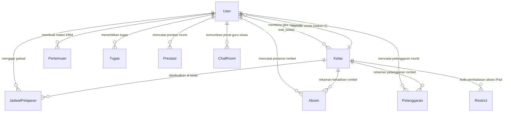
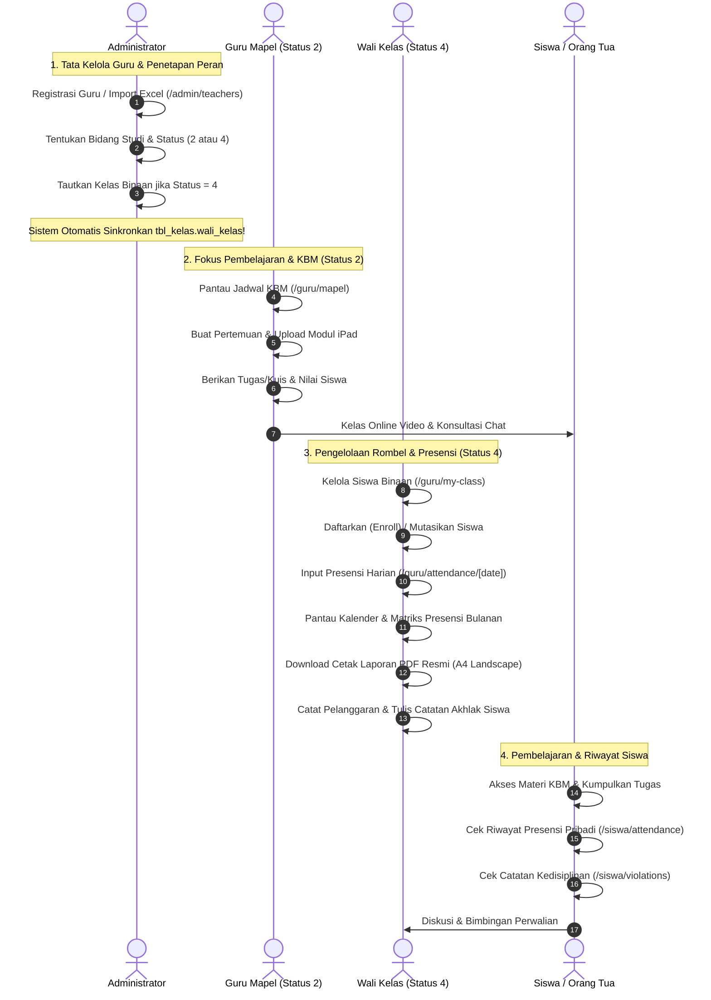

# Dokumentasi & Workflow Fitur Status Guru, Guru Mapel & Wali Kelas
### SD - SMP Islam Al-Azhar Cairo Palembang
*Sistem Informasi Akademik & Portal Pembelajaran Digital (Student Apps)*

---

## 📌 1. Pendahuluan & Gambaran Umum

Dalam ekosistem pendidikan **SD & SMP Islam Al-Azhar Cairo Palembang**, dewan guru memegang dua peranan strategis: sebagai **Pendidik Bidang Studi (Guru Mata Pelajaran)** yang bertanggung jawab atas capaian kurikulum akademik, serta sebagai **Pembina Karakter & Pengayom Rombel (Wali Kelas)** yang bertanggung jawab penuh atas kedisiplinan, kehadiran, akhlak, dan perkembangan holistik peserta didik di rombel binaannya.

Untuk mendukung fleksibilitas operasional sekolah tanpa menciptakan redundansi akun login, sistem **Student Apps** menerapkan arsitektur *Role-Based Access Control (RBAC)* dinamis berbasis **Status Pengguna (`users.status`)**. Arsitektur ini memungkinkan seorang guru memiliki akun tunggal yang secara cerdas menyesuaikan tampilan antarmuka, navigasi menu, dan izin eksekusi (*Server Actions*) berdasarkan status penugasan yang diberikan oleh **Administrator**:

1. **Status `"2"` — Guru Mata Pelajaran**:
   Fokus pada kegiatan belajar mengajar (KBM), pembuatan silabus pertemuan, distribusi modul ajar digital di iPad, bank soal, evaluasi tugas/kuis, serta tatap muka virtual interaktif (*live conference*).
2. **Status `"4"` — Guru & Wali Kelas**:
   Memiliki seluruh kewenangan Guru Mata Pelajaran, **ditambah** otoritas perwalian penuh: mengelola daftar peserta didik di rombel binaan (`/guru/my-class`), mencatat presensi harian, memantau matriks kehadiran bulanan, mengekspor dokumen rekapitulasi PDF resmi berstandar Al-Azhar (`/guru/attendance`), mencatat pelanggaran kedisiplinan santri, serta memberikan catatan pembinaan berkala.
3. **Status `"0"` — Pending Verifikasi**:
   Akun guru baru yang mendaftar atau didaftarkan namun belum diverifikasi secara resmi oleh Administrator sekolah.

Sistem dirancang dengan integrasi basis data real-time, sinkronisasi dua arah (*two-way synchronization*) antara profil guru dan data rombel kelas, serta proteksi keamanan berlapis di sisi server.

---

## 🏗️ 2. Arsitektur Data & Model Relasi (Database Schema)

Pengelolaan status guru, penugasan mata pelajaran, dan perwalian kelas terintegrasi melalui skema database MySQL Prisma ORM berikut:



### Penjelasan Entitas Database Terkait:

1. **`users` (`User`)**:
   - `id`: Primary key unik (BigInt).
   - `name`: Nama lengkap beserta gelar akademik guru (contoh: *Ustadzah Fatimah, S.Pd*).
   - `nip`: Nomor Induk Pegawai resmi yayasan/sekolah.
   - `guru_bidang`: Bidang studi resmi pengampu (contoh: *Pendidikan Agama Islam*, *Matematika*, *Bahasa Inggris*).
   - `status`: Penentu peran utama di sistem:
     - `"0"` = Akun baru menunggu verifikasi Admin.
     - `"1"` = Peserta didik (Siswa).
     - `"2"` = Guru Mata Pelajaran murni.
     - `"3"` = Administrator sistem & kurikulum.
     - `"4"` = Guru & Wali Kelas.
   - `kelas`: Nama rombel binaan jika guru bertindak sebagai Wali Kelas (contoh: *Kelas 4 - Mehmed Al Fatih*). Jika hanya Guru Mapel, bernilai `null` atau kosong.
   - `appleid` & `passwordappleid`: Kredensial sinkronisasi perangkat iPad edukasi guru.
   - `notes`: Catatan kepribadian / rekam jejak santri (pada akun siswa yang dikurasi oleh wali kelas).

2. **`tbl_kelas` (`Kelas`)**:
   - `id`: Primary key unik kelas (BigInt).
   - `nama_kelas`: Identitas rombel resmi (contoh: *Kelas 7 - Ibnu Sina*).
   - `jenjang`: Jenjang pendidikan (`SD` atau `SMP`).
   - `tingkat`: Tingkat jenjang kelas (angka `4` sampai `9`).
   - `wali_kelas`: Nama lengkap guru yang sedang bertugas sebagai Wali Kelas di rombel tersebut. Tersinkronisasi otomatis dengan akun User berstatus `"4"`.
   - `jumlah_siswa`: Daya tampung atau kuantitas santri dalam rombel.

3. **`tbl_absen` (`Absen`)**:
   - Menyimpan rekaman presensi santri per hari: `date` (`YYYY-MM-DD`), `month`, `year`, `user_id` (ID siswa), `kelas`, serta status kehadiran `keterangan` (`Hadir`, `Sakit`, `Izin`, `Alpa`).

4. **`tbl_pelanggaran` (`Pelanggaran`)**:
   - Buku catatan disiplin santri: `user_id`, `nama`, `kelas`, `kategori` (contoh: *Kedisiplinan*, *Ibadah*, *Seragam*), `keterangan`, dan stempel waktu `created_at`.

5. **`tbl_prestasi` (`Prestasi`)**:
   - Apresiasi pencapaian santri: `id_user`, `nama`, `kelas`, `prestasi`, `fotoanak`, dan tanggal perolehan.

---

## 👥 3. Workflow Lengkap Berdasarkan Peran Pengguna

Alur kerja dirancang untuk membagi wewenang secara adil, aman, dan transparan antara Administrator, Guru Mata Pelajaran, Wali Kelas, dan Siswa.



---

### A. Peran Administrator: Otoritas Tunggal Manajemen Guru & Wali Kelas

Administrator memiliki kendali mutlak atas penetapan identitas kepegawaian, verifikasi status, dan penugasan kelas di `/admin/teachers`.

#### 1. Registrasi & Verifikasi Status Akun Guru
- **Registrasi Manual**:
  - Admin menginput Nama Lengkap + Gelar, Email Login, Password (min. 6 karakter), NIP, Gender, Bidang Studi (`guru_bidang`), Apple ID, dan Password Apple ID untuk iPad guru.
  - Memilih peran melalui radio button:
    - `addRoleChoice = "2"` ➔ **Guru Mata Pelajaran** (tanpa kelas binaan).
    - `addRoleChoice = "4"` ➔ **Guru & Wali Kelas** (wajib memilih rombel *Kelas Wali* dari dropdown).
- **Import Massal via Excel (`.xlsx`)**:
  - Tersedia template unduhan standar (`Template_Import_Guru_AlAzhar.xlsx`) dengan kolom terstruktur: Nama, NIP, Email, Password, Gender, Bidang Studi, Status/Peran (`Guru` atau `Wali Kelas`), dan Nama Kelas Wali.
- **Verifikasi Akun Baru (`verifyUserAction`)**:
  - Akun guru baru yang mendaftar secara mandiri memiliki status awal `"0"` (*Pending Verifikasi*).
  - Admin membuka modal verifikasi dan menentukan status akhir guru: langsung diaktifkan sebagai Guru Mapel (`2`) atau Guru & Wali Kelas (`4`).

#### 2. Logika Sinkronisasi Otomatis Antara Akun Guru & Rombel Kelas (`tbl_kelas`)
Sistem menerapkan otomasi database mutakhir untuk mencegah inkonsistensi nama wali kelas:
1. **Penetapan Wali Kelas Baru**:
   Saat Admin memilih status `"4"` dan memilih kelas *Kelas 4 - Mehmed Al Fatih*, sistem secara otomatis mengeksekusi:
   ```sql
   UPDATE tbl_kelas SET wali_kelas = 'Nama Guru' WHERE nama_kelas = 'Kelas 4 - Mehmed Al Fatih';
   ```
2. **Mutasi / Perpindahan Kelas Binaan**:
   Jika guru sebelumnya membina *Kelas 4A* lalu dipindahkan membina *Kelas 4B*, sistem secara otomatis:
   - Mengosongkan wali kelas pada rombel lama (*Kelas 4A*): `wali_kelas = null`.
   - Menetapkan guru tersebut pada rombel baru (*Kelas 4B*): `wali_kelas = 'Nama Guru'`.
3. **Pencabutan Jabatan Wali Kelas (Kembali ke Guru Mapel `2`)**:
   Jika status guru diubah dari `"4"` menjadi `"2"`, sistem otomatis membersihkan field `wali_kelas` pada rombel binaannya dan mengosongkan `kelas` pada akun guru.
4. **Keamanan Integritas Data Kurikulum**:
   Atribut `guru_bidang`, `status`, dan `kelas` **dikunci sepenuhnya (*read-only*)** di halaman profil guru. Guru tidak dapat mengubah mata pelajaran yang diampunya maupun mengklaim kelas perwalian sendiri tanpa SK resmi dari Administrator.

---

### B. Peran Guru Mata Pelajaran (Status `"2"`): Pendidik Fokus KBM

Guru Mata Pelajaran murni berfokus penuh pada kualitas pembelajaran akademik santri tanpa dibebani urusan perwalian rombel harian.

#### 1. Ruang Lingkup Kerja & Navigasi Menu
- **Dashboard Personal (`/guru`)**:
  - Menampilkan ringkasan metrik: Jumlah materi yang diterbitkan, tugas aktif yang dibuka, tugas siswa yang menunggu penilaian (*Pending Review*), dan jadwal mengajar mingguan.
- **Mata Pelajaran & Silabus (`/guru/mapel`)**:
  - Menyusun pertemuan silabus (Pertemuan 1, 2, dst.), mengunggah berkas modul digital (PDF, PPT, Word), menyematkan video pembelajaran interaktif, membuat tugas/kuis, serta fitur *1-Click Copy* materi ke rombel paralel.
- **Kelas Online Tatap Muka Virtual (`/guru/kelas-online`)**:
  - Membuka ruang tatap maya (Daily.co Video Conference) berkeamanan tinggi dengan nama mata pelajaran yang diampu.
- **Pesan Chat Interaktif (`/guru/chat`)**:
  - Melayani konsultasi akademik 1-on-1 dengan seluruh santri yang diajarnya.
- **Pencatatan Prestasi Siswa (`/guru/achievements`)**:
  - Berhak mencatatkan prestasi akademik santri yang menonjol pada mata pelajaran bersangkutan.

#### 2. Proteksi & Guard Halaman Perwalian
Jika Guru Mata Pelajaran murni (status `"2"`) sengaja atau tidak sengaja mengakses URL perwalian (`/guru/my-class` atau `/guru/attendance`):
- Sistem **tidak melemparkan pesan error teknis mentah**, melainkan menampilkan antarmuka edukasi yang ramah:
  > **"Khusus Guru & Wali Kelas"**
  > *"Akun Anda terdaftar sebagai Guru Mata Pelajaran (Bahasa Inggris). Menu Kelas Saya & Absensi Kelas dikhususkan bagi dewan guru yang bertugas sebagai Wali Kelas. Silakan hubungi Administrator jika Anda ditugaskan sebagai Wali Kelas."*
- Disediakan tombol aksi cepat langsung menuju menu *Mapel & Tugas* atau kembali ke *Dashboard*.
- Di level server, fungsi `checkWaliKelasOrAdmin()` memblokir seluruh manipulasi data (Enroll, Hapus Siswa, Input Absen) dengan pesan penolakan otoritas resmi.

---

### C. Peran Guru & Wali Kelas (Status `"4"`): Pembina Rombel Holistik

Dewan guru berstatus `"4"` memiliki peran ganda: mengajar mata pelajaran resmi sekaligus menjadi pimpinan pembina bagi satu rombel kelas santri.

#### 1. Menu Eksklusif Sidebar
Pada bilah navigasi sidebar, sistem secara dinamis menampilkan 2 menu penting tambahan:
- **Kelas Saya (`/guru/my-class`)**
- **Absensi Kelas (`/guru/attendance`)**

#### 2. Manajemen Peserta Didik Rombel (`/guru/my-class`)
Wali Kelas bertindak sebagai manajer utama rombel binaannya:
- **Tabel Daftar Siswa Binaan**:
  - Menampilkan avatar foto siswa, NIS, nama lengkap, gender, poin sikap, serta catatan ringkas.
  - Pencarian instan dan penyaringan berdasarkan NIS atau nama anak.
- **Pendaftaran Siswa Baru (*Enroll Student*)**:
  - Memasukkan santri baru atau santri pindahan yang belum memiliki rombel ke dalam kelas binaan dengan 1 klik.
- **Pengeluaran Siswa Massal (*Bulk Remove from Class*)**:
  - Memilih beberapa siswa sekaligus menggunakan *checkbox* untuk dikeluarkan dari kelas binaan (misal karena mutasi rombel).
  - Dilengkapi sistem validasi: Wali Kelas dilarang keras mengeluarkan santri dari rombel lain.
- **Profil Siswa & Catatan Pembinaan (`/guru/my-class/[studentId]`)**:
  - **Catatan Wali Kelas (*Notes*)**: Wali Kelas dapat menuliskan evaluasi kepribadian, akhlak, adaptasi belajar, atau pesan pembinaan khusus yang tersimpan permanen di profil santri.
  - **Buku Pelanggaran Santri (*Violations Log*)**: Wali Kelas dapat mencatat jenis pelanggaran santri (kategori kedisiplinan, keterlambatan, perlengkapan sholat, seragam), memberi deskripsi tindakan pembinaan, serta menghapus rekaman jika santri telah memperbaiki perilakunya.

#### 3. Sistem Presensi Harian & Rekapitulasi Komprehensif (`/guru/attendance`)
Fitur presensi dirancang sangat lengkap dan fleksibel untuk kebutuhan harian maupun pelaporan bulanan:
- **Kalender Presensi Interaktif**:
  - Menampilkan visual kalender bulanan dengan indikator tanggal mana yang sudah diisi presensinya (*Hijau*) dan tanggal mana yang belum diisi (*Abu-abu*).
- **Form Presensi Harian Cepat (`/guru/attendance/[date]`)**:
  - Mengambil daftar seluruh santri di rombel secara otomatis.
  - Opsi status kehadiran per anak: `Hadir`, `Sakit`, `Izin`, dan `Alpa`.
  - Default kehadiran bernilai `Hadir` untuk mempercepat proses pencatatan.
- **Tabel Matriks Presensi Bulanan (`/guru/attendance/table/[date]`)**:
  - Tampilan layaknya spreadsheet matriks kalender dari tanggal 1 hingga 31, merangkum kehadiran setiap santri dalam satu layar penuh.
- **Export Dokumen Rekapitulasi PDF Resmi (`/guru/attendance/recap`)**:
  - Menghasilkan dokumen cetak resmi berstandar kurikulum Al-Azhar dalam format **PDF A4 Landscape**.
  - Dilengkapi Kop Surat Sekolah resmi SD/SMP Islam Al-Azhar Cairo Palembang, tabel data kehadiran santri lengkap dengan persentase kehadiran, serta kolom tanda tangan basah resmi untuk **Kepala Sekolah** dan **Wali Kelas**.

#### 4. Reaktivitas Sinkronisasi Nama Profil
Jika Wali Kelas memperbarui nama lengkap atau gelarnya di halaman `/guru/profile` (misalnya setelah menyelesaikan jenjang magister menjadi *Ustadz Farhan, M.Pd*), sistem secara otomatis mendeteksi status `"4"` dan memperbarui nilai `wali_kelas` di tabel `tbl_kelas` secara *real-time*.

---

### D. Peran Siswa: Penerima Bimbingan & Pemantau Prestasi

Siswa menikmati pengalaman terpadu dari bimbingan Wali Kelas dan Guru Mata Pelajaran:
1. **Identitas Wali Kelas**:
   - Siswa dapat melihat informasi lengkap mengenai siapa Wali Kelas yang membimbingnya di dashboard dan profil kelas.
2. **Transparansi Riwayat Kehadiran (`/siswa/attendance`)**:
   - Siswa dapat melihat rekapitulasi kehadiran dirinya sendiri (berapa kali Hadir, Sakit, Izin, atau Alpa) secara terbuka dan jujur.
3. **Pusat Evaluasi Diri (`/siswa/violations`)**:
   - Santri dapat memantau catatan pelanggaran kedisiplinan yang pernah dicatat oleh guru/wali kelas sebagai sarana introspeksi diri (*muhasabah*).
4. **Saluran Konsultasi Pribadi (`/siswa/chat`)**:
   - Membuka ruang percakapan privat dengan Wali Kelas untuk menceritakan kendala belajar, kesehatan, atau bimbingan konseling.

---

## 🔄 4. Keterhubungan Fitur dengan Modul Sistem Lainnya

Status kepegawaian guru dan perwalian kelas menjadi pondasi bagi kelancaran seluruh modul operasional sekolah:

| Fitur Terkait | Bentuk Integrasi dengan Status Guru & Wali Kelas |
| :--- | :--- |
| **Kelola Data Kelas (`/admin/classes`)** | Setiap rombel di `tbl_kelas` menampilkan nama Wali Kelas aktif. Perubahan data guru langsung merefleksikan perubahan di master kelas. |
| **Presensi Siswa (`/guru/attendance`, `/siswa/attendance`)** | Pengisian presensi dibatasi hanya untuk Wali Kelas yang bersangkutan (`checkWaliKelasOrAdmin`). Data absensi langsung tampil di portal santri. |
| **Buku Disiplin & Pelanggaran (`/guru/my-class/[id]`, `/siswa/violations`)** | Wali Kelas mencatatkan catatan pelanggaran santri rombel binaannya. Santri dapat melihat rekam jejak perilakunya untuk bahan evaluasi diri. |
| **Catatan Karakter & Rapor (`users.notes`)** | Wali kelas menginput catatan pembinaan santri yang akan diintegrasikan ke dalam laporan perkembangan santri semesteran. |
| **Jadwal Pelajaran (`/admin/schedules`, `/guru/mapel`)** | Baik Guru Mapel (status 2) maupun Wali Kelas (status 4) dapat dijadwalkan mengajar mata pelajaran tertentu di berbagai rombel kelas yang berbeda. |
| **Live Tatap Muka (`/guru/kelas-online`)** | Guru dapat membuka ruang video conference terenkripsi untuk jam pelajaran atau sesi perwalian kelas online. |
| **Chat Konsultasi (`/guru/chat`, `/siswa/chat`)** | Sistem otomatis memvalidasi hubungan perwalian dan jadwal KBM saat santri memulai obrolan dengan guru atau wali kelasnya. |
| **Manajemen iPad & Apple ID (`users.appleid`)** | Akun guru menyimpan kredensial Apple ID terstandarisasi untuk mendistribusikan aplikasi edukasi dan modul ajar ke perangkat iPad guru. |

---

## 💡 5. Skenario Nyata di Lapangan (Real-World Use Cases)

Berikut adalah skenario praktis penerapan alur kerja status guru dan wali kelas di lingkungan SD - SMP Islam Al-Azhar Cairo Palembang:

### 🎭 Skenario 1: Penugasan Guru Baru & Verifikasi Status oleh Admin
- **Situasi**: Ustadz Rian adalah dewan guru baru yang diterima mengajar mata pelajaran IPA di jenjang SMP. Beliau mendaftar ke sistem Student Apps.
- **Workflow Sistem**:
  1. Akun Ustadz Rian masuk dengan status awal `"0"` (*Pending Verifikasi*). Beliau belum bisa mengakses data KBM sekolah.
  2. Bagian Kurikulum (Admin) membuka `/admin/teachers` dan mendapati akun Ustadz Rian pada tabel guru dengan badge kuning *Pending Verifikasi*.
  3. Admin mengklik tombol aksi **"Verifikasi Status"**, memilih opsi **Guru Mata Pelajaran (Status 2)**, dan mengisi bidang studi `Ilmu Pengetahuan Alam (IPA)`.
  4. Karena belum ditugaskan sebagai wali kelas, kolom rombel dibiarkan kosong.
- **Hasil**: Akun Ustadz Rian langsung aktif. Beliau dapat login, menyusun materi di `/guru/mapel`, namun tidak dibebani menu perwalian rombel.

---

### 🎭 Skenario 2: Pergantian Wali Kelas di Awal Semester Baru
- **Situasi**: Karena rotasi tugas tahunan, Ustadzah Nur yang semula membina *Kelas 4 - Salahuddin Al Ayyubi* kini ditugaskan menjadi Wali Kelas *Kelas 5 - Thariq Bin Ziyad*, menggantikan Ustadz Hasan yang kini murni bertugas sebagai Guru Matematika.
- **Workflow Sistem**:
  1. Admin membuka `/admin/teachers` dan mengklik tombol **Edit Data** pada akun Ustadz Hasan. Admin mengubah perannya dari status `"4"` menjadi status `"2"` (Guru Mapel).
  2. Sistem secara otomatis menghapus Ustadz Hasan dari kolom `wali_kelas` di *Kelas 5 - Thariq Bin Ziyad* (`tbl_kelas`).
  3. Admin kemudian mengedit akun Ustadzah Nur, memilih status `"4"`, dan memilih rombel tujuan *Kelas 5 - Thariq Bin Ziyad*.
  4. Sistem otomatis melepaskan *Kelas 4* dari Ustadzah Nur dan menetapkan nama beliau di *Kelas 5*.
- **Hasil**: Dalam sekali simpan, sinkronisasi rombel kelas bersih tanpa duplikasi. Seluruh hak akses presensi dan daftar siswa Kelas 5 otomatis berpindah ke Ustadzah Nur.

---

### 🎭 Skenario 3: Rutinitas Presensi Pagi & Deteksi Santri Tidak Masuk
- **Situasi**: Setiap pukul 07.15 WIB sebelum dimulainya jam sholat Dhuha dan tadarus Al-Qur'an, Wali Kelas Kelas 7 - Ibnu Sina (Ustadz Farhan) melakukan pengecekan kehadiran santri.
- **Workflow Sistem**:
  1. Ustadz Farhan membuka iPad miliknya, login ke Student Apps, lalu membuka menu **Absensi Kelas** (`/guru/attendance`).
  2. Beliau mengklik kartu **"Form Absen Hari Ini"**. Seluruh santri Kelas 7 secara otomatis tampil dengan status default *Hadir*.
  3. Ustadz Farhan melihat ananda Zaidan izin sakit melalui surat dokter dari orang tua. Beliau cukup mengubah opsi Zaidan menjadi **Sakit**.
  4. Ustadz Farhan menekan tombol **"Simpan Presensi"**.
- **Hasil**: Data presensi tersimpan dalam hitungan detik. Di portal ananda Zaidan dan orang tuanya, status kehadiran hari itu langsung terverifikasi sebagai *Sakit*, dan tanggal hari itu di kalender wali kelas berubah menjadi hijau.

---

### 🎭 Skenario 4: Pembinaan Kedisiplinan & Pencatatan Pelanggaran Santri
- **Situasi**: Ketika pemeriksaan kelengkapan ibadah, seorang santri lupa membawa mushaf Al-Qur'an dan sajadah sholat selama dua hari berturut-turut.
- **Workflow Sistem**:
  1. Wali Kelas membuka menu **Kelas Saya** (`/guru/my-class`) dan mengklik nama santri bersangkutan untuk membuka halaman detail (`/guru/my-class/[id]`).
  2. Pada tab **Pelanggaran**, Wali Kelas menekan tombol **"Tambah Pelanggaran"**.
  3. Memilih kategori *Kedisiplinan / Perlengkapan Ibadah* dan menulis keterangan: *"Tidak membawa mushaf dan sajadah pribadi saat sholat Dhuha berjamaah"*.
  4. Wali Kelas juga menambahkan catatan pembinaan di tab **Catatan Wali Kelas**: *"Diberikan nasihat santun & diingatkan untuk menyiapkan perlengkapan ibadah di malam hari."*
- **Hasil**: Riwayat pembinaan tersimpan rapi. Wali murid dapat memantau catatan kedisiplinan tersebut dari rumah, menciptakan sinergi pembinaan akhlak antara sekolah dan keluarga.

---

### 🎭 Skenario 5: Cetak Laporan Rekap Presensi Bulanan Resmi untuk Kepala Sekolah
- **Situasi**: Pada akhir bulan September, Bagian Tata Usaha dan Kepala Sekolah meminta laporan rekapitulasi presensi seluruh santri Kelas 4 untuk arsip bulanan.
- **Workflow Sistem**:
  1. Wali Kelas Kelas 4 membuka `/guru/attendance/recap`.
  2. Sistem otomatis menghitung total Hadir, Sakit, Izin, dan Alpa setiap santri sepanjang bulan berjalan beserta persentase kehadirannya.
  3. Wali Kelas menekan tombol **"Cetak / Simpan PDF"**.
  4. Sistem menghasilkan dokumen resmi format PDF A4 Landscape berlogo Al-Azhar Cairo, lengkap dengan tanggal cetak dan kolom tanda tangan Kepala Sekolah serta Wali Kelas.
- **Hasil**: Laporan presensi rapi, formal, siap cetak tanpa perlu olah rumus manual di Microsoft Excel.

---

## 🎯 6. Masalah Krusial yang Diselesaikan Sistem Ini

Sebelum standarisasi fitur status guru dan wali kelas ini diimplementasikan, sekolah menghadapi sejumlah kendala administratif:

| Masalah Konvensional | Solusi Cerdas yang Dihadirkan Sistem Ini |
| :--- | :--- |
| **Kerancuan Akun Ganda Guru**<br>Guru yang merangkap Wali Kelas harus memiliki dua akun berbeda untuk mengajar dan mengelola rombel. | **Akun Tunggal Berbasis Dynamic Status**<br>Cukup satu akun login. Sistem otomatis menampilkan menu mengajar dan menu perwalian secara harmonis berdasarkan status pengguna. |
| **Ketidaksinkronan Nama Wali Kelas di Rombel**<br>Pergantian wali kelas di profil guru sering lupa diperbarui pada master data kelas sehingga rapor salah cetak nama. | **Sinkronisasi Otomatis Dua Arah (*Two-Way Sync*)**<br>Perubahan status dan kelas binaan di Admin atau perubahan nama di profil guru otomatis meng-update tabel `tbl_kelas.wali_kelas`. |
| **Klaim Sepihak & Kesalahan Akses Data Kelas**<br>Guru mengedit presensi atau mengubah data siswa di rombel yang bukan hak perwaliannya. | **Proteksi Ketat (*Server-Level Guard*)**<br>Fungsi `checkWaliKelasOrAdmin()` memastikan guru hanya berhak mengelola santri di kelas binaan resminya. |
| **Rekapitulasi Absensi Akhir Bulan yang Menyita Waktu**<br>Wali kelas menghitung manual hari hadir siswa dari buku absensi fisik untuk membuat laporan bulanan. | **Rekap Otomatis & Export PDF 1-Klik**<br>Sistem otomatis mengagregasi total kehadiran dan mencetak dokumen resmi PDF landscape lengkap dengan tanda tangan pengesahan. |
| **Riwayat Pelanggaran Santri Tercecer**<br>Catatan pelanggaran santri dicatat di kertas lepas atau grup WhatsApp sehingga tidak terpantau perkembangannya. | **Buku Pelanggaran Digital Terpusat**<br>Setiap santri memiliki rekam jejak digital terkait kedisiplinan dan pembinaan yang dapat dipantau langsung oleh wali kelas. |
| **Keterlambatan Verifikasi Guru Baru**<br>Guru baru yang didaftarkan langsung bisa mengacak-acak kurikulum tanpa persetujuan pimpinan. | **Status `"0"` Pending Verifikasi**<br>Akun guru baru dibekukan hak aksesnya hingga pimpinan/admin memverifikasi dan menetapkan status resminya. |

---

## 📋 7. Ringkasan Hak Akses & Matriks Fitur

Tabel matriks hak akses berikut merangkum wewenang masing-masing peran dalam sistem:

| Fitur / Modul | Administrator | Guru Mapel (Status 2) | Guru & Wali Kelas (Status 4) | Siswa | Lokasi Halaman |
| :--- | :---: | :---: | :---: | :---: | :--- |
| **Tambah & Hapus Akun Guru** | ✅ Penuh | ❌ Tidak | ❌ Tidak | ❌ Tidak | `/admin/teachers` |
| **Import & Export Data Guru (Excel)** | ✅ Penuh | ❌ Tidak | ❌ Tidak | ❌ Tidak | `/admin/teachers` |
| **Verifikasi Guru Baru (Status 0 ➔ 2/4)** | ✅ Penuh | ❌ Tidak | ❌ Tidak | ❌ Tidak | `/admin/teachers` |
| **Tetapkan Kelas Binaan & Bidang Studi** | ✅ Penuh | ❌ Tidak | ❌ Tidak | ❌ Tidak | `/admin/teachers` |
| **Kelola Silabus KBM, Materi & Tugas** | ✅ Penuh | ✅ Sesuai Jadwal | ✅ Sesuai Jadwal | ❌ Belajar Saja | `/guru/mapel` |
| **Buka Kelas Online (Daily.co)** | ✅ Monitor | ✅ Sesuai Mapel | ✅ Sesuai Mapel | ❌ Peserta Saja | `/guru/kelas-online` |
| **Akses Menu Kelas Saya** | ✅ Penuh | ❌ Ditolak (Card Edukasi) | ✅ Rombel Sendiri | ❌ Tidak | `/guru/my-class` |
| **Pendaftaran Siswa ke Rombel (*Enroll*)** | ✅ Penuh | ❌ Tidak | ✅ Rombel Sendiri | ❌ Tidak | `/guru/my-class` |
| **Mutasi / Keluarkan Siswa dari Rombel** | ✅ Penuh | ❌ Tidak | ✅ Rombel Sendiri | ❌ Tidak | `/guru/my-class` |
| **Tulis Catatan Kepribadian Siswa** | ✅ Penuh | ❌ Tidak | ✅ Rombel Sendiri | ❌ Hanya Baca | `/guru/my-class/[id]` |
| **Catat & Hapus Pelanggaran Siswa** | ✅ Penuh | ✅ Boleh Mencatat | ✅ Rombel Sendiri | ❌ Hanya Baca | `/guru/my-class/[id]`, `/siswa/violations` |
| **Input Presensi Harian Siswa** | ✅ Penuh | ❌ Ditolak (Card Edukasi) | ✅ Rombel Sendiri | ❌ Tidak | `/guru/attendance/[date]` |
| **Pantau Matriks & Kalender Absensi** | ✅ Penuh | ❌ Ditolak (Card Edukasi) | ✅ Rombel Sendiri | ❌ Hanya Milik Pribadi | `/guru/attendance` |
| **Export Rekap Presensi PDF Resmi** | ✅ Penuh | ❌ Tidak | ✅ Rombel Sendiri | ❌ Tidak | `/guru/attendance/recap` |
| **Catat Prestasi Siswa Berprestasi** | ✅ Penuh | ✅ Boleh | ✅ Boleh | ❌ Hanya Tampil | `/guru/achievements` |
| **Edit Profil Pribadi & Foto Avatar** | ✅ Penuh | ✅ Bio/Foto Saja | ✅ Bio/Foto Saja | ✅ Profil Sendiri | `/guru/profile` |

---

*Dokumen ini disusun secara resmi sebagai standar operasional prosedur (SOP) dan dokumentasi teknis sistem Student Apps SD - SMP Islam Al-Azhar Cairo Palembang.*
