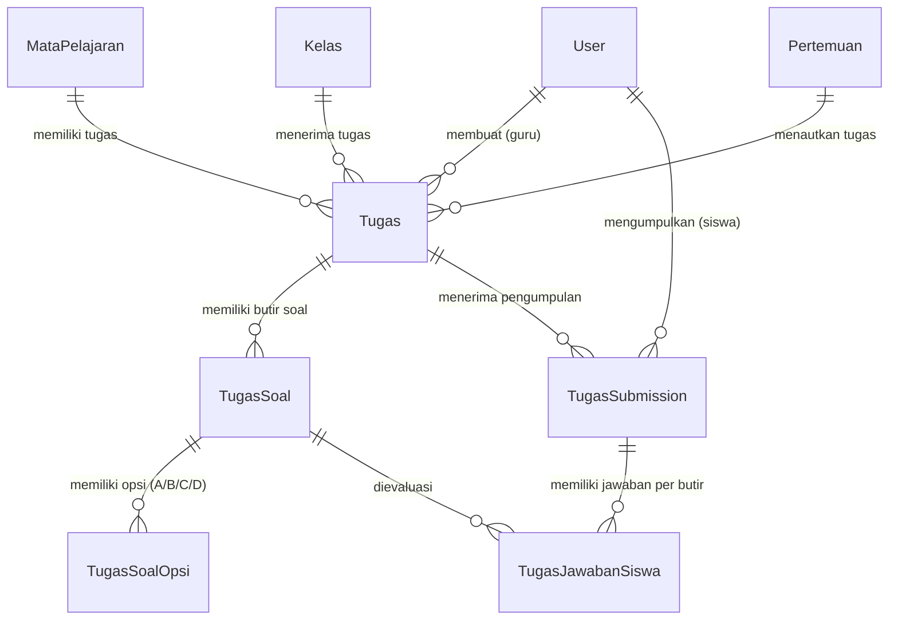
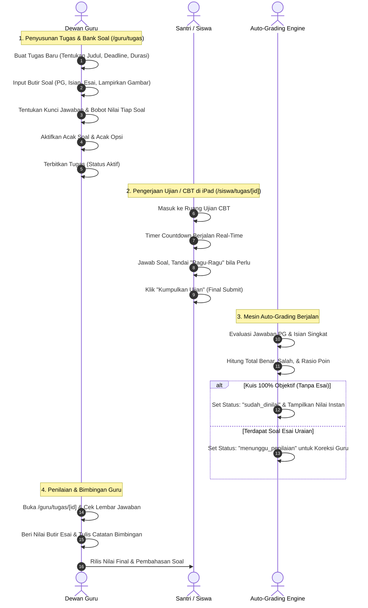

# Dokumentasi & Workflow Fitur Tugas & Kuis Interaktif (CBT & Penugasan)
### SD - SMP Islam Al-Azhar Cairo Palembang
*Sistem Informasi Akademik & Portal Pembelajaran Digital (Student Apps)*

---

## 📌 1. Pendahuluan & Gambaran Umum

Fitur **Tugas & Kuis Interaktif (Assignment & Computer-Based Testing / CBT)** merupakan instrumen evaluasi pembelajaran komprehensif dalam ekosistem digital **Student Apps SD & SMP Islam Al-Azhar Cairo Palembang**. Modul ini dirancang untuk mengukur capaian kompetensi santri secara objektif, transparan, dan efisien, sekaligus mengikis beban administratif koreksi manual bagi dewan guru.

Sistem mendukung **dua moda penugasan utama**:
1. **Moda Interaktif CBT (Computer-Based Testing)**:
   Ujian atau kuis digital berbasis butir soal dengan dukungan 4 format soal: **Pilihan Ganda**, **Pilihan Bergambar** (optimal untuk jenjang SD), **Isian Singkat**, dan **Esai Uraian**. Dilengkapi pengamanan ujian modern seperti pengacakan urutan soal (*shuffle questions*), pengacakan opsi jawaban (*shuffle options*), penghitung mundur durasi pengerjaan (*countdown timer*), tombol penanda *"Ragu-Ragu"*, hingga **Penilaian Otomatis Instan (*Instant Auto-Grading Engine*)**.
2. **Moda Pengumpulan Berkas (*File Upload & Document Submission*)**:
   Penugasan berbasis lembar kerja santri (LKS), proyek makalah, atau karya seni kaligrafi di mana santri mengunggah foto/dokumen pengerjaan. Guru dapat memeriksa berkas langsung di peramban menggunakan *In-Browser Document Viewer* dan memberikan nilai serta catatan bimbingan personal.

Modul tugas ini terhubung langsung dengan **Silabus Pertemuan KBM (`tbl_pertemuan`)**, sehingga latihan soal dan kuis tersaji tepat di bawah materi yang baru saja dipelajari santri.

---

## 🏗️ 2. Arsitektur Data & Model Relasi (Database Schema)

Arsitektur database dirancang sangat terstruktur dan ternormalisasi guna mendukung ribuan submisi jawaban santri secara bersamaan:

### Penjelasan Entitas Database Terkait:

1. **`tbl_tugas` (`Tugas`)**:
   - `id`: Primary key unik penugasan (BigInt).
   - `kelas_id`, `mapel_id`, `guru_id`: Menghubungkan rombel kelas, kurikulum mapel, dan guru pembuat.
   - `judul` & `deskripsi`: Informasi dan petunjuk umum tugas/kuis.
   - `file_petunjuk`: Lampiran berkas panduan dari guru (PDF/DOCX).
   - `deadline`: Batas akhir penyerahan tugas (stempel waktu presisi).
   - `poin_maksimal`: Skala nilai maksimum (default `100`).
   - `status`: Siklus hidup tugas (`draft`, `aktif` / `PUBLISHED`, `closed`).
   - `tipe_pengerjaan`: `INTERAKTIF` (CBT kuis) atau `UPLOAD` (berkas/foto).
   - `durasi_menit`: Batas waktu pengerjaan kuis interaktif (menit).
   - `acak_soal` & `acak_opsi`: Pengacakan soal dan opsi jawaban (anti-contek).
   - `tampilkan_nilai_instan`: Menentukan apakah skor langsung muncul setelah santri selesai submit.
   - `pertemuan_id`: Keterikatan tugas ke pertemuan silabus materi KBM.

2. **`tbl_tugas_soal` (`TugasSoal`)**:
   - `id`: Primary key unik butir soal.
   - `nomor_urut`: Urutan nomor soal awal.
   - `tipe_soal`: `PILIHAN_GANDA`, `PILIHAN_GAMBAR`, `ISIAN_SINGKAT`, `ESAI`.
   - `pertanyaan`: Teks narasi pertanyaan atau stimulus soal.
   - `gambar_soal`: Lampiran gambar/diagram pendukung soal.
   - `bobot_poin`: Poin nilai untuk butir soal tersebut.
   - `kunci_jawaban`: Kunci jawaban benar (disimpan terenkripsi/terlindungi dari santri).
   - `pembahasan`: Penjelasan solusi jawaban untuk refleksi santri.

3. **`tbl_tugas_soal_opsi` (`TugasSoalOpsi`)**:
   - `label`: Label opsi pilihan (`A`, `B`, `C`, `D`, `E`).
   - `teks_opsi` / `gambar_opsi`: Konten teks atau gambar pilihan.
   - `is_benar`: Penanda boolean opsi jawaban yang benar.

4. **`tbl_tugas_submission` (`TugasSubmission`)**:
   - Merekam pengerjaan satu santri (`@@unique([tugas_id, siswa_id])`).
   - `status`: `belum_mengerjakan`, `menunggu_penilaian`, `terlambat`, `sudah_dinilai`.
   - `nilai_otomatis`: Akumulasi nilai auto-grading soal objektif.
   - `nilai_manual`: Akumulasi nilai koreksi manual soal esai.
   - `nilai`: Total skor akhir yang diperoleh santri.
   - `catatan_guru`: Komentar apresiasi atau koreksi dari pendidik.
   - `durasi_detik`: Lama waktu santri menyelesaikan ujian.
   - `total_soal`, `total_benar`, `total_salah`: Statistik performa santri.

5. **`tbl_tugas_jawaban_siswa` (`TugasJawabanSiswa`)**:
   - Merekam respons santri per butir soal: `jawaban_siswa`, penanda `is_ragu` (ragu-ragu), boolean `is_benar`, dan `poin_didapat`.

---

## 👥 3. Workflow Lengkap Pengelolaan Tugas & Ujian CBT

Alur kerja evaluasi melibatkan siklus lengkap dari pembuatan soal oleh Guru, pengerjaan oleh Siswa, evaluasi otomatis sistem, hingga umpan balik nilai:

---

### A. Alur Kerja Dewan Guru: Perancang Evaluasi & Penilai

Guru mengelola tugas dan bank soal melalui menu `/guru/tugas` dan `/guru/tugas/[tugasId]`.

#### 1. Pembuatan Tugas Interaktif Baru (`createInteractiveTaskAction`)
- **Konfigurasi Parameter Ujian**:
  - Judul Tugas, Petunjuk Pengerjaan, Rombel Kelas Tujuan, dan Mata Pelajaran.
  - **Tenggat Waktu (*Deadline*)**: Menentukan batas akhir pengumpulan.
  - **Durasi Timer (*Countdown*)**: Misal 45 menit atau 60 menit.
  - **Opsi Acak Soal & Opsi (*Randomization*)**: Mengacak susunan soal dan opsi pilihan ganda A/B/C/D agar santri bersebelahan tidak mendapatkan urutan yang sama.
  - **Tampilkan Nilai Instan**: Toggle apakah santri boleh melihat skor langsung setelah submit.
  - **Tautkan ke Pertemuan Materi**: Menghubungkan kuis ini ke Pertemuan 1, 2, atau 3.

#### 2. Penyusunan Butir Soal Beragam Format
- Guru menyusun soal satu per satu atau memodifikasi bank soal:
  - **Pilihan Ganda / Pilihan Gambar**: Menentukan opsi jawaban, melampirkan gambar pada soal atau opsi, serta menandai centang opsi yang benar (`is_benar`).
  - **Isian Singkat**: Menuliskan teks kunci jawaban baku yang akan dicocokkan oleh sistem secara *case-insensitive*.
  - **Esai Uraian**: Menuliskan pertanyaan analisis atau penjelasan bebas dengan pembobotan poin tertentu.

#### 3. Penilaian Manual Soal Esai & Feedback Personal (`gradeInteractiveEssayAction`)
- Jika tugas memiliki butir soal esai:
  - Guru membuka daftar submisi santri di `/guru/tugas/[tugasId]`.
  - Guru membaca teks jawaban esai santri, memasukkan poin yang didapat (misal: 15 dari 20), dan memberikan catatan koreksi personal (*"Penjelasan rukun wudhu sudah tepat, perbaiki ejaan istilah bahasa Arabnya ya nak"*).
  - Sistem mengagregasi skor esai dengan skor objektif otomatis, lalu memperbarui status submission menjadi `sudah_dinilai`.

#### 4. Penilaian Tugas Unggah Berkas (*File Submission*)
- Pada tugas non-CBT (pengumpulan berkas/foto):
  - Guru memeriksa dokumen tugas siswa langsung di dalam peramban menggunakan **In-Browser Document Viewer** tanpa perlu mengunduh file satu per satu ke laptop.
  - Guru menginput nilai akhir dan catatan apresiasi.

---

### B. Alur Kerja Santri: Pengalaman Mengerjakan Ujian di iPad

Antarmuka santri di `/siswa/tugas/[tugasId]` dirancang bersih, fokus, dan nyaman untuk layar sentuh iPad.

#### 1. Ruang Ujian CBT Fokus (*Distraction-Free Interface*)
- **Timer Countdown Berdetak**: Menampilkan sisa waktu pengerjaan di bilah atas dengan indikator visual yang berubah warna saat waktu menipis.
- **Navigasi Butir Soal Cepat**: Kotak nomor soal (1, 2, 3...) yang menunjukkan status:
  - *Abu-abu*: Belum dijawab.
  - *Hijau*: Sudah dijawab.
  - *Kuning*: Ditandai ragu-ragu (*is_ragu*).
- **Penyimpanan Jawaban Real-Time (*Auto-Save*)**: Setiap kali santri memilih opsi jawaban, sistem secara otomatis menyimpan respons sementara ke database sehingga jawaban tidak hilang jika peramban tidak sengaja tertutup.

#### 2. Penyelesaian & Pengumpulan Ujian (*Submit Action*)
- Santri meninjau ringkasan jawaban sebelum menyelesaikan ujian.
- Ketika tombol **"Selesaikan & Kumpulkan"** ditekan:
  - Mesin `submitInteractiveTaskAction` melakukan evaluasi instan di sisi server.
  - Jika kuis bersifat objektif murni dan guru mengaktifkan nilai instan, santri langsung disambut banner apresiasi:
    > *"Alhamdulillah, tugas berhasil diselesaikan! 🚀"*
    > *"Nilai Kamu: 95 / 100 ⭐ (Benar: 19, Salah: 1)"*

#### 3. Refleksi & Pembahasan Soal
- Santri dapat membuka kembali lembar kuis yang telah dinilai untuk mempelajari letak kekeliruan jawaban dan membaca teks **Pembahasan** yang disediakan guru.

---

## 🔄 4. Keterhubungan Fitur Tugas dengan Modul Sistem Lainnya

Tugas dan evaluasi akademik terintegrasi dengan modul-modul penting lainnya:

| Modul Terkait | Bentuk Integrasi dengan Fitur Tugas |
| :--- | :--- |
| **Materi Pembelajaran (`/guru/mapel`, `/siswa/mapel`)** | Tugas disematkan langsung di dalam kartu silabus pertemuan KBM (`pertemuan_id`), memudahkan santri menemukan kuis bab terkait. |
| **Mata Pelajaran (`/admin/subjects`)** | Setiap tugas wajib terikat pada kurikulum mata pelajaran tertentu (`mapel_id`). |
| **Rombel Kelas (`/admin/classes`)** | Tugas didistribusikan spesifik kepada rombel kelas sasaran (`kelas_id`). |
| **Chat Konsultasi (`/siswa/chat`)** | Santri dapat langsung mengonsultasikan instruksi tugas yang belum dipahami kepada guru via ruang obrolan 1-on-1. |
| **Prestasi Santri (`/guru/achievements`)** | Santri dengan nilai tugas/kuis sempurna dapat diajukan oleh guru ke daftar prestasi santri sekolah. |

---

## 💡 5. Skenario Nyata di Lapangan (Real-World Use Cases)

Berikut adalah skenario penerapan fitur tugas dalam keseharian KBM di SD - SMP Islam Al-Azhar Cairo Palembang:

### 🎭 Skenario 1: Kuis Interaktif CBT IPA Kelas 7 (Auto-Grading Instan)
- **Situasi**: Di akhir bab *"Klasifikasi Makhluk Hidup"*, Ustadzah Ratna mengadakan kuis harian 20 soal pilihan ganda berdurasi 30 menit di lab komputer/iPad kelas.
- **Workflow Sistem**:
  1. Santri membuka `/siswa/tugas` dan memulai kuis. Soal dan opsi diacak otomatis oleh sistem.
  2. Santri mengerjakan kuis dengan tenang dipandu oleh timer countdown.
  3. Saat waktu habis atau santri menekan kumpul, mesin auto-grading langsung menghitung skor 20 butir soal secara matematis dalam waktu 0.5 detik.
  4. Santri langsung melihat skor nilai mereka di layar iPad masing-masing.
- **Hasil**: Ustadzah Ratna tidak perlu membawa pulang tumpukan kertas untuk dikoreksi malam hari. Rekap nilai 28 santri selesai seketika.

---

### 🎭 Skenario 2: Ujian PTS Fiqih Kombinasi Pilihan Ganda & Esai Uraian
- **Situasi**: Penilaian Tengah Semester (PTS) Fiqih terdiri dari 15 soal pilihan ganda dan 2 soal esai analisis dalil sholat.
- **Workflow Sistem**:
  1. Santri menyelesaikan seluruh soal dan menekan submit.
  2. Sistem secara otomatis menilai 15 soal pilihan ganda dan menyimpan skor sementara. Status pengerjaan disetel menjadi **Menunggu Penilaian**.
  3. Sore harinya, guru membuka dashboard guru `/guru/tugas/[id]`. Guru membaca 2 jawaban esai santri, memberikan poin 10 dan 10, serta menuliskan catatan koreksi.
  4. Status tugas santri otomatis berubah menjadi **Sudah Dinilai** dengan nilai total 100.
- **Hasil**: Kombinasi efisiensi koreksi otomatis dan kedalaman evaluasi nalar esai santri berjalan harmonis.

---

### 🎭 Skenario 3: Tugas Upload Foto Lembar Kalimat Thayyibah di iPad Siswa
- **Situasi**: Guru Bahasa Arab memberikan tugas menulis indah (khat kaligrafi) kalimat Thayyibah di buku tulis santri Kelas 4.
- **Workflow Sistem**:
  1. Guru membuat tugas bertipe `UPLOAD` dengan melampirkan file PDF contoh kaidah khat naskhi.
  2. Santri menulis kaligrafi di buku tulis, memotretnya menggunakan kamera iPad, dan mengunggah foto tersebut ke form tugas `/siswa/tugas/[id]`.
  3. Guru membuka berkas foto santri menggunakan **In-Browser Document Viewer**, memeriksa keindahan tulisan, memberikan nilai 92, dan menulis catatan: *"Masya Allah, tulisan kaligrafinya sangat rapi dan indah ananda!"*
- **Hasil**: Penugasan fisik tradisional tetap terdata rapi secara digital dalam portofolio santri.

---

## 🎯 6. Masalah Krusial yang Diselesaikan Sistem Ini

Modul tugas digital terpadu ini memecahkan berbagai tantangan evaluasi konvensional:

| Masalah Konvensional | Solusi Cerdas yang Dihadirkan Sistem Ini |
| :--- | :--- |
| **Koreksi Manual Kertas yang Menyita Waktu Guru** Guru menghabiskan waktu berjam-jam memeriksa lembar jawaban kertas kuis pilihan ganda. | **Auto-Grading Engine Instan** Soal pilihan ganda, pilihan gambar, dan isian singkat dinilai otomatis oleh server dalam hitungan detik. |
| **Umpan Balik Nilai yang Lambat Diterima Siswa** Siswa baru mengetahui hasil kuis berminggu-minggu setelah ujian dilaksanakan. | **Skor & Pembahasan Instan** Santri langsung mengetahui nilai dan pembahasan soal sesaat setelah menekan tombol kumpul. |
| **Kecurangan & Mencontek Antar-Siswa** Siswa yang duduk bersebelahan saling melirik nomor jawaban pilihan ganda yang sama. | **Pengacakan Soal & Opsi Jawaban** Urutan soal dan letak opsi A/B/C/D diacak berbeda bagi setiap santri (*anti-cheating*). |
| **Berkas Tugas Fisik Hilang atau Tertinggal di Rumah** Buku tugas santri tertinggal atau basah sehingga tidak dapat dinilai guru. | **Repositori Pengumpulan Digital Aman** Seluruh berkas dokumen dan riwayat jawaban tersimpan permanen di basis data server. |
| **Tugas Terisolasi Tanpa Konteks Materi** Siswa bingung kuis yang diberikan menguji kompetensi pada bab mana. | **Penautan Silabus Pertemuan (*Task Linkage*)** Tugas disematkan langsung di dalam modul pertemuan KBM bersangkutan. |

---

## 📋 7. Ringkasan Hak Akses & Matriks Fitur

Tabel matriks wewenang hak akses terhadap modul penugasan & kuis interaktif:

| Fitur / Modul | Administrator | Guru Pengampu | Siswa | Keterangan / Lokasi |
| :--- | :---: | :---: | :---: | :--- |
| **Buat Tugas CBT & Upload Baru** | ✅ Penuh | ✅ Rombel yang Diampu | ❌ Tidak | Menu `/guru/tugas` |
| **Kelola Bank Soal (PG/Gambar/Esai)** | ✅ Penuh | ✅ Hanya Tugas Miliknya | ❌ Tidak | Form soal ujian |
| **Atur Timer, Acak Soal & Kunci Jawaban**| ✅ Penuh | ✅ Rombel yang Diampu | ❌ Tidak | Konfigurasi CBT |
| **Kerjakan Kuis Interaktif (Timer CBT)** | ❌ Monitor | ❌ Pratinjau Guru | ✅ Siswa Terdaftar | Menu `/siswa/tugas/[id]` |
| **Tandai Soal "Ragu-Ragu"** | ❌ Tidak | ❌ Tidak | ✅ Fitur Navigasi CBT | Membantu evaluasi santri |
| **Auto-Grading Nilai Otomatis** | ✅ Otomatis | ✅ Otomatis | ✅ Penerima Nilai | Server Action Engine |
| **Koreksi Manual Butir Esai Santri** | ✅ Penuh | ✅ Rombel yang Diampu | ❌ Tidak | Lembar penilaian guru |
| **Periksa Berkas In-Browser Viewer** | ✅ Penuh | ✅ Penuh | ✅ Berkas Pribadi | Zero-download viewer |
| **Buka Kuis dari Silabus Pertemuan** | ✅ Ya | ✅ Ya | ✅ 1-Klik Instan | Dari `/siswa/mapel/[id]` |

---

*Dokumen ini disusun secara resmi sebagai standar operasional prosedur (SOP) dan dokumentasi teknis sistem Student Apps SD - SMP Islam Al-Azhar Cairo Palembang.*
