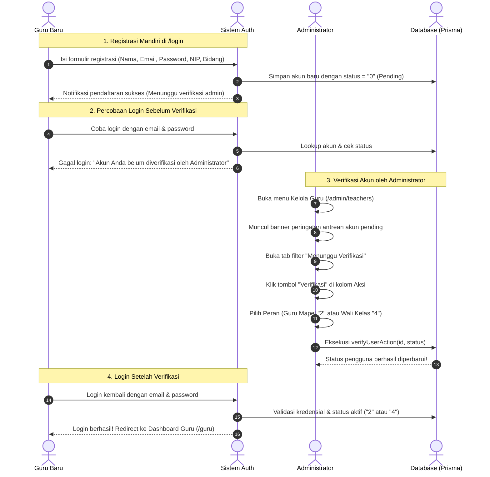

# Dokumentasi & Workflow Fitur Manajemen Akun Pengguna & Verifikasi Guru
### SD - SMP Islam Al-Azhar Cairo Palembang
*Sistem Informasi Akademik & Portal Pembelajaran Digital (Student Apps)*

---

## 📌 1. Pendahuluan & Gambaran Umum

Sistem **Student Apps SD & SMP Islam Al-Azhar Cairo Palembang** mengadopsi model *Role-Based Access Control (RBAC)* dinamis berbasis atribut status pengguna (`users.status`). Pengelolaan akun pengguna mencakup 3 entitas utama: **Administrator**, **Dewan Guru**, dan **Peserta Didik (Siswa)**.

Untuk menjaga integritas dan keamanan kurikulum akademik sekolah:
1. **Registrasi Mandiri Guru**: Dewan guru baru dapat melakukan pendaftaran akun secara mandiri melalui form registrasi di halaman `/login`.
2. **Status Pending Verifikasi (`status: "0"`)**: Setiap akun guru yang baru terdaftar tidak langsung memiliki hak akses KBM, melainkan berstatus *Pending Verifikasi* dan **tidak dapat login** ke sistem hingga diverifikasi resmi oleh Administrator sekolah.
3. **Filter & Otoritas Tunggal Admin (`/admin/teachers`)**: Administrator sekolah memiliki otoritas tunggal untuk menyeleksi, menyaring melalui tab filter status, dan menyetujui pendaftaran guru dengan menetapkan perannya sebagai **Guru Mata Pelajaran (`status: "2"`)** atau **Guru & Wali Kelas (`status: "4"`)**.

---

## 🏗️ 2. Skema & Definisi Status Pengguna (`users.status`)

| Kode Status | Peran (*Role*) | Deskripsi & Hak Akses | Status Login |
| :---: | :--- | :--- | :---: |
| **`"0"`** | **Pending Verifikasi** | Akun guru baru yang mendaftar mandiri. Belum memiliki izin KBM atau perwalian rombel. | ❌ **Diblokir** (Pesan menunggu verifikasi) |
| **`"1"`** | **Siswa** | Peserta didik aktif. Berhak mengakses jadwal, modul materi, kuis/tugas, riwayat absensi, dan poin sikap. | ✅ **Aktif** |
| **`"2"`** | **Guru Mata Pelajaran** | Dewan guru pengampu kurikulum KBM. Berhak mengelola silabus, tugas, ujian, dan video conference. | ✅ **Aktif** |
| **`"3"`** | **Administrator** | Pengelola sistem dan pimpinan kurikulum. Berhak atas seluruh manajemen data master sekolah. | ✅ **Aktif** |
| **`"4"`** | **Guru & Wali Kelas** | Guru pengampu KBM sekaligus pembina rombel kelas. Memiliki akses presensi rombel, rekap PDF, dan pembinaan santri. | ✅ **Aktif** |

---

## 🔄 3. Alur Kerja Registrasi & Verifikasi Akun Guru

---

## 🖥️ 4. Tampilan & Pengalaman Pengguna (UI/UX) di Admin

### A. Segmented Filter Tabs
Pada bagian atas tabel guru (`/admin/teachers`), tersedia tab penyaring yang responsif:
* **Semua Guru**: Menampilkan keseluruhan akun dewan guru.
* **Menunggu Verifikasi**: Menampilkan daftar akun guru yang baru registrasi dengan indikator *pulse* oranye menyala jika antrean > 0.
* **Guru Mapel**: Menampilkan dewan guru berstatus `"2"`.
* **Guru & Wali Kelas**: Menampilkan dewan guru berstatus `"4"`.

### B. Banner Notifikasi Real-Time
Ketika terdapat guru baru yang mendaftar dan Admin sedang melihat daftar umum, muncul banner peringatan di bagian atas:
> ⚠️ **Perhatian**: Terdapat *X* akun guru baru yang baru mendaftar dan menunggu verifikasi Admin sebelum bisa login ke sistem. `[Lihat Akun Pending (X)]`

### C. Tombol Aksi Cepat pada Baris Akun
* **Akun Pending (`status: "0"`)**:
  * Menampilkan badge `Pending Verifikasi` dengan ikon jam.
  * Tampil tombol utama **"Verifikasi"** (hijau/emerald) langsung di kolom Aksi di samping menu 3-dots.
* **Akun Terverifikasi (`status: "2"` atau `"4"`)**:
  * Menampilkan badge perannya (`Guru` atau `Guru & Wali Kelas`).
  * Menu dropdown 3-dots bersih tanpa opsi "Verifikasi Status":
    * 👁️ **Detail Guru**
    * ✏️ **Edit Data**
    * 🗑️ **Hapus Akun**

---

## 🔒 5. Keamanan & Proteksi Otentikasi (*Security Safeguards*)

1. **Proteksi di Level Autentikasi (`src/lib/auth.ts`)**:
   Fungsi `authenticateUser` secara ketat memblokir login jika `user.status === "0"` dengan pesan penolakan:
   > *"Akun Anda belum diverifikasi oleh Administrator. Silakan hubungi admin sekolah."*
2. **Proteksi di Level Layout Dashboard (`src/app/(dashboard)/layout.tsx`)**:
   Pengecekan sesi sisi server memastikan pengguna berstatus `"0"` yang mencoba mengakses rute internal `/guru` atau `/siswa` langsung dialihkan ke `/login`.
3. **Penyelarasan Data Kelas Otomatis (`verifyUserAction`)**:
   Saat akun diverifikasi sebagai Wali Kelas (`"4"`), sistem secara otomatis memperbarui tabel `tbl_kelas.wali_kelas` sesuai nama guru bersangkutan.

---

*Dokumen ini merupakan pedoman operasional baku (SOP) dan acuan teknis sistem informasi akademik SD - SMP Islam Al-Azhar Cairo Palembang.*
